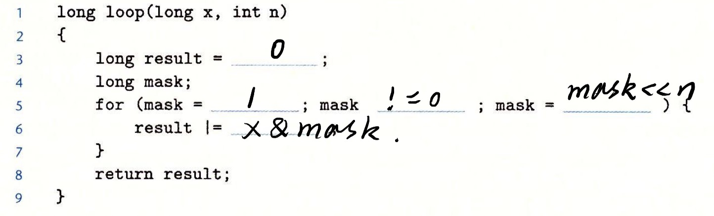
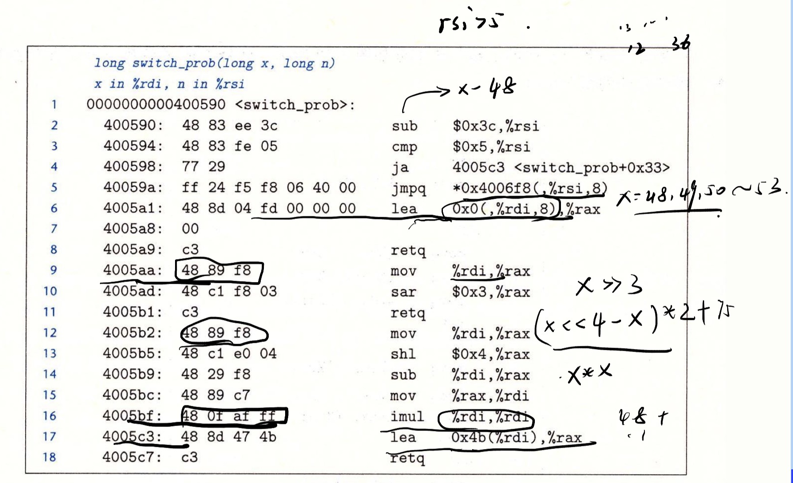
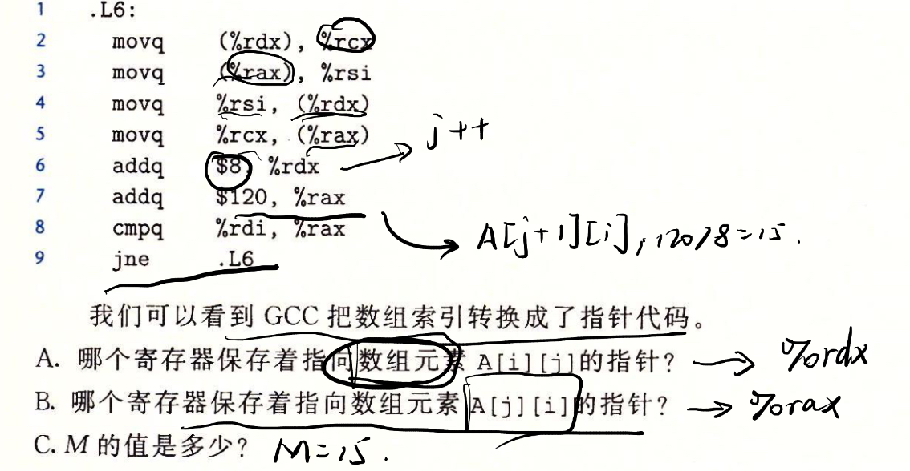
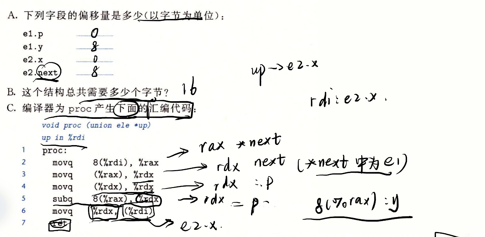

# 计算机系统第三章作业

> 陈俊潼 10185101210

## 3.60
各个变量存储的寄存器如下：

| x    | n    | result | mask |
| ---- | ---- | ------ | ---- |
| %rdi | %esi | %rax   | %rdx |

补全后的代码如下：



## 2.63

查看并分析汇编代码：



这里是一个switch语句。第一行会把n减去48，后面的`ja`为无符号大于，所以减去后的数字也必须大于0。可以推测switch语句是从60开始的（上图截图草稿有误）。不同的跳转点对应的操作都比较简单。整理后补全后的switch语句如下：

```c
long switch_prob(long x, long n) {
	long result = x;
	switch (n) {
	case 60:
	case 62:
		result = x * 8;
		break;
	case 63:
		result = x >> 3;
		break;
	case 64:
		x = x << 4 - x;
	case 65:
		x = x * x;
	default:
		result = x + 0x4B;
	}
	return result;
}
```

## 3.65

查看并分析汇编代码，得到答案如下：



## 3.69
首句中0x120=288，b_struct内的第一个int和第二个int相差了288个字节。
```s
lea (%rdi,%rdi,4), %rax       # 这一句将i*5
lea (%rsi,%rax,8), %rax       # 这一句将bp + i*40赋值给了%rax，%rax为ap
mov 0x8(%rax), %rdx           # 再将%rax内的指针加上八个字节，给%rdx, 推测%rdx就是ap + 8
                              # 同时可以得出b_struct以8字节对齐。
movsl %ecx, %rcx              # 将整形n拓展为长整型存储在%rcx中，推测a_struct中的x为long
```
又从后面的语句`mov %rcx, 0x10(%rax,%rdx,8)`中，0x10=40可以推断出每个a_struct的大小为40，40*7+8=288，所以**CNT=7**。

`mov %rcx, 0x10(%rax,%rdx,8)`可以推断a_struct中有一个long类型的x数组和long类型的idx。结合每个a_struct的大小得到完整定义如下：
```c
typedef struct a_struct{
  long idx,
  long x[4]
}
```

## 3.70



分析汇编语句，up中应该为e2类型，其中的next指向的是e1类型。

注意到前面对%rdx连续解了两次引用，关键的`subq 8(%rax), %rdx`语句后面的8(%rax)存储的是next里的y，%rdx指向的是next里的p指向的long数据。

补全后的语句如下：
```c
void proc (union ele * up){
    up->e2.x = *(*(up->e2.next).e1.p) - *(up->e2.next).e1.y;
}
```
---
## 3.46

选做题好难，我要累死了Orz.