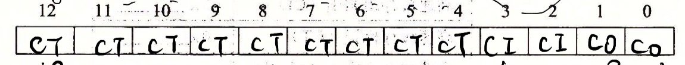
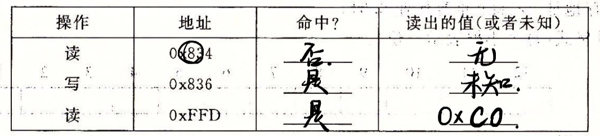
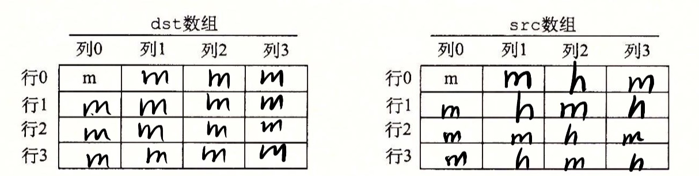

# 第十讲 Cache 课后作业

> 陈俊潼 10185101210

## 6.25

根据 C = B * E * S 计算。

## 6.29

**A.**

**B.**

由这些地址的二进制地址`1000 0011 0100`、`1000 0011 0110`、`1111 1111 1101`分别匹配块偏移、组索引和标识位。

## 6.34
如果不访问 dst 的话，src 中的命中情况应该在每一行都是 m h h h。需要访问 dst 了，当 j%2 = i%2 时，dst[j] 会替换掉 src[i] 刚刚更新的缓存行，导致下次访问时会不命中。

## 6.36

数组 x 的总大小为 2 * 128 * 4 = 1024 字节。

**A.** 缓存的总大小只有 512 字节。每 16 个字节的高数缓存行能放下连续 4 个 int。在交替访问 x[0][i] 和 x[1][i] 的时候，都指向的同一个缓存行，每次都会覆盖，所以不命中率为 **100%**。

**B.** 翻倍到 1024 字节后，每 4 次读取中会有 3 次不命中，也就是一直是 `m h h h` 的循环，所以不命中率为 **25%**。

**C.** 在每一次引用 x[0][i] 和 x[1][i] 的时候，都会指向相同的一个缓存组，而由于每个组是有两个缓存行相联的，所以不会替换刚刚被缓存的 x[0][i]，而会在第二个缓存行中存入 x[1][i]，所以也是 `m h h h` 的循环，不命中率为 **%25**。

**D.** 不会。因为没个缓存行的第一次引用都会是不命中的。

**E.** 可以。因为每一次缓存了更多的内存进缓存行，那么这个循环 `m h h h h ... ` 后面的 h 就会随着块大小的增大而增大，所以不命中率会降低。

## 6.41

由题可知，每一个 pixel 是长度为 4 个字节的结构体。由于高数缓存足够大，所以考虑每一个缓存行的情况。在每一次循环体中，第一次对 `buffer[i][j].r` 的引用是不命中的，并且缓存四个字节。由于 g b a 紧随其后，所以后面的三次引用都将是命中的。在每一个缓存行中的命中情况为 `m h h h`，所以代码中有 **25%** 的代码会不命中。