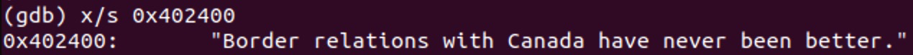
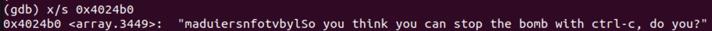
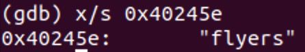
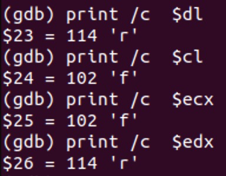
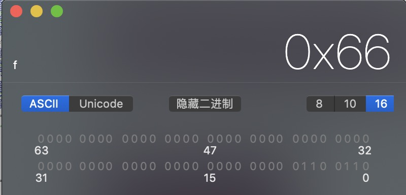
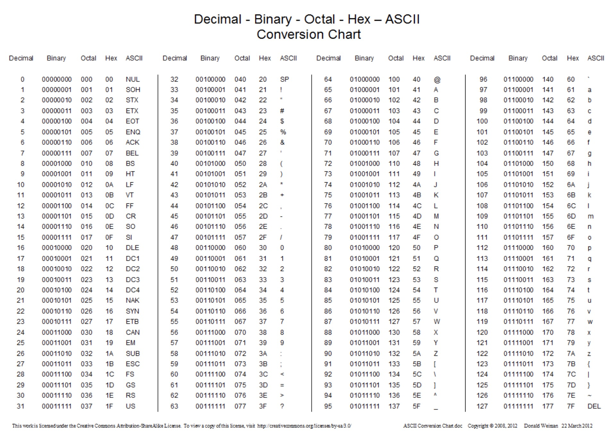
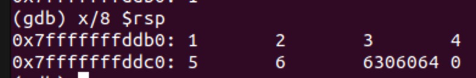
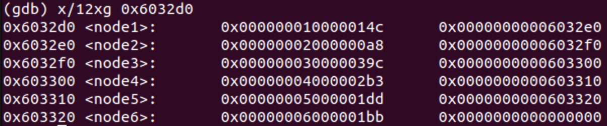

# LAB2 实验分析

使用`gdb bomb`命令可以实时调试程序。结合`break function`、`break *地址`、`disas`、`x/s $地址`命令实时查看程序内的内容，同时用`info registers`和`info frame`查看寄存器信息和栈帧信息，可以拆除炸弹。

## Phase 1

在Phase_1打下断点，使用`info register`可以得到寄存器信息：
```s
(gdb) info register
rax            0x603780            6305664
rbx            0x0                 0
rcx            0x3                 3
rdx            0x1                 1
rsi            0x603780            6305664
rdi            0x603780            6305664
rbp            0x402210            0x402210 <__libc_csu_init>
rsp            0x7fffffffde28      0x7fffffffde28
r8             0x604674            6309492
r9             0x7ffff7fba540      140737353852224
r10            0x3                 3
r11            0x7ffff7e015c0      140737352046016
r12            0x400c90            4197520
r13            0x7fffffffdf10      140737488346896
r14            0x0                 0
r15            0x0                 0
rip            0x400ee0            0x400ee0 <phase_1>
eflags         0x206               [ PF IF ]
cs             0x33                51
ss             0x2b                43
ds             0x0                 0
es             0x0                 0
fs             0x0                 0
gs             0x0                 0
```

得到汇编代码如下：
```s
Dump of assembler code for function phase_1:
=> 0x0000000000400ee0 <+0>:	sub    $0x8,%rsp
   0x0000000000400ee4 <+4>:	mov    $0x402400,%esi
   0x0000000000400ee9 <+9>:	callq  0x401338 <strings_not_equal>
   0x0000000000400eee <+14>:	test   %eax,%eax
   0x0000000000400ef0 <+16>:	je     0x400ef7 <phase_1+23>
   0x0000000000400ef2 <+18>:	callq  0x40143a <explode_bomb>
   0x0000000000400ef7 <+23>:	add    $0x8,%rsp
   0x0000000000400efb <+27>:	retq
```
发现程序调用了`strings_not_euqal`函数，该函数应该是用于比较两个字符串是否相等的。可以发现%eax是输入的字符串数据，调用程序会将如果返回值%eax为0的话je结束函数phase_1。其中所以使用命`x/s 0x402400`获取存储的字符串，得到结果：



所以第一个炸弹的答案为：

> Border relations with Canada have never been better.

## Phase 2

同样获取这一阶段的汇编代码：
```s
(gdb) disas
Dump of assembler code for function phase_2:
=> 0x0000000000400efc <+0>:	push   %rbp
   0x0000000000400efd <+1>:	push   %rbx
   0x0000000000400efe <+2>:	sub    $0x28,%rsp
   0x0000000000400f02 <+6>:	mov    %rsp,%rsi
   0x0000000000400f05 <+9>:	callq  0x40145c <read_six_numbers>
   0x0000000000400f0a <+14>:	cmpl   $0x1,(%rsp)
   0x0000000000400f0e <+18>:	je     0x400f30 <phase_2+52>
   0x0000000000400f10 <+20>:	callq  0x40143a <explode_bomb>
   0x0000000000400f15 <+25>:	jmp    0x400f30 <phase_2+52>
   0x0000000000400f17 <+27>:	mov    -0x4(%rbx),%eax
   0x0000000000400f1a <+30>:	add    %eax,%eax
   0x0000000000400f1c <+32>:	cmp    %eax,(%rbx)
   0x0000000000400f1e <+34>:	je     0x400f25 <phase_2+41>
   0x0000000000400f20 <+36>:	callq  0x40143a <explode_bomb>
   0x0000000000400f25 <+41>:	add    $0x4,%rbx
   0x0000000000400f29 <+45>:	cmp    %rbp,%rbx
   0x0000000000400f2c <+48>:	jne    0x400f17 <phase_2+27>
   0x0000000000400f2e <+50>:	jmp    0x400f3c <phase_2+64>
   0x0000000000400f30 <+52>:	lea    0x4(%rsp),%rbx
   0x0000000000400f35 <+57>:	lea    0x18(%rsp),%rbp
   0x0000000000400f3a <+62>:	jmp    0x400f17 <phase_2+27>
   0x0000000000400f3c <+64>:	add    $0x28,%rsp
   0x0000000000400f40 <+68>:	pop    %rbx
   0x0000000000400f41 <+69>:	pop    %rbp
   0x0000000000400f42 <+70>:	retq   
End of assembler dump.
```
有一个read_six_numbers的函数，猜测会从输入中读取六个数字。所以可以随便输入6个数字测试以一下。查看read_six_numbers的汇编代码：
```s
Dump of assembler code for function read_six_numbers:
   0x000000000040145c <+0>:	sub    $0x18,%rsp
   0x0000000000401460 <+4>:	mov    %rsi,%rdx
   0x0000000000401463 <+7>:	lea    0x4(%rsi),%rcx
   0x0000000000401467 <+11>:	lea    0x14(%rsi),%rax
   0x000000000040146b <+15>:	mov    %rax,0x8(%rsp)
   0x0000000000401470 <+20>:	lea    0x10(%rsi),%rax
   0x0000000000401474 <+24>:	mov    %rax,(%rsp)
   0x0000000000401478 <+28>:	lea    0xc(%rsi),%r9
   0x000000000040147c <+32>:	lea    0x8(%rsi),%r8
   0x0000000000401480 <+36>:	mov    $0x4025c3,%esi
   0x0000000000401485 <+41>:	mov    $0x0,%eax
   0x000000000040148a <+46>:	callq  0x400bf0 <__isoc99_sscanf@plt>
   0x000000000040148f <+51>:	cmp    $0x5,%eax
   0x0000000000401492 <+54>:	jg     0x401499 <read_six_numbers+61>
   0x0000000000401494 <+56>:	callq  0x40143a <explode_bomb>
   0x0000000000401499 <+61>:	add    $0x18,%rsp
   0x000000000040149d <+65>:	retq   
End of assembler dump.
```
通过观察寄存器的信息，可以发现输入的数据存储在了 %rsp 下的各个位置，分别为%rsp + 1， %rsp + 2……等等（可以通过`(gdb) print /d *0x7fffffffddf0 + 4 $5 = 5`来检查，更多的是通过函数的名称猜测出来的，因为不太确定scanf的机制，猜测这里scanf的返回值应该存储在eax内，为成功读取到的数据个数，`cmp    $0x5,%eax`这句会使成功读取的数据少于5的时候炸弹爆炸。）

对于phase_2的汇编代码，第一条cmp语句可以看出在比较输入的第一个数字，如果不为1就爆炸。之后的结构中有许多的跳转语句，可以判断这是一个循环。循环中把后面一个数字传入%rbx中，再把前一个数字传入%eax中。`add    %eax,%eax`一句再讲前一个数字乘以二，如果相等的话就可以跳过这个+36处的爆炸点。紧接着将%rbx指向下一个整数，比较是否和%rsp相等，也就是达到了最后一个整数的情况，如果没有就继续循环，达到了就跳到+64处，炸弹解除。所以只要每一个数都是前一个的两倍就可以了，答案为：

> 1 2 4 8 16 32

## Phase 3

接下来观察phase_3的汇编代码：
```s
Dump of assembler code for function phase_3:
=> 0x0000000000400f43 <+0>:	sub    $0x18,%rsp
   0x0000000000400f47 <+4>:	lea    0xc(%rsp),%rcx
   0x0000000000400f4c <+9>:	lea    0x8(%rsp),%rdx
         # ️x/s 0x4025cf可以得到"%d %d"，这就是需要输入的两个数据
   0x0000000000400f51 <+14>:	mov    $0x4025cf,%esi
   0x0000000000400f56 <+19>:	mov    $0x0,%eax
   0x0000000000400f5b <+24>:	callq  0x400bf0 <__isoc99_sscanf@plt> 
         # ️%scanf如果返回值为1也就是读取成功的个数为1的话就会爆炸，所以猜测这里需要至少读取两个数据才能跳过下一个爆炸点。
   0x0000000000400f60 <+29>:	cmp    $0x1,%eax
   0x0000000000400f63 <+32>:	jg     0x400f6a <phase_3+39>
   0x0000000000400f65 <+34>:	callq  0x40143a <explode_bomb>
   0x0000000000400f6a <+39>:	cmpl   $0x7,0x8(%rsp)
         # ️%rsp + 8 如果大于7，则炸弹会爆炸。观察发现 %rsp + 8 存储的是第一个输入的整数。由于ja是无符号比较，所以输入的值必须大于等于0，否则也一定会爆炸。
   0x0000000000400f6f <+44>:	ja     0x400fad <phase_3+106>
   0x0000000000400f71 <+46>:	mov    0x8(%rsp),%eax
         # ️这里是个switch语句，根据rax的值去查找跳转表对应的值。rax是输入的第一个整数。
   0x0000000000400f75 <+50>:	jmpq   *0x402470(,%rax,8)
   0x0000000000400f7c <+57>:	mov    $0xcf,%eax
   0x0000000000400f81 <+62>:	jmp    0x400fbe <phase_3+123>
   0x0000000000400f83 <+64>:	mov    $0x2c3,%eax
   0x0000000000400f88 <+69>:	jmp    0x400fbe <phase_3+123>
   0x0000000000400f8a <+71>:	mov    $0x100,%eax
   0x0000000000400f8f <+76>:	jmp    0x400fbe <phase_3+123>
   0x0000000000400f91 <+78>:	mov    $0x185,%eax
   0x0000000000400f96 <+83>:	jmp    0x400fbe <phase_3+123>
   0x0000000000400f98 <+85>:	mov    $0xce,%eax
   0x0000000000400f9d <+90>:	jmp    0x400fbe <phase_3+123>
   0x0000000000400f9f <+92>:	mov    $0x2aa,%eax
   0x0000000000400fa4 <+97>:	jmp    0x400fbe <phase_3+123>
   0x0000000000400fa6 <+99>:	mov    $0x147,%eax
   0x0000000000400fab <+104>:	jmp    0x400fbe <phase_3+123>
   0x0000000000400fad <+106>:	callq  0x40143a <explode_bomb>
   0x0000000000400fb2 <+111>:	mov    $0x0,%eax
   0x0000000000400fb7 <+116>:	jmp    0x400fbe <phase_3+123>
   0x0000000000400fb9 <+118>:	mov    $0x137,%eax
         # ️这里会比较%rsp+12的值（可以发现就是我们输入的第二个值）和%eax中的数据是否相等，一样的话就跳过爆炸点。
   0x0000000000400fbe <+123>:	cmp    0xc(%rsp),%eax
   0x0000000000400fc2 <+127>:	je     0x400fc9 <phase_3+134>
   0x0000000000400fc4 <+129>:	callq  0x40143a <explode_bomb>
   0x0000000000400fc9 <+134>:	add    $0x18,%rsp
   0x0000000000400fcd <+138>:	retq   
End of assembler dump.
```
分析已经插入在了汇编代码中。中间的`switch`语句可以通过输入不同的值和断点来探索出对应跳转的地方。比如我在这里第一个数字为2后，将断点设置在`print /x *(0x402470 + 16)`
显示出来的位置，可以发现程序跳转到了 `=> 0x0000000000400f83 <+64>:	mov    $0x2c3,%eax`的语句。

这里的0x2c3就应该是第二个数的答案。转换为十进制为707。可以推测这个题目一共有八个解答，只要输入的第二个数字和第一个数字对应的跳转关系相对应即可。进一步多次解析，可以得到第三个炸弹答案表如下：
| 第一个数字 | 跳转到的语句                      | 第二个数字 |
| ---------- | --------------------------------- | ---------- |
| 0          | 400f7c <+57>:	mov    $0xcf,%eax   | 207        |
| 1          | 400fb9 <+118>:	mov    $0x137,%eax | 311        |
| 2          | 400f83 <+64>:	mov    $0x2c3,%eax  | 707        |
| 3          | 400f8a <+71>:	mov    $0x100,%eax  | 256        |
| 4          | 400f91 <+78>:	mov    $0x185,%eax  | 389        |
| 5          | 400f98 <+85>:	mov    $0xce,%eax   | 206        |
| 6          | 400f9f <+92>:	mov    $0x2aa,%eax  | 682        |
| 7          | 400fa6 <+99>:	mov    $0x147,%eax  | 327        |

## Phase 4

汇编代码及分析如下：
```s
Dump of assembler code for function phase_4:
=> 0x000000000040100c <+0>:	sub    $0x18,%rsp
   0x0000000000401010 <+4>:	lea    0xc(%rsp),%rcx
   0x0000000000401015 <+9>:	lea    0x8(%rsp),%rdx
      # ️查看scanf的格式化输入（在0x4025cf）可得到"%d %d"，所以需要输入两个整形数据。
   0x000000000040101a <+14>:	mov    $0x4025cf,%esi
   0x000000000040101f <+19>:	mov    $0x0,%eax
   0x0000000000401024 <+24>:	callq  0x400bf0 <__isoc99_sscanf@plt>
      # ️必须输入两个数据，否则就会直接跳转到爆炸点。
   0x0000000000401029 <+29>:	cmp    $0x2,%eax
   0x000000000040102c <+32>:	jne    0x401035 <phase_4+41>
      # ️比较0xe和输入的第一个数据的大小，数据必须要小于或等于0xe(14)才能跳过爆炸点
   0x000000000040102e <+34>:	cmpl   $0xe,0x8(%rsp)
   0x0000000000401033 <+39>:	jbe    0x40103a <phase_4+46>
   0x0000000000401035 <+41>:	callq  0x40143a <explode_bomb>
   0x000000000040103a <+46>:	mov    $0xe,%edx
   0x000000000040103f <+51>:	mov    $0x0,%esi
   0x0000000000401044 <+56>:	mov    0x8(%rsp),%edi
      # ️调用fuc4函数，此时edx等于14，esi等于0，edi等于输入的第一个数x，
         相当于调用func4(x, 0, 14)
   0x0000000000401048 <+60>:	callq  0x400fce <func4>
   0x000000000040104d <+65>:	test   %eax,%eax
      # ️测试func4返回值是否为0。如果不为0的话会直接跳到爆炸点。
   0x000000000040104f <+67>:	jne    0x401058 <phase_4+76>
      # ️比较rp+12，应该是第二个数字是否为0，如果为0的话可以跳过爆炸点。
   0x0000000000401051 <+69>:	cmpl   $0x0,0xc(%rsp)
   0x0000000000401056 <+74>:	je     0x40105d <phase_4+81>
   0x0000000000401058 <+76>:	callq  0x40143a <explode_bomb>
   0x000000000040105d <+81>:	add    $0x18,%rsp
   0x0000000000401061 <+85>:	retq   
End of assembler dump.
```
发现+60处会调用func4函数，反汇编func4如下。在func4内部还会再次调用func4，可以看出这是一个递归的函数过程，进一步分析：
```s
(gdb) disas func4
Dump of assembler code for function func4:
   0x0000000000400fce <+0>:	sub    $0x8,%rsp
   0x0000000000400fd2 <+4>:	mov    %edx,%eax
   0x0000000000400fd4 <+6>:	sub    %esi,%eax
   0x0000000000400fd6 <+8>:	mov    %eax,%ecx
      # ️将%ecx右移31位（可以用来判断eax的正负，比较第二个参数和第三个参数的大小
   0x0000000000400fd8 <+10>:	shr    $0x1f,%ecx
   0x0000000000400fdb <+13>:	add    %ecx,%eax
      # ️将eax算数右移一位，即除以2
   0x0000000000400fdd <+15>:	sar    %eax
   0x0000000000400fdf <+17>:	lea    (%rax,%rsi,1),%ecx
   0x0000000000400fe2 <+20>:	cmp    %edi,%ecx
      # ️如果%ecx小于%edi就跳转到36并把返回值设置为0。
   0x0000000000400fe4 <+22>:	jle    0x400ff2 <func4+36>
      # 否则将rcx减去1传给edx。
         相当于递归调用
   0x0000000000400fe6 <+24>:	lea    -0x1(%rcx),%edx
   0x0000000000400fe9 <+27>:	callq  0x400fce <func4>
   0x0000000000400fee <+32>:	add    %eax,%eax
   0x0000000000400ff0 <+34>:	jmp    0x401007 <func4+57>
   0x0000000000400ff2 <+36>:	mov    $0x0,%eax
   0x0000000000400ff7 <+41>:	cmp    %edi,%ecx
      # ️如果%ecx大于%edi就结束函数，否则继续调用下一层递归。
   0x0000000000400ff9 <+43>:	jge    0x401007 <func4+57>
      # ️把%rcx + 1 传递到%esi中，作为下一个func4的参数。
   0x0000000000400ffb <+45>:	lea    0x1(%rcx),%esi
   0x0000000000400ffe <+48>:	callq  0x400fce <func4>
   0x0000000000401003 <+53>:	lea    0x1(%rax,%rax,1),%eax
   0x0000000000401007 <+57>:	add    $0x8,%rsp
   0x000000000040100b <+61>:	retq   
End of assembler dump.
```

结构比较复杂，尝试逐行翻译成C语言代码如下：
```c
func4(x, 0 ,14)
int func4(int a, int b, int c){
    // t in %eax , q in % ecx
    // a in %rdi, b in %rsi, c in %rdx
    int t = c;
    t = t - b;
    int q = t;
    q = q >> 31;
    t = t + q;
    t = t/2;
    q = t + b;
    if (q <= a){
        t = 0;
        if (q >= a){
            return t;
        }
        else{
            b = q + 1;
            func4(a, b, c);
        }
    }
    else{
        c = q - 1;
        func4(a, b, c);
        t = 2t;
    }
    return t;
}
```

分析发现第一次运行的时候，q会被赋值为7，而当x=7的时候可以直接跳过递归部分，解除炸弹。所以答案为：

> 7 0

## Phase 5

汇编代码如下：

```s
(gdb) disas phase_5
Dump of assembler code for function phase_5:
   0x0000000000401062 <+0>:	push   %rbx
   0x0000000000401063 <+1>:	sub    $0x20,%rsp
   0x0000000000401067 <+5>:	mov    %rdi,%rbx
   0x000000000040106a <+8>:	mov    %fs:0x28,%rax
   0x0000000000401073 <+17>:	mov    %rax,0x18(%rsp)
   0x0000000000401078 <+22>:	xor    %eax,%eax
   0x000000000040107a <+24>:	callq  0x40131b <string_length>
   0x000000000040107f <+29>:	cmp    $0x6,%eax
   0x0000000000401082 <+32>:	je     0x4010d2 <phase_5+112>
      # ️这里有一个爆炸点，上面的函数为string_length，所以推断应该输入长度为6的字符串。
   0x0000000000401084 <+34>:	callq  0x40143a <explode_bomb>
   0x0000000000401089 <+39>:	jmp    0x4010d2 <phase_5+112>
   0x000000000040108b <+41>:	movzbl (%rbx,%rax,1),%ecx
   0x000000000040108f <+45>:	mov    %cl,(%rsp)
   0x0000000000401092 <+48>:	mov    (%rsp),%rdx
      # 将传入的%edx和0xf做与运算，相当于只保留这一个字符的ASCII码的最后的4位。
   0x0000000000401096 <+52>:	and    $0xf,%edx
      # ️movzbl为做了0扩展的字节传送，0x4024b0 存储的是一个字符串。这里用%rdx的偏移量将字符串中的某一个字符传递到edx中。。
   0x0000000000401099 <+55>:	movzbl 0x4024b0(%rdx),%edx
   0x00000000004010a0 <+62>:	mov    %dl,0x10(%rsp,%rax,1)
      # ️rax加一，作为循环的计数器。循环6次以后跳出。
   0x00000000004010a4 <+66>:	add    $0x1,%rax
   0x00000000004010a8 <+70>:	cmp    $0x6,%rax
   0x00000000004010ac <+74>:	jne    0x40108b <phase_5+41>
   0x00000000004010ae <+76>:	movb   $0x0,0x16(%rsp)
   0x00000000004010b3 <+81>:	mov    $0x40245e,%esi
   0x00000000004010b8 <+86>:	lea    0x10(%rsp),%rdi
      # 比较%rsp里存储的字符串是否与0x4025e相等。
   0x00000000004010bd <+91>:	callq  0x401338 <strings_not_equal>
   0x00000000004010c2 <+96>:	test   %eax,%eax
      # ️eax必须等于0（字符串相等），否则爆炸。
   0x00000000004010c4 <+98>:	je     0x4010d9 <phase_5+119>
   0x00000000004010c6 <+100>:	callq  0x40143a <explode_bomb>
   0x00000000004010cb <+105>:	nopl   0x0(%rax,%rax,1)
   0x00000000004010d0 <+110>:	jmp    0x4010d9 <phase_5+119>
   0x00000000004010d2 <+112>:	mov    $0x0,%eax
   0x00000000004010d7 <+117>:	jmp    0x40108b <phase_5+41>
   0x00000000004010d9 <+119>:	mov    0x18(%rsp),%rax
   0x00000000004010de <+124>:	xor    %fs:0x28,%rax
   0x00000000004010e7 <+133>:	je     0x4010ee <phase_5+140>
   0x00000000004010e9 <+135>:	callq  0x400b30 <__stack_chk_fail@plt>
   0x00000000004010ee <+140>:	add    $0x20,%rsp
   0x00000000004010f2 <+144>:	pop    %rbx
   0x00000000004010f3 <+145>:	retq   
End of assembler dump.
```
可以看到0x4024b0里存储了一个字符串：



0x245e里也存储了一个字符串：



确定必须输入长度为6的字符串之后，随便输入fgr123，执行到+55行。由于使用了%cl这种只能存储char类型的寄存器，所以继续用`print /c` 探索寄存器里的数据：



探索核心语句`movzbl 0x4024b0(%rdx),%edx`和`mov    %dl,0x10(%rsp,%rax,1)`。在这里输入的第一个字符为f，他的二进制ASCII码为0x66，二进制为0110 0110：



取后四位，0110是十进制的6，用6做索引，取string[6]，得到字符`'r'`，正好是寄存器%dl里存储的字符。

所以以此类推，可以得到phase5的逻辑大致如下：

- 读取长度为6的字符串
- 逐个字符读取，取每一个字符的ASCII码的后4位
- 以这后4为作为索引，取0x4024b0中的第n个字符，并将这一个字符存入到`0x10(%rsp)`中
- 循环6次，依次读取
- 将最后得到的字符串`0x10(%rsp)`同`flyers`比较，相同则通过。

由于后4位的二进制数能存储的最大数字为15，所以能够起到作用的只有长字符串的前16位，必须要在前16位中查找。

`flyers`每个字母在字符串中的序列依次为：**9 15 14 5 6 7**。依次转换成二进制为： 
**1001 1111 1110 0101 0110 0111**。所以需要找6个字符，他们的ASCII码的二进制后4位满足以上序列就可以了。

拿来一张具有二进制表示的ASCII码表：


可以得到一个答案为：

> ION567


## Phase 6

得到巨大的汇编代码（实在是太可怕了），所以拆分开来，分成几个部分分析：
```s
Dump of assembler code for function phase_6:
   0x00000000004010f4 <+0>:	push   %r14
   0x00000000004010f6 <+2>:	push   %r13
   0x00000000004010f8 <+4>:	push   %r12
   0x00000000004010fa <+6>:	push   %rbp
   0x00000000004010fb <+7>:	push   %rbx
   0x00000000004010fc <+8>:	sub    $0x50,%rsp
   0x0000000000401100 <+12>:	mov    %rsp,%r13
   0x0000000000401103 <+15>:	mov    %rsp,%rsi
   0x0000000000401106 <+18>:	callq  0x40145c <read_six_numbers>
      # r14里存储了数组的初始化地址
   0x000000000040110b <+23>:	mov    %rsp,%r14
```
发现同样是读取了六个数字，所以随便输入1 2 3 4 5 6，发现这里取了六个整数并存储在栈帧里：



```s
   0x000000000040110e <+26>:	mov    $0x0,%r12d
   0x0000000000401114 <+32>:	mov    %r13,%rbp
   0x0000000000401117 <+35>:	mov    0x0(%r13),%eax
      # %eax减1后和5比较
   0x000000000040111b <+39>:	sub    $0x1,%eax
   0x000000000040111e <+42>:	cmp    $0x5,%eax
      # 如果任何一个数字小于等于5，则跳过爆炸点
   0x0000000000401121 <+45>:	jbe    0x401128 <phase_6+52>
   0x0000000000401123 <+47>:	callq  0x40143a <explode_bomb>
```
目前为止读取了6个数字，必须是在1~6之间。
```s
   0x0000000000401128 <+52>:	add    $0x1,%r12d
   0x000000000040112c <+56>:	cmp    $0x6,%r12d
   0x0000000000401130 <+60>:	je     0x401153 <phase_6+95>
      #%ebx在这里是数组指针，后面会被存储在%rax中。
   0x0000000000401132 <+62>:	mov    %r12d,%ebx
   0x0000000000401135 <+65>:	movslq %ebx,%rax
   0x0000000000401138 <+68>:	mov    (%rsp,%rax,4),%eax
      # 判断下一个元素是否和%rax指向的元素相等，如果相等就爆炸。
   0x000000000040113b <+71>:	cmp    %eax,0x0(%rbp)
   0x000000000040113e <+74>:	jne    0x401145 <phase_6+81>
   0x0000000000401140 <+76>:	callq  0x40143a <explode_bomb>
   0x0000000000401145 <+81>:	add    $0x1,%ebx
      # 判断数组下标是否到达了5
   0x0000000000401148 <+84>:	cmp    $0x5,%ebx
   0x000000000040114b <+87>:	jle    0x401135 <phase_6+65>
   0x000000000040114d <+89>:	add    $0x4,%r13
   0x0000000000401151 <+93>:	jmp    0x401114 <phase_6+32>
```
这一部分用于判断数组6个数是否存在重复值，若存在则引爆炸弹。这里是一个循环结构，分别将每一个元素和数组后面的所有元素进行比较。
```s
      #把数组最后一个元素的位置传给了%rsi。
   0x0000000000401153 <+95>:	lea    0x18(%rsp),%rsi
   0x0000000000401158 <+100>:	mov    %r14,%rax
      # 用7减去每一个元素
   0x000000000040115b <+103>:	mov    $0x7,%ecx
   0x0000000000401160 <+108>:	mov    %ecx,%edx
   0x0000000000401162 <+110>:	sub    (%rax),%edx
   0x0000000000401164 <+112>:	mov    %edx,(%rax)
   0x0000000000401166 <+114>:	add    $0x4,%rax
      # 比较%rax是否指向了数组末尾的位置，如果到达就跳出循环。
   0x000000000040116a <+118>:	cmp    %rsi,%rax
   0x000000000040116d <+121>:	jne    0x401160 <phase_6+108>
```
上面这一部分把数组的每个数字用7去减。目的不明（？
```s
       # 将%esi初始化为0，作为数组下标
   0x000000000040116f <+123>:	mov    $0x0,%esi
   0x0000000000401174 <+128>:	jmp    0x401197 <phase_6+163>
      # 偏移量为8，类似于 p = p -> next
   0x0000000000401176 <+130>:	mov    0x8(%rdx),%rdx
   0x000000000040117a <+134>:	add    $0x1,%eax
      # 在第一次循环里，判断栈里的第一个数字判断是否为1，如果是1，就把0x6032d0放在栈里，否则就对下一个数字进行判断。
   0x000000000040117d <+137>:	cmp    %ecx,%eax
   0x000000000040117f <+139>:	jne    0x401176 <phase_6+130>
   0x0000000000401181 <+141>:	jmp    0x401188 <phase_6+148>
      # 把一个链表的指针传给%eax。
   0x0000000000401183 <+143>:	mov    $0x6032d0,%edx
   0x0000000000401188 <+148>:	mov    %rdx,0x20(%rsp,%rsi,2)
   0x000000000040118d <+153>:	add    $0x4,%rsi
   0x0000000000401191 <+157>:	cmp    $0x18,%rsi
   0x0000000000401195 <+161>:	je     0x4011ab <phase_6+183>
   0x0000000000401197 <+163>:	mov    (%rsp,%rsi,1),%ecx
      # 比较%ecx是否为1（因为%ecx不可能为0）
   0x000000000040119a <+166>:	cmp    $0x1,%ecx
   0x000000000040119d <+169>:	jle    0x401183 <phase_6+143>
   0x000000000040119f <+171>:	mov    $0x1,%eax
   0x00000000004011a4 <+176>:	mov    $0x6032d0,%edx
   0x00000000004011a9 <+181>:	jmp    0x401176 <phase_6+130>
```
这个地方在+143处有一个常量指针，多次尝试输出值，发现这里存储了一个链表结构。使用`x/12xg 0x6032d0`可以看到，打印出来的名称node也提示这是一个链表：



每个节点第一个是long类型（推测），第二个是一个指向下一个node的指针，所以偏移量都是8。进一步依次用类似于`*0x6032d0`的语句来探索链表里每个节点存储的数值。可以得到链表里存储的数据如下：
| node1 | node2 | node3 | node4 | node5 | node6 |
| ----- | ----- | ----- | ----- | ----- | ----- |
| 332   | 168   | 924   | 691   | 477   | 443   |

上面这一部分可以根据输入的数字来读取链表的第n位，并把第n位的节点存储进`0x20(%rsp,%rsi,2)`内用于后续操作。也就是说这个帧里存储着按照特定顺序排列好的节点，这个顺序就是我们输入的数字经过7-x的结果。

接下来的部分：
```s
      # 开始从%rsp + 20的位置开始读取刚才存储在这里的节点
   0x00000000004011ab <+183>:	mov    0x20(%rsp),%rbx
      # 第2个元素的地址
   0x00000000004011b0 <+188>:	lea    0x28(%rsp),%rax
   0x00000000004011b5 <+193>:	lea    0x50(%rsp),%rsi
   0x00000000004011ba <+198>:	mov    %rbx,%rcx
   0x00000000004011bd <+201>:	mov    (%rax),%rdx
      # 把下一个节点的地址存储在上一个指针的next里
   0x00000000004011c0 <+204>:	mov    %rdx,0x8(%rcx)
   0x00000000004011c4 <+208>:	add    $0x8,%rax
   0x00000000004011c8 <+212>:	cmp    %rsi,%rax
      # 如果%rax到达结尾位置就结束循环
   0x00000000004011cb <+215>:	je     0x4011d2 <phase_6+222>
   0x00000000004011cd <+217>:	mov    %rdx,%rcx
   0x00000000004011d0 <+220>:	jmp    0x4011bd <phase_6+201>
```
在rsp+20处存储了更换了顺序之后的6个节点，这里是需要把每个节点的next都重新链接，使他们重新按照指定的顺序连接起来。

```s
   0x00000000004011d2 <+222>:	movq   $0x0,0x8(%rdx)
   0x00000000004011da <+230>:	mov    $0x5,%ebp
      # 偏移量为8，准备判断下一个数字
   0x00000000004011df <+235>:	mov    0x8(%rbx),%rax
   0x00000000004011e3 <+239>:	mov    (%rax),%eax
   0x00000000004011e5 <+241>:	cmp    %eax,(%rbx)
      # 判断是否为递减的数列。
   0x00000000004011e7 <+243>:	jge    0x4011ee <phase_6+250>
   0x00000000004011e9 <+245>:	callq  0x40143a <explode_bomb>
      # 偏移量为8，准备判断下一个数字
   0x00000000004011ee <+250>:	mov    0x8(%rbx),%rbx
   0x00000000004011f2 <+254>:	sub    $0x1,%ebp
   0x00000000004011f5 <+257>:	jne    0x4011df <phase_6+235>
```
这一部分就是比较新的这一个序列的节点里，是否里面存储的数字是递减的，一旦发现不是递减的就引爆炸弹。

最后清空内存。
```s
   0x00000000004011f7 <+259>:	add    $0x50,%rsp
   0x00000000004011fb <+263>:	pop    %rbx
   0x00000000004011fc <+264>:	pop    %rbp
   0x00000000004011fd <+265>:	pop    %r12
   0x00000000004011ff <+267>:	pop    %r13
   0x0000000000401201 <+269>:	pop    %r14
   0x0000000000401203 <+271>:	retq   
End of assembler dump.
```
按照上面分析的逻辑，只要输入6个在1-6的整数x，按照7-x的顺序重新排序节点，判断排序之后的节点是否为递减数列，如果是的话就成功解除炸弹。

再次检查原始链表里存储的数字：

| node1 | node2 | node3 | node4 | node5 | node6 |
| ----- | ----- | ----- | ----- | ----- | ----- |
| 332   | 168   | 924   | 691   | 477   | 443   |

所以为了让他们成为递减数列，需要按照**3 4 5 6 1 2**的顺序排列。但由于**3 4 5 6 1 2**是由输入的数据被7减去得来的，所以最后一个炸弹的答案应该为：

> 4 3 2 1 6 5
---
~~现在已经凌晨3点了，实在是太可怕了。~~