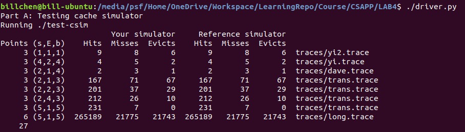
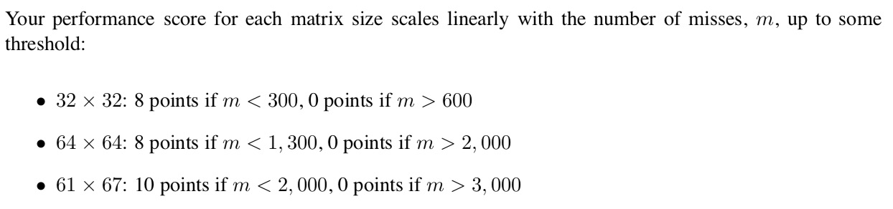
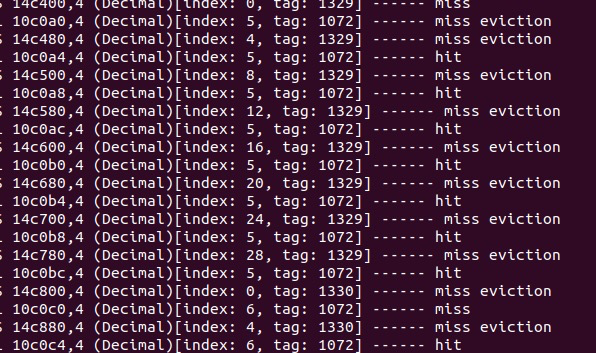
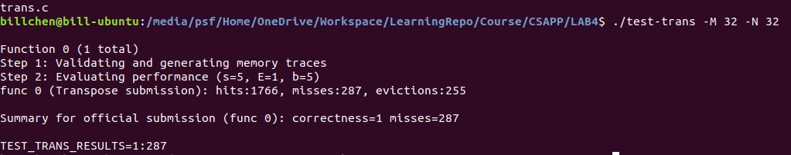
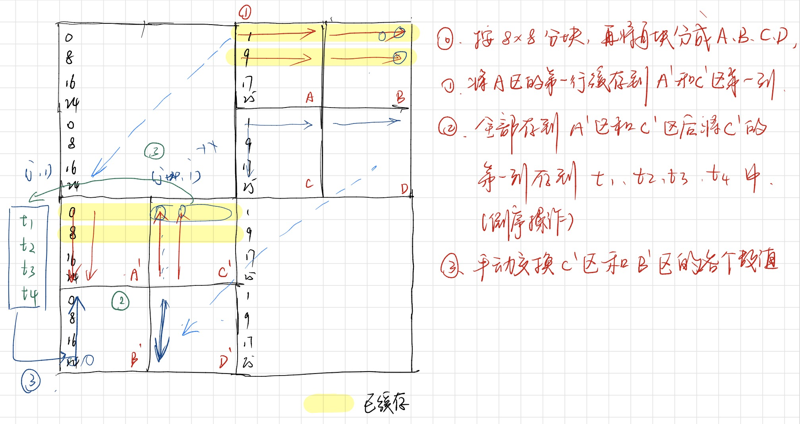
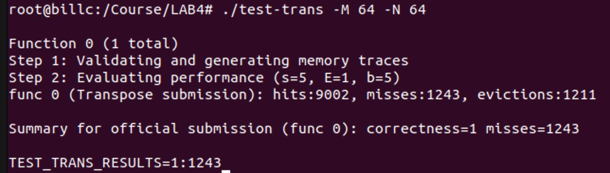
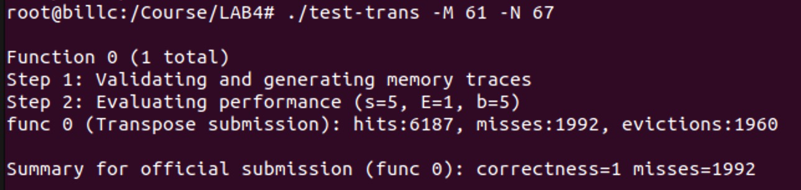
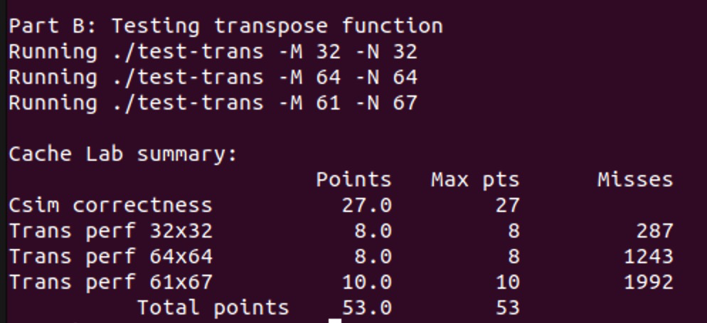

# Lab 4 实验分析

从官方文档得知需要完善 `csim.c` 和 `trans.c` 文件，第一个是模拟一个高速缓存的程序并从由 `valgrind` 程序生成的 `trace` 文件中统计 hit, miss 和 eviction 的数量。第二个文件需要优化矩阵转置程序降低程序的不命中度。

## PART A

这一部分的核心是使用了一个结构体来模拟一个缓存行：

```c
typedef struct {
	int valid;
	ulong tag;
	clock_t time;
} CacheLine;
```

再通过把缓存行在内存中动态分配成一个二维数组，实现模拟缓存的功能。并且使用了`typedef CacheLine *CacheSet;` 和 `typedef CacheSet *CacheHead;` 来让程序更整齐。输入来源于文件和命令行参数。可以用 `getopt()` 函数来解析参数。

各个函数的作用如下：

- `CacheHead CacheInit(int S, int E)` 为缓存动态分配内存；
- `int CacheJudge(CacheHead cache, ulong index, ulong tag)` 判断缓存状态，是否有效，标记匹配；
- `void CacheEvict(CacheHead cache, ulong index, ulong tag)` 执行 eviction 操作；
- `void CacheTouch(CacheHead cache, ulong index, ulong tag)` 执行读取操作，只更新时间戳；
- `void CacheInsert(CacheHead cache, ulong index, ulong tag)` 执行缓存写入操作；
- `void Adder(int type, int num)` 计数器，增加 hit, miss 和 eviction 的数量，并根据配置选择打印信息；
- `void printByte(bytept h, int len)` 逐字节以 16 进制打印内存数据；
- `void Execute(CacheHead cache, char type, ulong address, int len)` 主要的执行函数；
- `int main(int argc, char *args[]) ` main 函数，读取参数，打开文件；

完整的程序代码如下：

```c
// Written By @BillChen
// 2019.5.20
#include "cachelab.h"
#include <getopt.h>
#include <stdio.h>
#include <stdlib.h>
#include <time.h>
#include <unistd.h>

#define MACHINE_BITS 64
#define NEED_EVICT -1
#define NO_MATCH -2
#define CACHED 1
#define ADD_HIT 1
#define ADD_MISS 2
#define ADD_EVICT 3

int totalMissCount = 0;
int totalHitCount = 0;
int totalEvictCount = 0;

typedef unsigned long ulong;
typedef unsigned char *bytept;
const char *optString = "s:E:b:t:hVv";

struct globalOptions {
	int setIndexBits;
	int associativity;
	int blockBits;
	int verboseFlag;
	int tagBits;
	int superVerboseFlag;
	char *traceDir;
} globalOptions;
struct result {
	int hit;
	int miss;
	int evict;
};
typedef struct {
	int valid;
	ulong tag;
	clock_t time;
} CacheLine;

typedef CacheLine *CacheSet;
typedef CacheSet *CacheHead;

void usage() {
	printf("Usage: ./csim [-hv] -s <s> -E <E> -b <b> -t <tracefile>\n");
	printf("-h get help info\n");
	printf("-v Optional verbose flag that displays trace info\n");
	printf("-V Optional super verbose flag that displays very detailed trace info\n");
	printf("-s <s> Number of set index bits\n");
	printf("-E <E> Associativity (number of lines per set)\n");
	printf("-b <b> Number of block bits\n");
	printf("-t <tracefile>: Name of the valgrind trace to replay\n");
}

CacheHead CacheInit(int S, int E) {
	CacheHead cache;
	cache = calloc(1 << S, sizeof(CacheSet));
	if (cache == NULL) {
		printf("Fail to allocate memory for cache.\n");
		exit(EXIT_FAILURE);
	}
	int i = 0;
	for (i = 0; i < 1 << S; i++) {
		if ((cache[i] = calloc(E, sizeof(CacheLine))) == NULL) {
			printf("Fail to allocate memory for cache.\n");
			exit(EXIT_FAILURE);
		}
	}
	for (i = 0; i < 1 << S; i++) {
		int j;
		for (j = 0; j < E; j++) {
			cache[i][j].valid = 0;
		}
	}
	return cache;
}

int CacheJudge(CacheHead cache, ulong index, ulong tag) {
	int i;
	int fullFlag = 1;
	int matchFlag = 0;
	for (i = 0; i < globalOptions.associativity; i++) {
		if (cache[index][i].valid == 0) {
			fullFlag = 0;
		}
		if (cache[index][i].tag == tag && cache[index][i].valid == 1) {
			matchFlag = 1;
		}
	}
	if (matchFlag == 1)
		return CACHED;
	if (fullFlag == 1)
		return NEED_EVICT;
	else
		return NO_MATCH;
}

void CacheInsert(CacheHead cache, ulong index, ulong tag) {
	int freeLine = 0, i;
	for (i = 0; i < globalOptions.associativity; i++) {
		if (cache[index][i].valid == 0)
			break;
		freeLine++;
	}
	CacheLine *target = cache[index] + freeLine;
	target->tag = tag;
	target->valid = 1;
	target->time = clock();
}

void CacheEvict(CacheHead cache, ulong index, ulong tag) {
	int firstLine = 0, i = 0;
	clock_t firstCachedTime = cache[index][i].time;
	for (i = 0; i < globalOptions.associativity; i++) {
		if (cache[index][i].time < firstCachedTime) {
			firstCachedTime = cache[index][i].time;
			firstLine = i;
		}
	}
	CacheLine *target = cache[index] + firstLine;
	target->tag = 0;
	target->time = 0;
	target->valid = 0;
}

void CacheTouch(CacheHead cache, ulong index, ulong tag) {
	int touchLine = 0;
	while (cache[index][touchLine].tag != tag)
		touchLine++;
	cache[index][touchLine].time = clock();
}

void Adder(int type, int num) {
	int v = globalOptions.verboseFlag;
	switch (type) {
	case ADD_EVICT:
		totalEvictCount += num;
		if (v && num != 0)
			printf("eviction ");
		break;
	case ADD_HIT:
		totalHitCount += num;
		if (v && num != 0)
			printf("hit ");
		break;
	case ADD_MISS:
		totalMissCount += num;
		if (v && num != 0)
			printf("miss ");
	}
}

void printByte(bytept h, int len) {
	int i;
	for (i = 0; i < len; i++)
		printf("%.2x ", h[i]);
	printf("\n");
}

void Execute(CacheHead cache, char type, ulong address, int len) {
	ulong index = (address << globalOptions.tagBits) >> (MACHINE_BITS - globalOptions.setIndexBits);
	ulong tag = address >> (globalOptions.blockBits + globalOptions.setIndexBits);
	int status = CacheJudge(cache, index, tag);
	if (globalOptions.verboseFlag == 1) {
		if(globalOptions.superVerboseFlag == 1){
			printf("\n[address:] ");
			printByte((bytept)&address, sizeof(long));
			printf("[index:] ");
			printByte((bytept)&index, sizeof(long));
			printf("[tag:] ");
			printByte((bytept)&tag, sizeof(long));
			printf("(Decimal)[index: %ld, tag: %ld]\n------------------------------------------- ", index, tag);
		} 
		else{
			printf("(Decimal)[index: %ld, tag: %ld] ------ ", index, tag);
		}
	}
	switch (status) {
	case CACHED:
		CacheTouch(cache, index, tag);
		if (type == 'M') {
			Adder(ADD_HIT, 1);
			Adder(ADD_HIT, 1);
		} else {
			Adder(ADD_HIT, 1);
		}
		break;
	case NO_MATCH:
		CacheInsert(cache, index, tag);
		if (type == 'M') {
			Adder(ADD_MISS, 1);
			Adder(ADD_HIT, 1);
		} else {
			Adder(ADD_MISS, 1);
		}
		break;
	case NEED_EVICT:
		CacheEvict(cache, index, tag);
		CacheInsert(cache, index, tag);
		if (type == 'M') {
			Adder(ADD_MISS, 1);
			Adder(ADD_EVICT, 1);
			Adder(ADD_HIT, 1);

		} else {
			Adder(ADD_MISS, 1);
			Adder(ADD_EVICT, 1);
		}
		break;
	default:
		printf("Unknown error.\n");
		exit(EXIT_FAILURE);
	}
	if (globalOptions.verboseFlag == 1) {
		printf("\n");
	}
}

int main(int argc, char *args[]) {
	char ch;
	while ((ch = getopt(argc, args, optString)) != -1) {
		switch (ch) {
		case 's':
			if (atoi(optarg) < 0) {
				printf("Unvalid input for <s>. Try Again.\n");
				exit(EXIT_FAILURE);
			}
			globalOptions.setIndexBits = atoi(optarg);
			break;
		case 'E':
			if (atoi(optarg) < 0) {
				printf("Unvalid input for <E>. Try Again.\n");
				exit(EXIT_FAILURE);
			}
			globalOptions.associativity = atoi(optarg);
			break;
		case 'b':
			if (atoi(optarg) < 0) {
				printf("Unvalid input for <b>. Try Again.\n");
				exit(EXIT_FAILURE);
			}
			globalOptions.blockBits = atoi(optarg);
			break;
		case 't':
			globalOptions.traceDir = optarg;
			break;
		case 'v':
			globalOptions.verboseFlag = 1;
			break;
		case 'h':
			usage();
			exit(EXIT_FAILURE);
		case 'V':
			globalOptions.verboseFlag = 1;
			globalOptions.superVerboseFlag = 1;
			break;
		default:
			usage();
			exit(EXIT_FAILURE);
			break;
		}
	}
	globalOptions.tagBits = MACHINE_BITS - globalOptions.blockBits - globalOptions.setIndexBits;

	FILE *traceFile = fopen(globalOptions.traceDir, "r");
	if (traceFile == NULL) {
		printf("Fail to open file: %s\n", globalOptions.traceDir);
		exit(EXIT_FAILURE);
	}
	CacheHead cache = CacheInit(globalOptions.setIndexBits, globalOptions.associativity);
	char traceLine[32];
	while (fgets(traceLine, 32, traceFile) != NULL) {
		char mode;
		ulong address;
		int len;
		sscanf(traceLine, " %c %lx,%d", &mode, &address, &len);
		if (mode == 'I')
			continue;
		if (globalOptions.verboseFlag == 1) {
			printf("%c %lx,%d ", mode, address, len);
		}
		Execute(cache, mode, address, len);
	}
	printSummary(totalHitCount, totalMissCount, totalEvictCount);
	free(cache);
	return 0;
}
```

最终在 `./driver.py` 的测试下，该程序和 `csim-ref` 的运行结果一致。



## PART B

按照官方文档的说明，需要在 `trans.c` 中写入一个优化的矩阵转置函数。尽可能地降低不命中率。使用命令 `./test-trans -M <rol> -N <col>` 可以查看这一转置函数的不命中数。生成的 `trace.fi` 文件还可以利用 PART A 写的缓存模拟器检查命中情况。



从官方文档得知要在 PART B 中得到分数需要完成三个测试并满足对应的不命中数条件。

### Test I: 32 * 32

由于程序使用的缓存 block size 为 5，也就是有 2^5 的块大小，为32字节。`sizeof(int) = 4`，所以可以存储下 8 个整数。


先研究原始的一个简单的矩阵转置函数：

```c
int i, j, tmp;
for (i = 0; i < N; i++) {
    for (j = 0; j < M; j++) {
        tmp = A[i][j];
        B[j][i] = tmp;
    }
}
```

这一函数的运行结果出现了 1000 多个 miss。提取一小部分原始的文件，利用 csim 查看详细的 miss 和 eviction 信息，可以发现在读取的时候发生了严重的抖动，导致了大量 miss 的出现。



所以可以利用矩阵分块的思想。每一行数组都可以被存入 4 个缓存行中，一共有 32 个缓存行，所以**每过 8 行就会出现一次和前面相同的组索引**，发生 miss 和 eviction。所以考虑将 32 * 32 的矩阵分成 16 个 8 * 8 的矩阵，每一次都将一行的 8 个 int 分别存储进 t1 - t4。

即，将矩阵划分成如下结构：

| 1   | 2   | 3   | 4   |
| --- | --- | --- | --- |
| 5   | 6   | 7   | 8   |
| 9   | 10  | 11  | 12  |
| 13  | 14  | 15  | 16  |

其中每一个小块都是 8 * 8，每一行能够完整存储到缓存行中的矩阵。这种情况在 `transpose_submit()` 中的代码如下：

```c
if(N == 32 && M == 32){
    int i, j, k;
    int t1, t2, t3, t4, t5, t6, t7, t8;
    for (i = 0; i < 32; i += 8) {
        for (j = 0; j < 32; j += 8) {
            for (k = 0; k < 8; k++) {
                t1 = A[i + k][j];
                t2 = A[i + k][j + 1];
                t3 = A[i + k][j + 2];
                t4 = A[i + k][j + 3];
                t5 = A[i + k][j + 4];
                t6 = A[i + k][j + 5];
                t7 = A[i + k][j + 6];
                t8 = A[i + k][j + 7];
                B[j][i + k] = t1;
                B[j + 1][i + k] = t2;
                B[j + 2][i + k] = t3;
                B[j + 3][i + k] = t4;
                B[j + 4][i + k] = t5;
                B[j + 5][i + k] = t6;
                B[j + 6][i + k] = t7;
                B[j + 7][i + k] = t8;
            }
        }
    }
}
```
结果如下图所示：



### Test II: 64 * 64

和第一种情况测试类似。但是由于大小变成了 64 * 64，每过 4 行就会出现一次冲突的情况。所以可以先分成 8 * 8 的块，然后再把 8 * 8 的块分成 4 个 4 * 4 的块。读取一行，但存储进的位置如图所示。逆序存储之后再逐行处理 C' 和 B' 处的数据。

由于之前是逆序存储的，所以在 C' 会把 0 加载进缓存，而在 B' 会把 24 加载进缓存，再利用 t1, t2, t3, t4 四个变量作临时变量存储，交换 0 行和 24 行的位置。

大概的逻辑如下图所示：



具体的代码实现如下：

```c
else if (N == 64 && M == 64) {
    int t0, t1, t2, t3, t4, t5, t6, t7;
    for (int i = 0; i < N; i += 8) {
        for (int j = 0; j < M; j += 8) {
            for (int k = i; k < i + 4; k++) {
                t0 = A[k][j];
                t1 = A[k][j + 1];
                t2 = A[k][j + 2];
                t3 = A[k][j + 3];
                t4 = A[k][j + 4];
                t5 = A[k][j + 5];
                t6 = A[k][j + 6];
                t7 = A[k][j + 7];
                B[j][k] = t0;
                B[j + 1][k] = t1;
                B[j + 2][k] = t2;
                B[j + 3][k] = t3;
                B[j + 0][k + 4] = t7;
                B[j + 1][k + 4] = t6;
                B[j + 2][k + 4] = t5;
                B[j + 3][k + 4] = t4;
            }
            for (int h = 0; h < 4; h++) {
                t0 = A[i + 4][j + 3 - h];
                t1 = A[i + 5][j + 3 - h];
                t2 = A[i + 6][j + 3 - h];
                t3 = A[i + 7][j + 3 - h];
                t4 = A[i + 4][j + 4 + h];
                t5 = A[i + 5][j + 4 + h];
                t6 = A[i + 6][j + 4 + h];
                t7 = A[i + 7][j + 4 + h];
                B[j + 4 + h][i + 0] = B[j + 3 - h][i + 4];
                B[j + 4 + h][i + 1] = B[j + 3 - h][i + 5];
                B[j + 4 + h][i + 2] = B[j + 3 - h][i + 6];
                B[j + 4 + h][i + 3] = B[j + 3 - h][i + 7];
                B[j + 3 - h][i + 4] = t0;
                B[j + 3 - h][i + 5] = t1;
                B[j + 3 - h][i + 6] = t2;
                B[j + 3 - h][i + 7] = t3;
                B[j + 4 + h][i + 4] = t4;
                B[j + 4 + h][i + 5] = t5;
                B[j + 4 + h][i + 6] = t6;
                B[j + 4 + h][i + 7] = t7;
            }
        }
    }
}
```
得到如下结果：



### Test III: 61 * 67

这一测试中由于矩阵不规则，而且也不是 8 的倍数，所以在行与行之间没有特别明显的冲突不命中的关系。可以尝试用分块矩阵的方式优化。经过尝试 8 * 8 的分块和 16 * 16 的分块后，发现使用 16 * 16 的分块方式可以将 miss 数降低到 2000 以下。

这一部分的代码如下：

```c
else {
    int i, j, k, h;
    for (i = 0; i < N; i += 16) {
        for (j = 0; j < M; j += 16) {
            for (k = i; k < i + 16 && k < N; k++) {
                for (h = j; h < j + 16 && h < M; h++) {
                    B[h][k] = A[k][h];
                }
            }
        }
    }
}
```
可以得到 1992 的 miss 数。



最终在 `./driver.py` 的运行结果中，Part B 获得如下结果：



---

> 一如既往地，现在又是凌晨了 orz.
>
> 2019.5.22