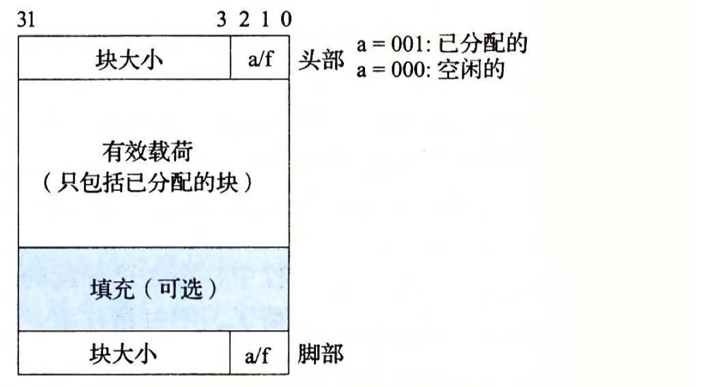
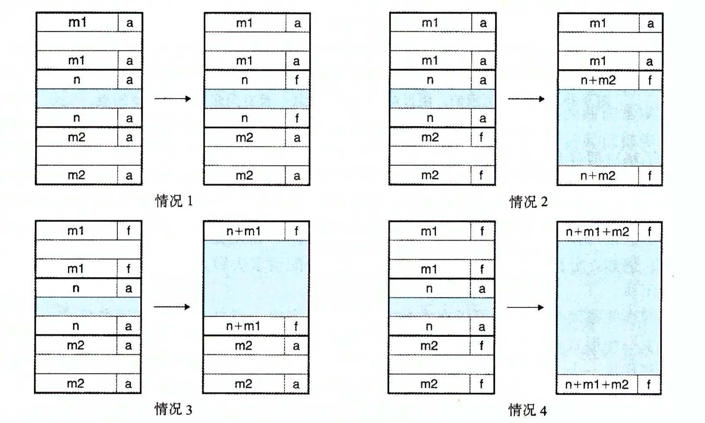
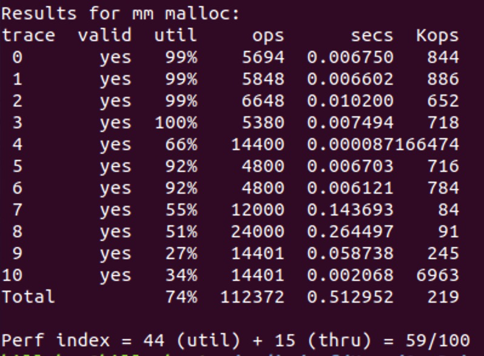

# Lab 5 实验分析

根据官方文档要求，需要实现自己的 malloc, free, realloc, init 函数。完成在 mm.c 中的以下几个函数

```c
int mm_init(void);
void *mm_malloc(size_t size);
void mm_free(void *ptr);
void *mm_realloc(void *ptr, size_t size);
```

在这个实验中采用的是双字对齐，隐式链表，采用首次适配。先在mm.h中声明宏定义：

```c
#define WSIZE 4
#define DSIZE 8
#define CHUNKSIZE (1<<12)
#define MAX(x,y) ((x)>(y)?(x):(y))
#define PACK(size,alloc) ((size)|(alloc))
#define GET(p)     (*(unsigned int *)(p))
#define PUT(p,val) (*(unsigned int *)(p) = (val))
#define GET_SIZE(p)  (GET(p) & ~0x7)
#define GET_ALLOC(p) (GET(p) & 0x1)
#define HDRP(bp) ((char *)(bp) - WSIZE)
#define FTRP(bp) ((char *)(bp) + GET_SIZE(HDRP(bp)) - DSIZE)
#define NEXT_BLKP(bp) ((char *)(bp) + GET_SIZE(((char *)(bp) - WSIZE)))
#define PREV_BLKP(bp) ((char *)(bp) - GET_SIZE(((char *)(bp) - DSIZE)))
```

然后将需要用到的函数和辅助函数定义如下：

```c
extern void *extend_heap(size_t words);
extern void *coalesce(void *bp);
extern void *find_fit(size_t size);
extern void place(void *bp,size_t asize);
extern int mm_init (void);
extern void *mm_malloc (size_t size);
extern void mm_free (void *ptr);
extern void *mm_realloc(void *ptr, size_t size);
static char *heap_listp = 0; //指向块首的指针
```

## mm_init()

代码如下：
```c
int mm_init(void) 
{
    /* Create the initial empty heap */
    if ((heap_listp = mem_sbrk(4*WSIZE)) == (void *)-1) 
        return -1;
    PUT(heap_listp, 0);                          /* Alignment padding */
    PUT(heap_listp + (1*WSIZE), PACK(DSIZE, 1)); /* Prologue header */ 
    PUT(heap_listp + (2*WSIZE), PACK(DSIZE, 1)); /* Prologue footer */ 
    PUT(heap_listp + (3*WSIZE), PACK(0, 1));     /* Epilogue header */
    heap_listp += (2*WSIZE);                      

    /* Extend the empty heap with a free block of CHUNKSIZE bytes */
    if (extend_heap(CHUNKSIZE/WSIZE) == NULL) 
        return -1;
    return 0;
}
```



- 以堆底为起始位置，新建四个WSIZE（4bytes or 32bits）大小的块 
- 第一块什么都不放作为填充字 
- 第二、三块分别作为序言块的头和脚 
- 第四块作为结尾块 
- 然后将指针后移两块，指向序言块脚部起始位置，随后调用extend_heap()，申请CHUNKSIZE大小的空间，以备用。

## extend_heap()

代码如下：
```c
static void *extend_heap(size_t words){
    char *bp;
    size_t size;
    size = (words%2) ? (words+1)*WSIZE : words*WSIZE;
    if((long)(bp=mem_sbrk(size))==(void *)-1)
        return NULL;
    PUT(HDRP(bp),PACK(size,0));
    PUT(FTRP(bp),PACK(size,0));
    PUT(HDRP(NEXT_BLKP(bp)),PACK(0,1));
    return coalesce(bp);
}
```
这个函数将堆扩容指定 byte 大小。如果指定 words 大小不为 8 的倍数则向上取整使得每次扩容都是八字节对齐 ，最后将头、脚内容补齐并将下一个块置为结尾块，最后调用coalesce()函数堆 bp 进行合并操作后返回

## mm_malloc()
```c
void *mm_malloc(size_t size)
{
    size_t asize;
    size_t extendsize;
    char *bp;
    if(size ==0) return NULL;
    if(size <= DSIZE){
        asize = 2*(DSIZE);
    }else{
        asize = (DSIZE)*((size+(DSIZE)+(DSIZE-1)) / (DSIZE));
    }
    if((bp = find_fit(asize))!= NULL){
        place(bp,asize);
        return bp;
    }
    extendsize = MAX(asize,CHUNKSIZE);
    if((bp = extend_heap(extendsize/WSIZE))==NULL){
        return NULL;
    }
    place(bp,asize);
    return bp;
}
```
此函数申请大小为 size 的空间。asize 为对 size 进行8字节对齐检查后的大小，extendsize 为取 CHUNKSIZE 和 asize 中较大的一个。

先用 find_fit() 在现有的块中进行搜索，如果搜索到了，即用 place() 函数将 asize 大小的空间放到bp中。由于有可能全部分也可能分割成一个占用块和一个空闲块，所以不能粗暴的完全占用，要写一个 place() 函数来分配。如果找不到合适块，就向堆申请新空间，新空间的大小为extendsize，然后再用 place() 函数放入。

## mm_free()

代码如下：
```c
void mm_free(void *bp)
{
    if(bp == 0)
    return;
    size_t size = GET_SIZE(HDRP(bp));
    PUT(HDRP(bp), PACK(size, 0));
    PUT(FTRP(bp), PACK(size, 0));
    coalesce(bp);
}

这个函数释放指针指向的占用块。将块的头尾块的alloc信息改为 0，然后进行合并。
```

## coalesce()

```c
static void *coalesce(void *bp){
    size_t  prev_alloc = GET_ALLOC(FTRP(PREV_BLKP(bp)));
    size_t  next_alloc = GET_ALLOC(HDRP(NEXT_BLKP(bp)));
    size_t size = GET_SIZE(HDRP(bp));
    if(prev_alloc && next_alloc) {
        return bp;
    }else if(prev_alloc && !next_alloc){
            size += GET_SIZE(HDRP(NEXT_BLKP(bp)));
            PUT(HDRP(bp), PACK(size,0));
            PUT(FTRP(bp), PACK(size,0));
    }else if(!prev_alloc && next_alloc){
        size += GET_SIZE(HDRP(PREV_BLKP(bp)));
        PUT(FTRP(bp),PACK(size,0));
        PUT(HDRP(PREV_BLKP(bp)),PACK(size,0));
        bp = PREV_BLKP(bp);
    }else {
        size +=GET_SIZE(FTRP(NEXT_BLKP(bp)))+ GET_SIZE(HDRP(PREV_BLKP(bp)));
        PUT(FTRP(NEXT_BLKP(bp)),PACK(size,0));
        PUT(HDRP(PREV_BLKP(bp)),PACK(size,0));
        bp = PREV_BLKP(bp);
    }
    return bp;
}
```

此函数将对传入的块指针进行前后检查，如果前面块或者后面块同样为空闲块，就进行合并。首先获取前后块的空闲状态，然后进行条件判断，会出现四种情况：(如图所示) 

1. 前后都忙碌
2. 前忙碌，后空闲
3. 前空闲，后忙碌
4. 前后都空闲 



## find_fit()

```c
static void *find_fit(size_t size){
    void *bp;
    for(bp = heap_listp; GET_SIZE(HDRP(bp))>0; bp = NEXT_BLKP(bp)){
        if(!GET_ALLOC(HDRP(bp)) && (size <= GET_SIZE(HDRP(bp)))){
            return bp;
        }
    }
    return NULL;
}
```

此函数从头至尾遍历堆，找到合适大小的块则返回指向该块的指针（即头部块末尾），找不到则返回 NULL。

## place()
```c
static void place(void *bp,size_t asize){
    size_t csize = GET_SIZE(HDRP(bp));
    if((csize-asize)>=(2*DSIZE)){
        PUT(HDRP(bp),PACK(asize,1));
        PUT(FTRP(bp),PACK(asize,1));
        bp = NEXT_BLKP(bp);
        PUT(HDRP(bp),PACK(csize-asize,0));
        PUT(FTRP(bp),PACK(csize-asize,0));
    }else{
        PUT(HDRP(bp),PACK(csize,1));
        PUT(FTRP(bp),PACK(csize,1));
    }
}
```

此函数将经过8字节对齐大小的空间放到指定的块中。如果分割后原块剩余大小大于 2*DSIZE 即16 字节，则进行分块。否则将整个块都占用。

## mm_realloc()

代码如下：
```c
void *mm_realloc(void *ptr, size_t size)
{
    size_t oldsize;
    void *newptr;
    /* If size == 0 then this is just free, and we return NULL. */
    if(size == 0) {
    mm_free(ptr);
    return 0;
    }
    /* If oldptr is NULL, then this is just malloc. */
    if(ptr == NULL) {
    return mm_malloc(size);
    }
    newptr = mm_malloc(size);
    /* If realloc() fails the original block is left untouched  */
    if(!newptr) {
    return 0;
    }
    /* Copy the old data. */
    oldsize = GET_SIZE(HDRP(ptr));
    if(size < oldsize) oldsize = size;
    memcpy(newptr, ptr, oldsize);
    /* Free the old block. */
    mm_free(ptr);
    return newptr;
}
```

此函数返回指向一个大小为 size 的区域指针。如果 ptr 不是空指针：函数调用的效果和 mm_malloc(size) 效果是一样的；如果 ptr 是空指针：先按照 size 指定的大小分配空间，将原有数据从头到尾拷贝到新分配的内存区域，而后释放原来 ptr 所指内存区域。

最后执行 `./mdriver -t reaces -v` 得到运行结果如下：


