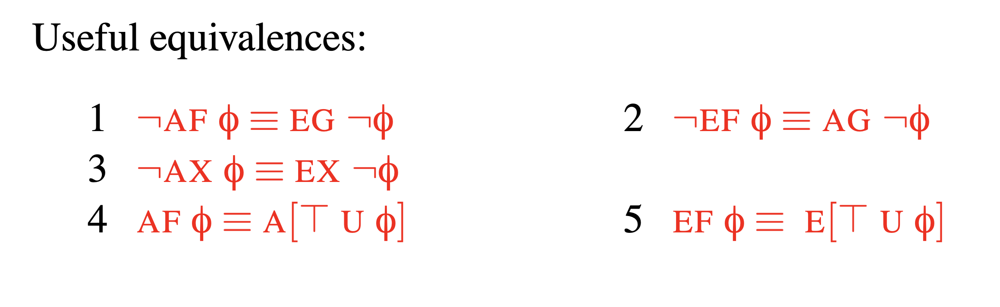
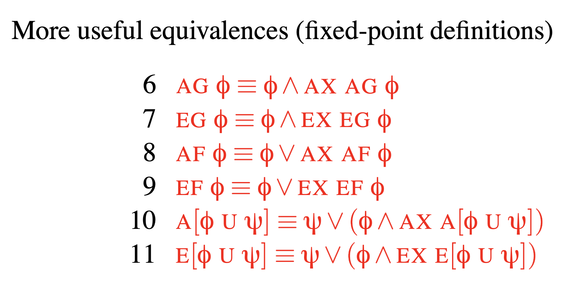

# CSLogic Outline

## Predicate Logic

- Function symbols:
- Predicate symbols:

Note that one can always do without function symbols, by using a predicate symbol instead. However, it is usually neater to use function symbols. To generate a neater symbol.

- Free variable: $\phi$ is a leaf node such that there’s no path upwards from node $x$ to $\forall x$ or $\exists x$.
- Bound variable: Vice versa.

## Verification by Model Checking

- Some useful equivalences:

### Labeling algorithm

- May cause the problem of state explosion
- No efficient general solution for now