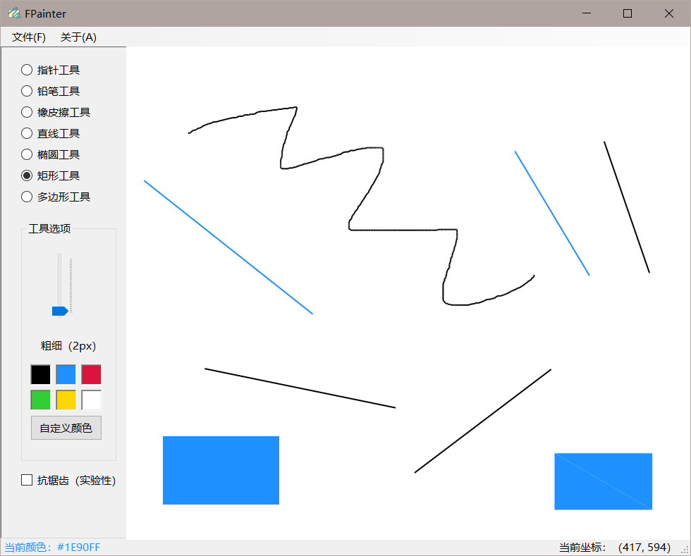

## 项目介绍

如图所示，项目采用 C# 和 OpenGL 实现了一个含有各种画图工具，并带有图形界面的画图软件。

## 主要功能

- 铅笔工具
- 橡皮擦工具
- 各种几何图形的绘制
- 颜色选择功能和自定义颜色功能
- 可调节的笔刷粗细
- 抗锯齿功能（OpenGL自带）
- 友好的用户图形界面。

大多数工具直接拖动使用即可，对于多边形工具，需要连续点击画布，并以双击完成一次绘制，下一次点击将不会连线。

文件中的新建菜单可以清空画布。

本项目采用了 SharpGL 库以在 C# 中接入 OpenGL。在项目中将和绘图有关的函数包装在了 Painter.cs 类中，用 MainForm.cs 内的事件监听函数调用。

在开发时采用的屏幕缩放率为 125%，在该缩放率下会取得最佳显示效果。如果出现显示错位等问题可以试着调整屏幕缩放率，或将 app.manifest 中的 dpiAware 调整为 false。

> 2019.10.10，陈俊潼