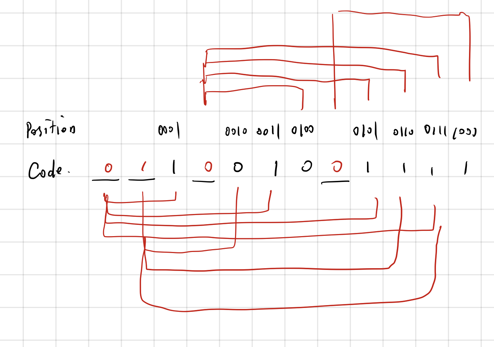
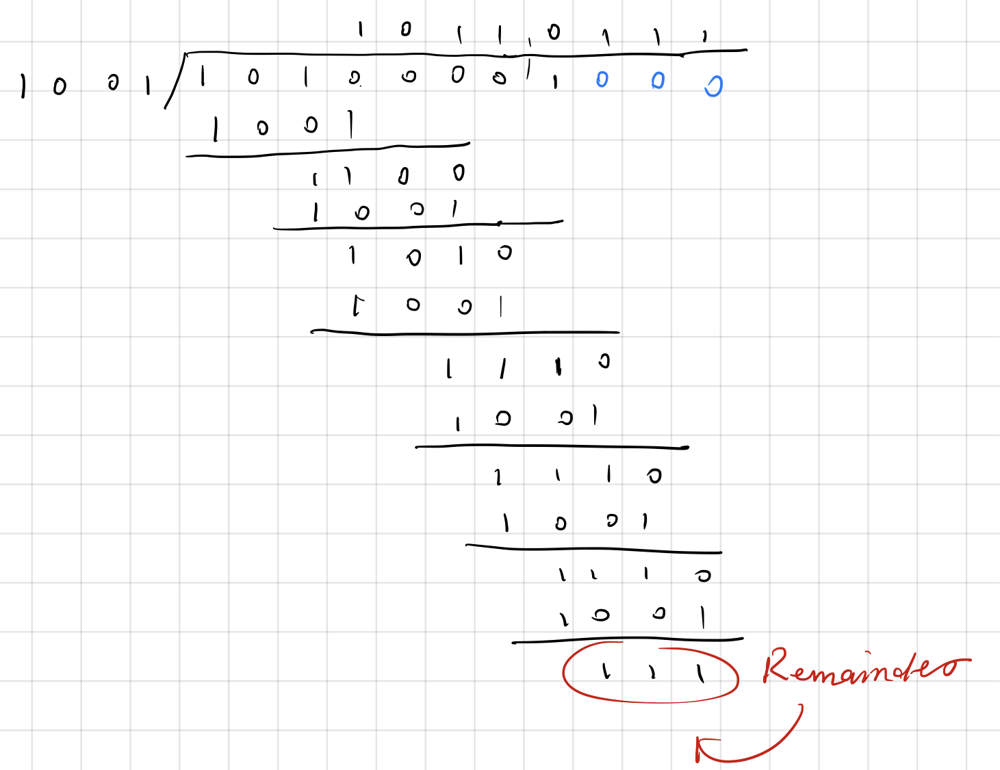

# Computer Networks Chapter 3 Assignment

> 10185101210 陈俊潼, ECNU

#### 3-1. The following data fragment occurs in the middle of a data stream for which the byte stuffing algorithm described in the text is used: A B ESC C ESC FLAG FLAG D. What is the output after stuffing?

The output should be` A B ESC ESC C ESC ESC ESC FLAG ESC FLAG D`.

#### 3-2. Can you think of any circumstances under which an open-loop protocol (e.g., a Hamming code) might be preferable to the feedback-type protocols discussed throughout this chapter?

1. If the transmitting time is quite long, an open-loop protocol can save a lot of time because the sender doesn't need wait for the feedback.
2. If the chance of error is low, the open-loop protocol is more efficient.

#### 3-3. An 8-bit byte with binary value 10101111 is to be encoded using an even-parity Hamming code. What is the binary value after encoding?

Calculating Process:

011001001111.

#### 3-4. What is the remainder obtained by dividing x7 + x5 +1by the generator polynomial x3+1?

Calculating Process:

The Remainder is 111.

#### 3-5. Suppose that a message 1001 1100 1010 0011 is transmitted using Internet Checksum (4-bit word). What is the value of the checksum?

(1001 + 1100 + 1010 + 0011) mod 1000 = 0010

checksum = (0010)' = 1101.'

#### 3-6. A channel has a bit rate of 4 kbps and a propagation delay of 20 msec. For what range of frame sizes does stop-and-wait give an efficiency of at least 50%?

Bit rate = 4 kbps
One-way propagation delay = 20 ms
Efficiency = Transmission time of packet/(Transmission time of packet + 2 * Propagation delay)
To reach the efficiency of at least 50%, let x be the frame size.

So 0.5 = a /(a + 2 * 20)
a = x / 4000 * 1000
Therefore, Minimum frame size = x = 160bit.

#### 3-7. A 3000-km-long T1 trunk is used to transmit 64-byte frames using protocol 5. If the propagation speed is 6 μsec/km, how many bits should the sequence numbers be?

Protocol 5 here refers to the Go-Back-N Protocol.

The propagation time = 6 * 3000 = 18 ms, the transmission speed for T1 Trunk is 1.544Mbps = 1544 bits/ms

Transmission time for a frame is
64byte * 8 / 1.544 * 10 ^ 6  * 1000 + PROPAGATION TIME = 0.3ms + 36ms = 36.2

During the 0.3 ms, frames to be sent: 
1544 * 36.3 / (64 * 8) = 109. Because 2 ^ 7 = 128 > 109, so 7 bits are needed for the sequence number. 

#### 3-8. In protocol 6, when a data frame arrives, a check is made to see if the sequence number differs from the one expected and no_nak is true. If both conditions hold, a NAK is sent. Otherwise, the auxiliary timer is started. Suppose that the else clause were omitted. Would this change affect the protocol’s correctness?

Protocol 6 here refers to the Selective Repeat Protocol.

Yes, if there isn't an auxiliary timer， when a batch of frames arrives and all acknoledgements were lost, the sender will just repeatedly send the first frame again and again because it doesn't know it's already sent and have no time limit, thus there will be a deadlock.

#### 3-9. Suppose that the three-statement while loop near the end of protocol 6 was removed from the code. Would this affect the correctness of the protocol or just the performance? Explain your answer.

Protocol 6 here refers to the Selective Repeat Protocol.

Yes. These code were used for placing the incoming acknowledgements. If there's not this, the sender would keep timing out and no further frame will be sent.

#### 3-10. Frames of 1000 bits are sent over a 1-Mbps channel using a geostationary satellite whose propagation time from the earth is 270 msec. Acknowledgements are always piggybacked onto data frames. The headers are very short. Three-bit sequence numbers are used. What is the maximum achievable channel utilization for

(a) Stop-and-wait?

(b) Protocol 5?

(c) Protocol 6?

The time needed for trasmitting a frame: 1000 bits / 1Mbps = 1 ms
The time needed for the first frame to arrive: 270 ms
The time neede for the acknowlegement to send: 1ms
The time needed for the feedback acknowlement to arrive: 270ms

During this time cycle, 542 ms is needed in total.

If there were k frames are sent in the 542 ms, the efficiency is k/542.

a) k = 1, efficiency = 1/542;
b) Protocol 5 refers to Go-Back-N Protocol, as three-bit sequence number is used, there can be 7 frames be sending, efficiency = 7/542;
c) In the Selective Repeat Protocol, the size of window should be no larger than half of the sequence number, so k = 4, efficiency = 4/542.