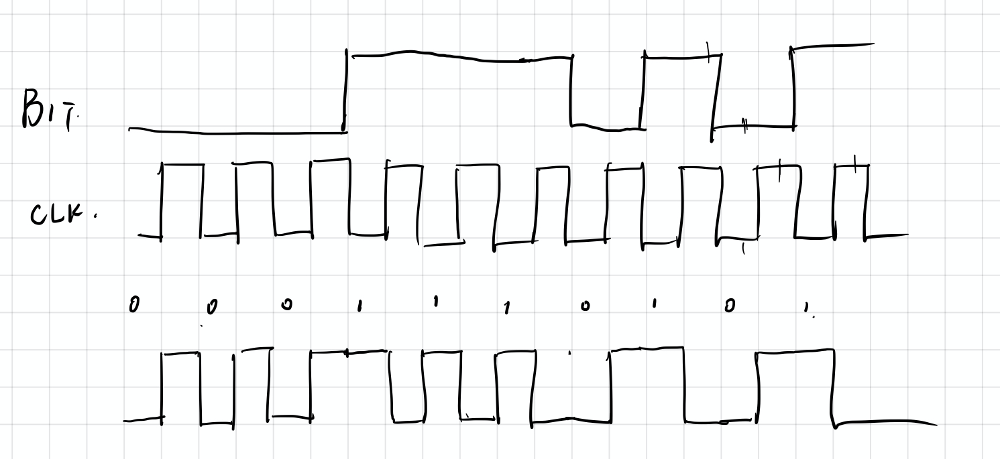

# Computer Networks Chapter 4 Assignment

> 10185101210 陈俊潼

#### 4-1 A group of N stations share a 56-kbps pure ALOHA channel. Each station outputs a 1000-bit frame on average once every 100 sec, even if the previous one has not yet been sent (e.g., the stations can buffer outgoing frames). What is the maximum value of N?

For pure ALOHA the usable bandwidth is 18.4%, 56kbps * 0.184 = 10.304 kbps;
For each station, the bandwidth needed is 1000/100 = 10 b/s
So there can be approximately 10304/10 = 1030 stations.

#### 4-2 Measurements of a slotted ALOHA channel with an infinite number of users show that 10% of the slots are idle.

(a) What is the channel load, G?

(b) What is the throughput? 

(c) Is the channel underloaded or overloaded?

a. From Poisson theorem: p(k=0) = e^-G = 0.1
	So we can calculate that G=-ln0.1 = 2.3

b. S = GP(k=0) = 2.3 * 0.1 = 0.23

c. Because the channel load is 2.3 > 1, so the channel is overloaded.

#### 4-3 What is the baud rate of classic 10-Mbps Ethernet?

The classic Ethernet uses Manchester Encoding, which two symbols carry a bit. So the baud rate is 20Mbaudps.

#### 4-4 Sketch the Manchester encoding on a classic Ethernet for the bit stream 0001110101.

The classic Ethernet uses Manchester Encoding.

#### 4-5 Consider  building a CSMA/CD network running at 1 Gbps over a 1-km cable with no repeaters. The signal speed in the cable is 200,000 km/sec. What is the minimum frame size?

Time needed to transfer: 1/200,000 = 0.005 ms.
Time needed for the feedback to get back: 0.01ms.
Minimmum frame size: 1Mbpms * 0.01 = 0.01Mb = 10kbit.

#### 4-6. Two CSMA/CD stations are each trying to transmit long (multiframe) files. After each frame is sent, they contend for the channel, using the binary exponential backoff algorithm. What is the probability that the contention ends on round *k*, and what is the mean number of rounds per contention period?

#### 4-7. Ethernet frames must be at least 64 bytes long to ensure that the transmitter is stillgoing in the event of a collision at the far end of the cable. Fast Ethernet has the same 64-byte minimum frame size but can get the bits out ten times faster. How is it possible to maintain the same minimum frame size?

The longest cable length is 1/10 of the classic Ethernet.

#### 4-8. Suppose that an 11-Mbps 802.11b LAN is transmitting 64-byte frames back-to-back over a radio channel with a bit error rate of 10−7. How many frames per second will be damaged on average?

The probability for all bits to be transmitted correctly is: p = (1-10^-7)^512 = 0.9999488013
Frames per second: 11 * 10^6 / 512 = 21484.375
So the number of damaged frame is: 21484.375 * (1-p) = 1

#### 4-9. A switch designed for use with fast Ethernet has a backplane that can move 10 Gbps. How many frames/sec can it handle in the worst case?

#### 4-10. Store-and-forward switches have an advantage over cut-through switches with respect to damaged frames. Explain what it is.

Store-and-forward switches store entire frames before forwarding them. After a frame comes in, the checksum can be verified. If the frame is damaged, it is discarded immediately. With cut-through, damaged frames cannot be discarded by the switch because by the time the error is detected, the frame is already gone.