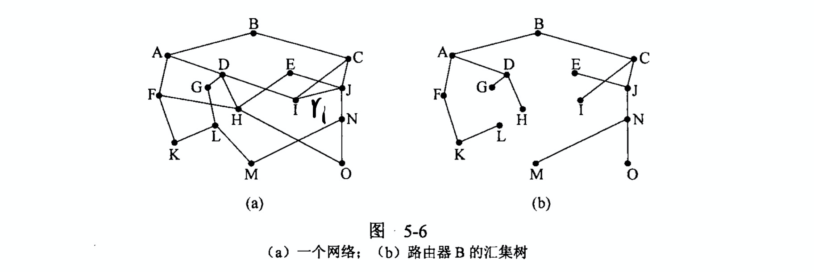
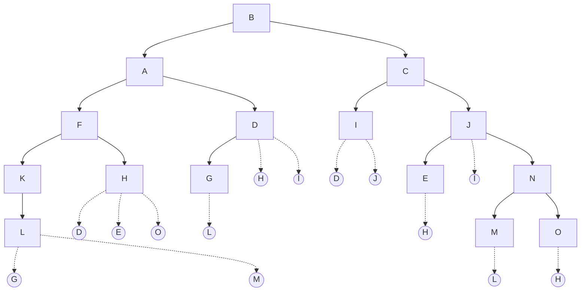
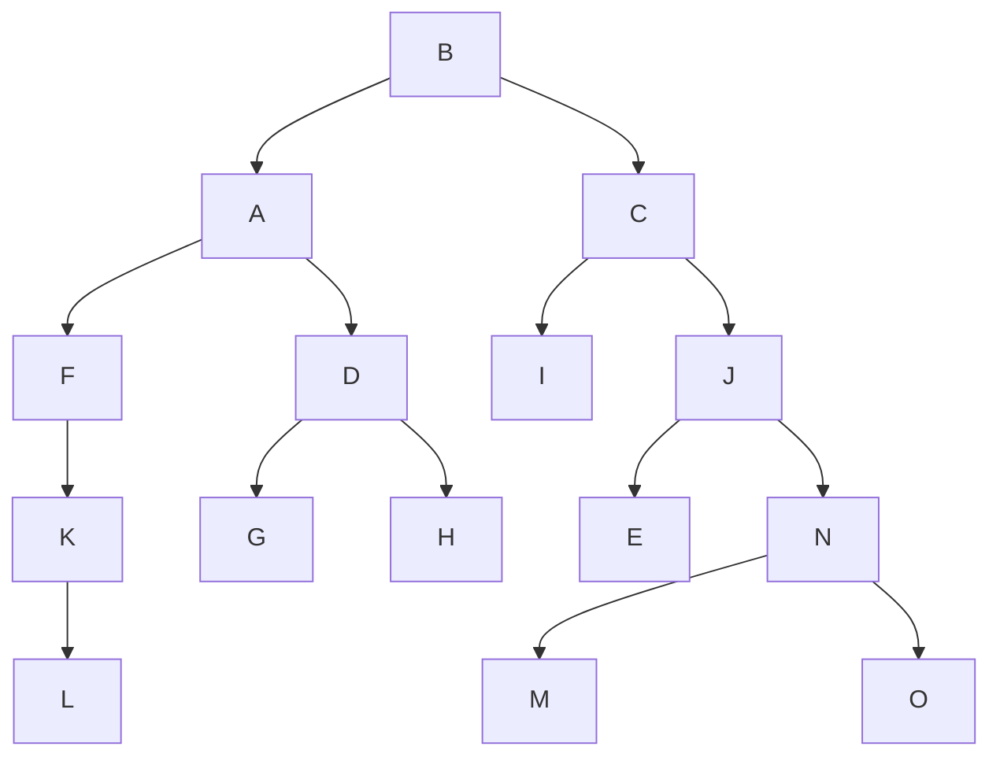

# Computer Networks Chapter 5 Assignment

> 10185101210 陈俊潼，East China Normal University

#### 5-1 Consider the network of Fig.5-7, but ignore the weights on the lines. Suppose that it uses flooding as the routing algorithm. If a packet sent by A to D has a maximum hop count of 3, list all the routes it will take. Also tell how many hops worth of bandwidth it consumes.

**Solution:** the paths: ABCD; ABCF; ABEF; AGEF; AGHF; AGHD

It consumes 24 hops of bandwidth.

#### 5-2 Consider the network of Fig. 5-12(a). Distance vector routing is used, and the following vectors have just come in to router C: from B: (5, 0, 8, 12, 6, 2); from D: (16, 12, 6, 0, 9, 10); and from E: (7, 6, 3, 9, 0, 4). The cost of the links from C to B, D, and E, are 6, 3, and 5, respectively. What is C’s new routing table? Give both the outgoing line to use and the cost.

**Solution:** C's new routing table is shown as follows:

| To   | Time | Route |
| ---- | ---- | ----- |
| A    | 11   | B     |
| B    | 6    | B     |
| C    | 8    | E     |
| D    | 0    | ---   |
| E    | E    | 0     |
| F    | 8    | B     |

#### 5-3 Looking at the network of Fig. 5-6, how many packets are generated by a broadcast from B, using 

(a) Reverse path forwarding?

(b) The sink tree?

**Solution:**

a.

There are 2 + 4 + 10 + 8 + 4 = 28 packets in total.

b.

There are 2 + 4 + 5 + 3 = 14 packets in total.

#### 5-4 Suppose that host A is connected to a router R 1, R 1 is connected to another router, R 2, and R 2 is connected to host B. Suppose that a TCP message that contains 900 bytes of data and 20 bytes of TCP header is passed to the IP code at host A for delivery to B. Show the Total length, Identification, DF, MF, and Fragment offset fields of the IP header in each packet transmitted over the three links. Assume that link A-R1 can support a maximum frame size of 1024 bytes including a 14-byte frame header, link R1-R2 can support a maximum frame size of 9 bytes, including an 8-byte frame header, and link R2-B can support a maximum frame size of 512 bytes including a 12-byte frame header.

**Solution: **

Suppose the length of IPv4 header is 20 bytes.

A --> R1:

Total Length: 900 + 20 + 20 = 940, Identification: X, DF = 0, MF = 0, Offset = 0.

R1 --> R2:

1. Length = 500, Identification = X, DF = 0, MF = 1, Offset = 0.

2. Length = 460, Identification = X, DF = 0, MF = 0, Offset = 60.

R2 -- > B:

1. Length = 500, Identification = X, DF = 0, MF = 1, Offset = 0.

2. Length = 460, Identification = X, DF = 0, MF = 0, Offset = 60.

#### 5-5 A router is blasting out IP packets whose total length (data plus header) is 1024 bytes. Assuming that packets live for 10 sec, what is the maximum line speed the router can operate at without danger of cycling through the IP datagram ID number space?

**Solution:** There are 2 bytes in the ID flags, so there could be 2^16 different id.

Living time: 1024 * 2 ^ 16 = 2 ^ 26.

Maximum line speed:  2 ^ 26 bytes / 10 = 6,710,886.4 bytes/sec. = 6.4 MB/s.

#### 5-6 An IP datagram using the Strict source routing option has to be fragmented. Do you think the option is copied into each fragment, or is it sufficient to just put it in the first fragment? Explain your answer.

**Solution: **It should be copied into each fragment so the receiver know that this is a strict source routing packet.

#### 5-7 Suppose that instead of using 16 bits for the network part of a class B address originally, 20 bits had been used. How many class B networks would there have been?

**Solution:** The network part contains net bit and 10 for Class B ip addresses.

So there are 2 ^ (20 - 2) = 262144 networks.

#### 5-8 A network on the Internet has a subnet mask of 255.255.240.0. What is the maximum number of hosts it can handle?

240(10) = 1111 0000(2)

So there are 12 bits for host, 2 ^ 12 = 4096 hosts.

#### 5-9  A large number of consecutive IP addresses are available starting at 198.16.0.0. Suppose that four organizations, A, B, C, and D, request 4000, 2000, 4000, and 8000 addresses, respectively, and in that order. For each of these, give the first IP address assigned, the last IP address assigned, and the mask in the w.x.y.z/s notation.

**Solution:**

| Organization | First IP    | Last IP       | Subnet mask    |
| ------------ | ----------- | ------------- | -------------- |
| A            | 192.16.0.0  | 192.16.15.255 | 192.16.0.0/20  |
| B            | 192.16.16.0 | 192.16.23.255 | 192.16.16.0/21 |
| C            | 192.16.32.0 | 192.16.47.255 | 192.16.32.0/20 |
| D            | 192.16.64.0 | 192.16.95.255 | 192.16.64.0/19 |

#### 5-10 A router has the following (CIDR) entries in its routing table:

| Address/mask   | Next hop    |
| -------------- | ----------- |
| 135.46.56.0/22 | Interface 0 |
| 135.46.60.0/22 | Interface 1 |
| 192.53.40.0/23 | Router 1    |
| default        | Router 2    |

For each of the following IP addresses, what does the router do if a packet with that
address arrives?
(a) 135.46.63.10
(b) 135.46.57.14
(c) 135.46.52.2
(d) 192.53.40.7
(e) 192.53.56.7

**Solution：**

a. To interface 1

b. To interface 0

c. To Router 2

d. To Router 1

e. To Interface 0

---

2019.12.17