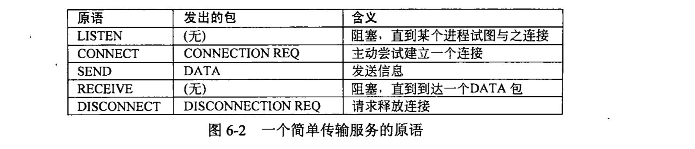
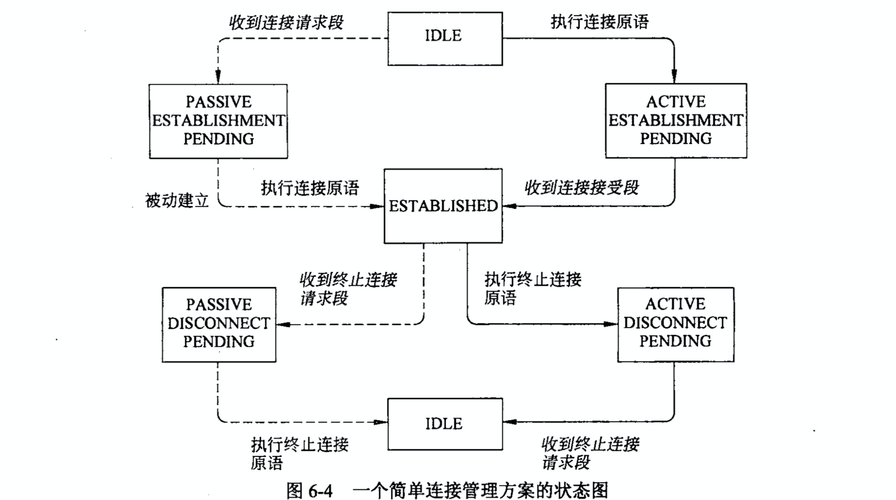

# Computer Networks Chapter 6 Assignment

> 10185101210 陈俊潼, 10185101210

#### 6-1 In our example transport primitives of Fig. 6-2, LISTEN is a blocking call. Is this strictly necessary? If not, explain how a nonblocking primitive could be used. What advantage would this have over the scheme described in the text?

Sol. 

This is not strictly necessary. A nonblocking primitive could be used via a signal, telling the server that is in the statement of listen and then the server could response with ACCEPT or REJCET. By using this scheme, the server could handle more jobs while listening rather than block and wait.

#### 6-2 In the underlying model of Fig. 6-4, it is assumed that packets may be lost by the network layer and thus must be individually acknowledged. Suppose that the network layer is 100 percent reliable and never loses packets. What changes, if any, are needed to Fig. 6-4?

Sol.

Since the  network layer is 100 percent reliable, there will be no confirm from PASSIVE ESTABLISHMENT PENDING to ESTABLISHED because the connection can be established at once without acknowledging each side. 

Remark: 连接必然是可靠的，所以当服务器同意了之后可以立即跳到建立状状态（确认对方肯定能收到，没有必要处于PASSIVE ESTABLISHMENT PENDING 状态。对于断开，由于收到了客户端的断开请求之后只意味着不会再收到客户端的数据包。此时仍需要保持PENDING状态，因为服务器可能还有数据需要向客户端发送。

#### 6-3 Why does the maximum packet lifetime, T, have to be large enough to ensure that not only the packet but also its acknowledgements have vanished?

Sol. Because if there occured some error during transportation, the packet sould be resend. And this happends after the acknowledgment vanished, so the packet lifetime have to be longer than this so that it can be retransmitted correctly.

Remark：I DON'T KNOW(

#### 6-4 Discuss the advantages and disadvantages of credits versus sliding window protocols.

Sol. The sliding window protocol is easier to maintain and develop because it only have to maintain a window size variation, however the credits is more flexible and have dynamic management of buffer and can handle more circumstances.

Remark: Credit：信用量协议可以动态控制缓存

#### 6-5 Why does UDP exist? Would it not have been enough to just let user processes send raw IP packets?

Sol. No. The raw IP packets doesn't contain port number, it only know where to send, but can't define which process to send. And the receiver can't resolve the packet properly without port number.

#### 6-6.Suppose that the TCP congestion window is set to 18 KB and a timeout occurs. How big will the window be if the next four transmission bursts are all successful? Assume that the maximum segment size is 1 KB.

Sol. The window will be 2 * 2 * 2 = 8KB big.

#### 6-7. A TCP machine is sending full windows of 65,535 bytes over a 1-Gbps channel that has a 10-msec one-way delay. What is the maximum throughput achievable? What is the line efficiency?

Sol. Time for one window to send : 2 * 10 = 20 ms; (50 windows/sec).

Maximum data rate: 3,276,750 bytes/sec.

The line efficiency is 26.4 Mbps/1000 Mbps = 2.6%

#### 6-8 In a network whose max segment is 128 bytes, max segment lifetime is 30 sec, and has 8-bit sequence numbers, what is the maximum data rate per connection?

Sol. Max sequence number a sender can send: 2^8 - 1 = 255;

The maximum data rate = 255 * 128 / 30 = 1.088 kB/s.

#### 6-9.A CPU executes instructions at the rate of 1000 MIPS. Data can be copied 64 bits at a time, with each word copied costing 10 instructions. If an coming packet has to be copied four times, can this system handle a 1-Gbps line? For simplicity, assume that all instructions, even those instructions that read or write memory, run at the full1 000-MIPS rate.

Sol. It takes 4 × 10 = 40 instructions to copy 8 bytes. Forty instructions takes 40 nsec. Thus, each byte requires 5 nsec of CPU time for copying. The system is thus capable of handling 200 MB/sec or 1600 Mbps. It can handle a 1- Gbps line if no other bottleneck is present. The size of the sequence space is 264 bytes.

#### 6-10 To get around the problem of sequence numbers wrapping around while old packets still exist, one could use 64-bit sequence numbers. However, theoretically, an optical fiber can run at 75 Tbps. What maximum packet lifetime is required to make sure that future 75-Tbps networks do not have wraparound problems even with 64-bit sequence numbers? Assume that each byte has its own sequence number, as TCP does.

Sol. 2 × 10 ^ 19 bytes. A 75-Tbps transmitter uses up sequence space at a rate of 9.375 × 10 ^ 12 sequence numbers per second. It takes 2 million seconds to wrap around. Since there are 86,400 seconds in a day, it will take over 3 weeks to wrap around, even at 75 Tbps. A maximum packet lifetime of less than 3 weeks will prevent the problem. In short, going to 64 bits is likely to work for quite a while.