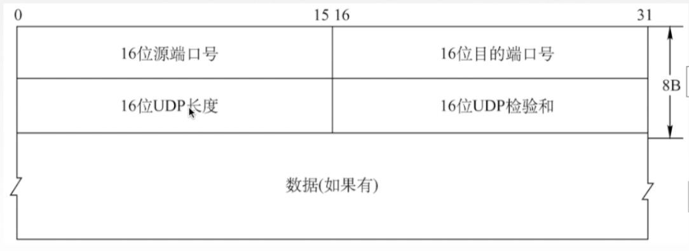
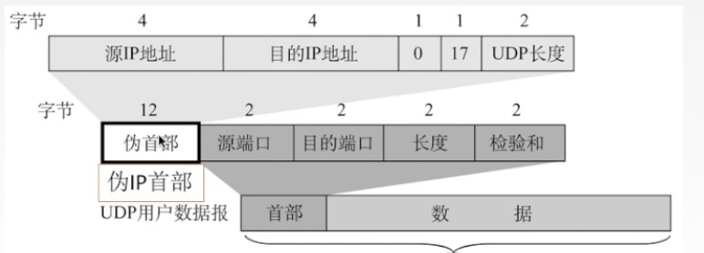
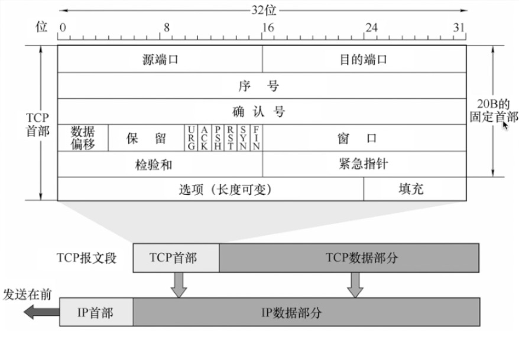
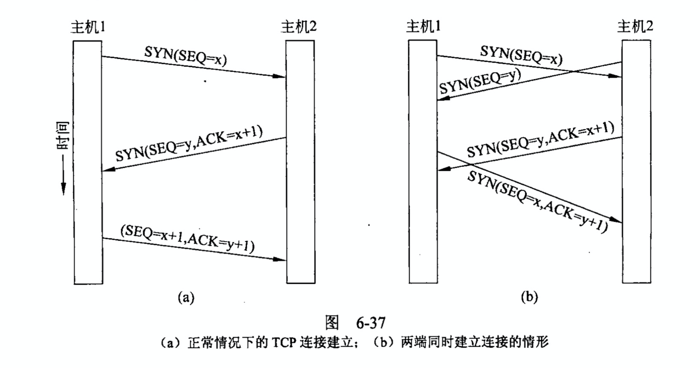
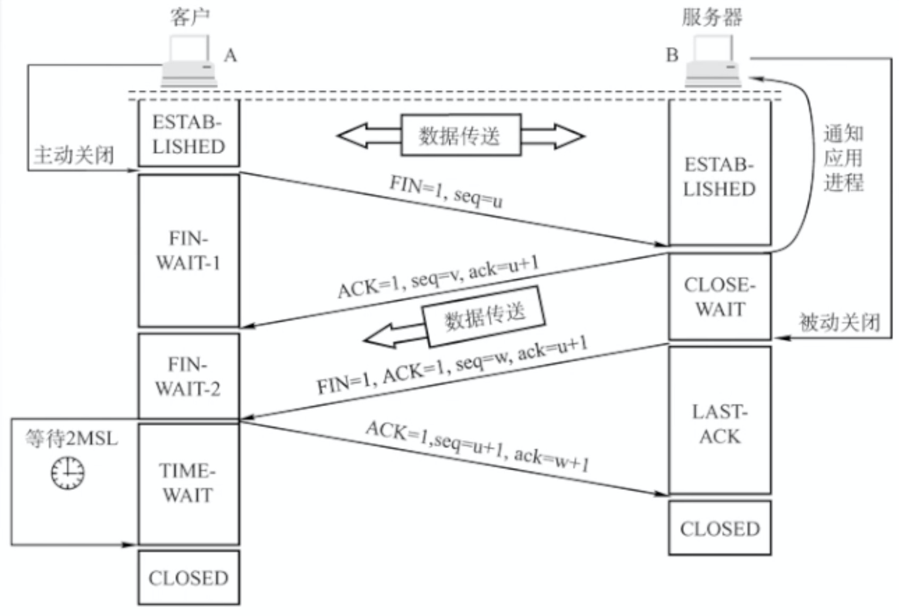
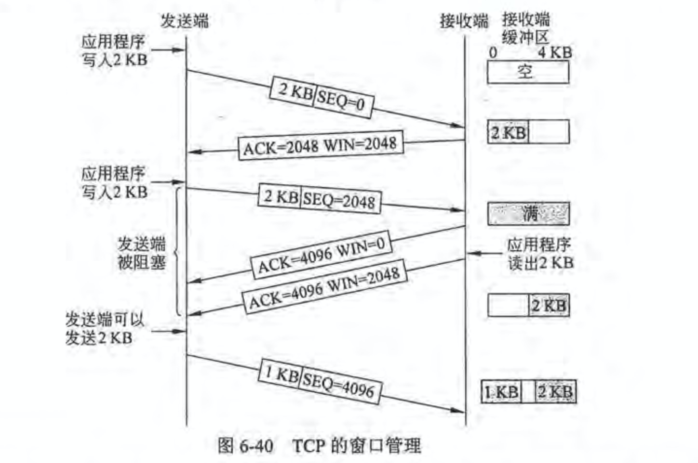
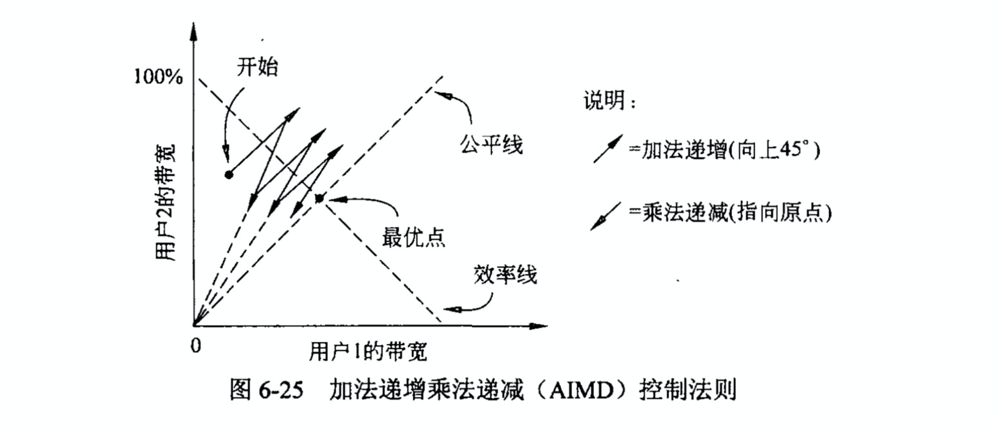
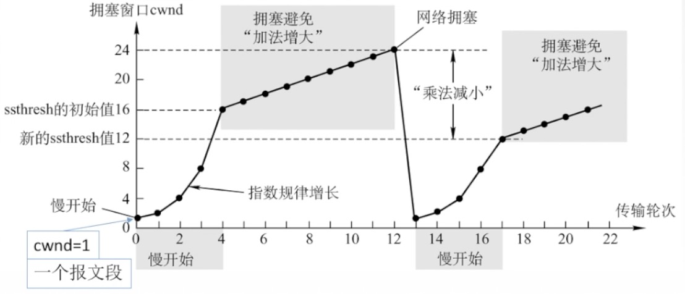
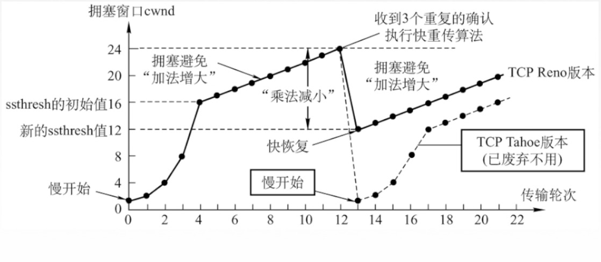

# Computer Networks Final Review

> Bill Chen, 2019.12

 **7 - layer OSI Model**

## Chapter 4 Media Access Control

### 一些术语

- DCF: Distributed Coordination Function -- ad hoc architecture
- PCF: Point Coordination Function (Optional)
- OFDM: Orthodox Frequency Division Multiplexing (正交频分多路复用)
- DSSS: Direct-Sequence Spread Spectrum(直接扩频)
- FHSS: Frequency-Hopping Spread Spectrum (跳频扩频技术)
- BSS: Basic Server Set
- ESS: Extent Server Set (服务集)
- 发展历史： 802.11b (QPSK 2.4GHz) -> 802.11a (OFDM 5.0GHz) -> 802.11g (OFDM .4GHz)

## Chapter 6 Transport Layer

### UDP 协议

- User Datagram Protocol

- 不建立连接

- 减少了开销和时延

- 使用最大努力交付，不保证可靠交付（由应用层保证可靠）

- 面型报文的，适合一次性传输少量数据的网络应用

  - 应用层给了多长的报文就发送多长的报文
  - 首部开销少，仅 8 字节

- 简单的协议头：

  - 

- 伪首部：仅用于计算校验和

  - 

  - 校验和的计算：加上伪首部，全0填充校验和字段，全0填充数据部分，求和，把反码填入校验和字段
  - 校验和的验证：填上伪首部，伪首部+首部+数据采用二进制反码求和，如果结果全为1则无差错，否则出错

### TCP 协议特点

- Transmission Control Protocol

- 面向连接（点对点，虚连接）
- 每个TCP是只能点对点的（不能用于多端口）
- 提供可靠的交付服务，无差错，不丢失
- 提供全双工通信（可以同时发送和接受数据）
  - 具有发送缓存和接受缓存（不可以过早删除因为可能会被删除
- 面向字节流 - 会把数据看做字节流

### TCP 报文格式

- TCP首部必须为 **4字节的整数倍**（填充位的作用）
- 序号字段：**第一个字节使用的编号是多少**（TCP会把每个字节都编号）
- 确认号：期望收到对方下一个报文的字节数
- 加了长度字段之后会有一个字段固定首部多长
- **窗口**：反映了发送方自己可以容纳的最多字节流
  - 体现了自己能容纳的最大大小
- 数据偏移：TCP报文段的数据距离起始部分有多远，（会 x4
  - 用于规定首部有多长
- 校验和：检验 **首部+尾部**，对于头部使用 **ip伪头部** + TCP头
  - 伪首部共有12字节，包含如下信息：源IP地址、目的IP地址、保留字节(置0)、传输层协议号(TCP是6)、TCP报文长度(报头+数据)。（和 UDP 相同）
- 紧急指针：之处紧急数据的字节数
- 6个控制位
  - URG 紧急位：高优先级（移到发送方缓存的最前方
  - ACK 确认为：在连接建立后所有位设置为 1
  - PSH 推送为：接收方应该及时交付给上层（及时从接收方的缓存移走
  - RST 复位：表明出现严重差错，必须释放练级诶
  - SYN 同步位：表示是一个请求连接或接受连接的报文
  - 终止位 FIN：表明报文发送完毕，需要终止
- 选项：MSS、SACK、扩大等

### TCP 建立连接

- 三次握手建立连接

  - 

  - SYN = 1, seq = x（报文段是序号x

  - SYN = 1, ACK = 1, seq = y, ack = x + 1 （服务器收到的确认就是客户端的x + 1）

    - 服务器分配缓存和变量，并向客户端返回确认报文

  - SYN = 0, ACK = 1, sqe = x + 1, ack = y + 1 

    - 客户端分配缓存和变量

  - > SYN 洪泛攻击
    >
    > 黑客发送大量请求字段，使客户端无法完成连接的建立(Solution. SYN cookie)

- 服务原语

  

### TCP 连接释放

- 释放连接的两种方式
  - 对称释放：两方作为单独的连接控制断开与连接 （**TCP使用的方式**）
  - 非对称释放：一旦一方断开连接两侧都断开
- 四次挥手
  -  
  - 客户端：FIN = 1, seq = u
  - 服务器：ACK = 1, seq = v, ack = u + 1（服务器端关闭，已经处于 CLOSE-WAIT 状态）
  - 服务器（发完数据）：FIN = 1, ACK = 1, seq = w, ack = u + 1（这段时间客户端不可能发送任何数据所以确认位相同）
  - 客户端：回复一个确认报文段，再等待计时器设置的 2MSL 后彻底关闭连接
    - MSL: Maximum Survival Time 数据包的最长生存时间

### TCP 差错控制

- 确认机制：发送方把缓存发送给客户端之后，等待接收方的确认
  - 在收到接收方的确认之后从缓存中删除
  - 接收方使用累计确认的方式把已经收到的数据发送回发送方
  - 之后接收方可以从缓存中删除
  - 如果少了位，接收方 ack 将不会前进
- 重传机制：发送条件复杂，不可简单设置超时重传（会增大网络负荷
  - **RTTs**：Round Trip Time (smooth)：加权的平均往返
    - 超时重传（可能会等待时间过长）
  - 冗余 ACK：每当比期望小大的时候发送一个冗余 ACK，表明期待的下一个字节的序号
    - 比如连续收到多个未来的包，会发送多个 ACK，而接收方确认了多个冗余的 ACK 之后，则认定该包丢失，会重传（快重传）

### TCP 流量控制

- 用于解决点到点的问题（区别于拥塞控制）

- **滑动窗口机制**：动态调整接受缓存机制 - Sliding Window
  - 发送窗口取决于接收窗口 rwnd 和拥塞窗口 cwnd 的最小值
  - 发送方的发送窗口可以变化，根据接收方发送回来的报文段改变
  - 发送也可以指定每一个报文的大小
  - 当窗口满的时候发送方不再发送新的消息，等待超时重传
  - 
  - 死锁解决（例如客户端发送回来的发送包因为传输原因消失
    - TCP设置了计时器，如果超时会发送**探测报文段**
    - 如果窗口仍然为 0，则发送方重新设置持续计时器（超时后重新发送报文段

### TCP 拥塞控制

- 解决问题：网络中的资源不够用（解决客户端之间的问题

- XCP - eXplicit Congestion Protocol 显示拥塞协议
- ECN - Explicit Congestion Notification 显示拥塞通知 
  
  - TCP 协议使用，使用比特位告知发送者是否拥塞但不控制具体拥塞的成都和量	
- **AIMD - Additive Increase Multiplicative Decrease** 加法递增乘法递减法则
  - 达到有效和公平（收敛原则）
  - 

- 四种算法

  - 慢开始和拥塞避免：

    - 
    - 一个传输轮次：发送了一批报文段并收到确认的时间 - RTT
    - ssthresh：慢开始阈值，之后则线性增长<u>（新的ssthreash值应当为出现拥塞的大小的 1/2）</u>
    - 发现拥塞之后瞬间缩小到慢开始的情况
    - 增倍时间：一旦收到消息确认，立即翻倍

  - 快重传和快恢复：

    - 

    - 收到冗余 ACK 的时候执行快重传算法，在重传之后 **快恢复**

    - 恢复不用降低到1，只用降低到新的 ssthresh 值，线性加法增大。

    - TCP Reno 已被弃用。

      

