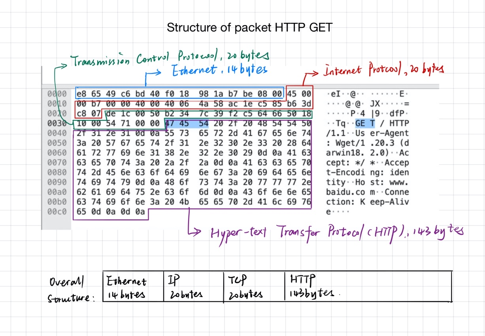

# 华东师范大学软件工程学院实验报告

| 实验课程： | 计算机网络     | 年级： | 2018级      | 实验成绩： |            |
| ---------- | -------------- | ------ | ----------- | ---------- | ---------- |
| 实验名称： | Protocol Layer | 姓名： | 陈俊潼      |
| 实验编号： | 1              | 学号： | 10185101210 | 实验日期： | 2019.11.12 |
| 指导教师： | 刘献忠|组号：   | -      | 实验时间：  | 2019.11.12 |

---

## 一、实验目的

1. 学会通过Wireshark获取各协议层的数据包；

2. 掌握协议层数据包结构；

3. 分析协议开销；

## 二、实验内容与实验步骤

###Step One: Capture a trace

使用Wireshark和wget捕捉数据包。

### Step Two: Inspect a trace

掌握如何在Wireshark中查看一个包。

### Step Three: Packet Structure

辨析并绘制一个数据包的结构，辨识出以太网协议、IP协议、TCP协议、HTTP协议的部分。

### Step Four: Protocol Overhead

根据实验内容，分析除了HTTP以外的额外协议开销。

### Step Three: Demultiplexing Keys

分析解复用键，找出以太网头部中哪一部分是解复用键并且告知它的下一个高层指的是IP、IP头部中哪一部分是解复用键并且告知它的下一一个高层指的是TCP，并找出对应的值。

## 三、实验环境

- macOS 10.5.1

- Wireshark Version 3.0.6

- 电信宽带网络

## 四、实验过程与分析

### Step One: Capture a trace

1. 在Options选项卡中启用Resolve network names，并勾选Wi-Fi的Promiscuous，在设置中勾选Resolve network names，使用Wireshark准备抓包：

 

2. 在终端中输入命令 `wget https://www.baidu.com`即可抓取来自[www.baidu.com](http://www.baidu.com)的数据，Wireshark中会追踪这一过程中的数据包：
    

 

3. 接下来在Wireshark中确定抓取到数据之后，点击停止按钮，停止抓包。查看wget过程中的包数据。
    

### Step 2: Inspect a Trace:

在Wireshark中点几集HTTP GET帧，可以在软件下方看到这一帧的详细信息：

 

### Step 3: Packet Structure

分析HTTP GET帧的结构并绘制总体结构如下：

### Step 4: Protocol Overhead

将接收到的http信息视为有效信息，http协议之下的TCP、IP、Ethernet数据为协议开销。

Wireshark统计的第8帧下载帧中的的有效http字节数为： 2781 bytes.

该帧是由3个TCP段数据合并而来的，加上协议开销为：4 * (Ethernet Overhead + IP Overhead + TCP Overhead) 

= 4 * (14+20+20) = 216 bytes.

发现第5帧SYC ACK帧后有6字节的填充：

所以总的协议开销为216 bytes + padding = 222 bytes.

所以协议开销占比为 222 / (222 + 2781) = 7.39%.

### Step 5: Demultiplexing Keys

- 观察第五帧的Ethernet部分：

发现第13字节和第14字节表示了下一层协议。在这里，0x0800表示为IPv4协议。

观察第五帧IP层的部分：

即IP层的第10个字节表示了下一层协议。这里0x06表示TCP协议。

 

## 五、实验结果总结

思考题目：

- Look at a short TCP packet that carries no higher-layer data. To what entity is this packet des- tined? After all, if it carries no higher-layer data then it does not seem very useful to a higher layer protocol such as HTTP!
- 第一帧数据可以作为一个控制帧，有利于传输双方控制它们之间的传输状态，如果直接传输数据的话容易导致数据丢失。

- In a classic layered model, one message from a higher layer has a header appended by the lower layer and becomes one new message. But this is not always the case. Above, we saw a trace in which the web response (one HTTP message comprised of an HTTP header and an HTTP pay- load) was converted into multiple lower layer messages (being multiple TCP packets). Imagine that you have drawn the packet structure (as in step 2) for the first and last TCP packet carrying the web response. How will the drawings differ?

- In the classic layered model described above, lower layers append headers to the messages passed down from higher layers. How will this model change if a lower layer adds encryption?

- In the classic layered model described above, lower layers append headers to the messages passed down from higher layers. How will this model change if a lower layer adds compression?

 

通过本次实验，我掌握了Wireshark的基本使用方法和数据包的查看方法，也了解了一个数据包中所包含的以太网协议、Internet Protocol协议、Transmission Control Protocol协议头的结构。同时，通过分析协议的开销，我认识到了OSI模型不能过多层的原因之一就是每增加一层就会增加一些额外的开销，降低带宽的使用效率，但这样却可以使协议更严谨，传输更稳定。

在下一次实验中，我将会尝试先关闭其他正在使用网络的程序，避免在抓包的时候被干扰，影响对数据的分析。 

## 六、附录

无