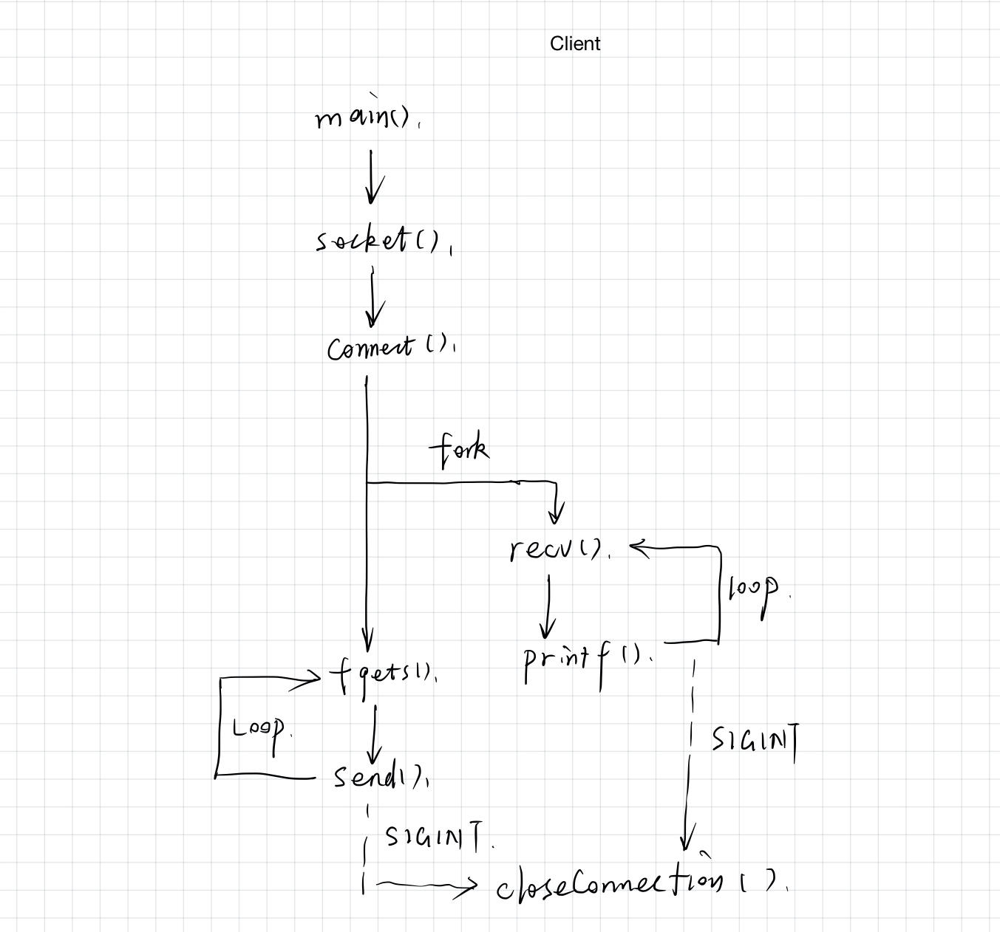
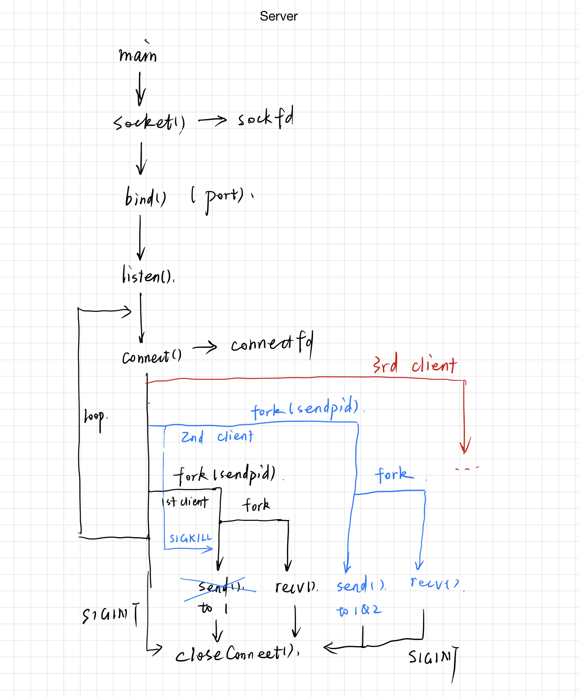
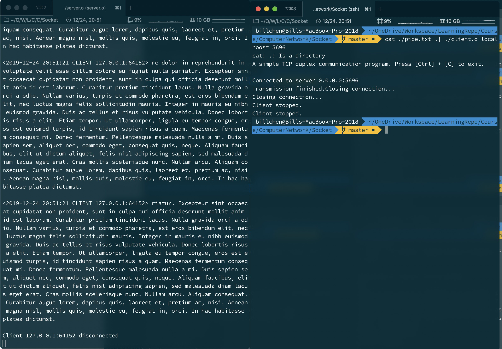
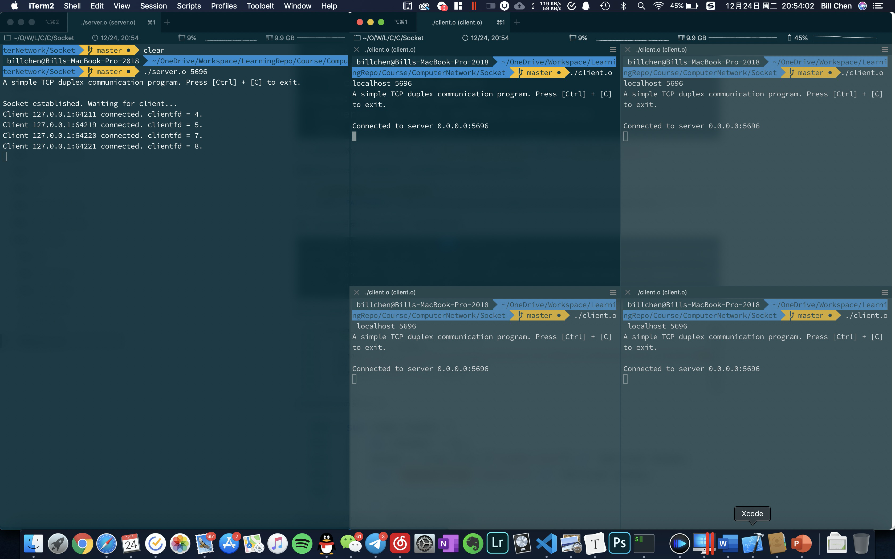
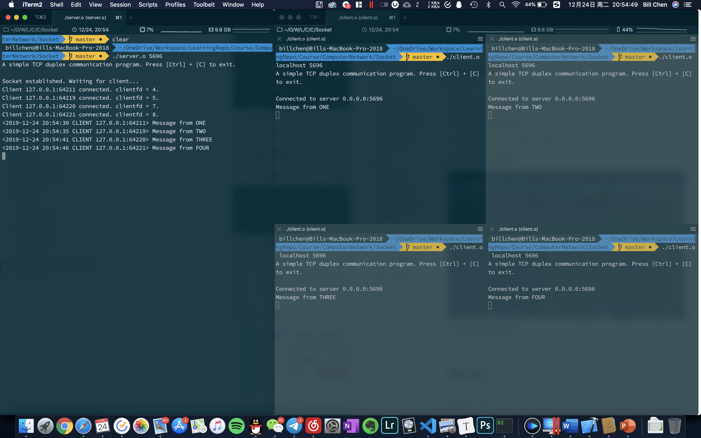
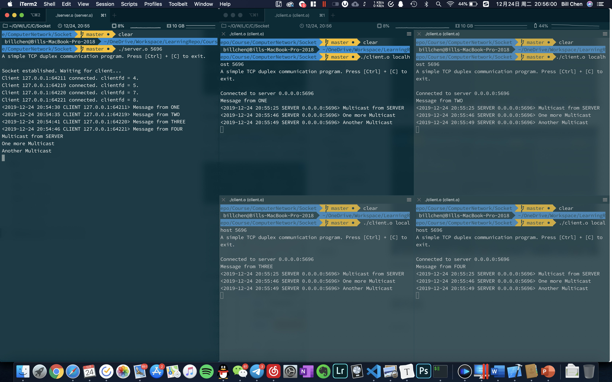

# Socket 编程实验报告

> 10185101210 陈俊潼，East China Normal University.

## 实验过程

### Makefile

为了方便在终端可以输入`make`命令一次性编译，先编写如下 makefile，可以方便地通过输入`make`同时编译客户端和服务器，使用`make clean`命令删除编译的所有文件，使用`make kill`命令杀死所有使用 5696 端口的进程。

```makefile
cc = gc
all: client server
.PHONY : all
client : 
	cc client.c -o client.o
server :
	cc server.c -o server.o
kill:
	kill -9 `lsof -i:5696 -t`
clean:
	rm *.o
```

### 客户端

首先编写客户端。客户端接受终端中的两个命令行参数，分别为要连接的服务器地址`server`和服务器端口`serverport`，接下来程序将使用这两个参数建立连接。在客户端中使用的多进程结构可以用下图表示：



#### 创建 socket

`socket()`函数可以创建一个本地套机字返回给`localfd`，如果创建失败则报错。

```c
	/* 创建 Socket */
	if ((localfd = socket(AF_INET, SOCK_STREAM, IPPROTO_TCP)) == -1) {
		printf("Error occured in socket(): %s(erro: %d)", strerror(errno), errno);
		exit(-1);
	}
```

#### 设置服务器地址

使用一个`sockaddr_in`结构体，设置连接参数并连接服务器，并处理错误信息。其中，`inet_pton()`用于将十进制的点分地址转换为二进制的服务器地址用于 `connect()`函数建立连接。

```c
/* 设置服务地址 */
if ((hp = gethostbyname(host)) < 0){
  printf("Error occured in gethostbyname(): %s(erro: %d)", strerror(errno), errno);
  exit(-1);
}
memset(&socketaddr, 0, sizeof(socketaddr));
socketaddr.sin_family = AF_INET;
socketaddr.sin_port = htons(atoi(serverport));
if (inet_pton(AF_INET, host, &socketaddr.sin_addr) < 0) {
  printf("Error occured in inet_pton(): %s(erro: %d)", strerror(errno), errno);
  exit(-1);
}
/* 连接服务器 */
if (connectfd = connect(localfd, (struct sockaddr *)&socketaddr, sizeof(socketaddr)) == -1){
  printf("Error occured in connect(): %s(erro: %d)", strerror(errno), errno);
  exit(-1);
}

```

#### 处理消息收发

建立连接之创建一个子进程，在子进程中使用`recv()`函数接收数据，父进程中使用`fgets()`和`send()`发送数据。其中`recv()`和`fgets()`都是阻塞的。

为了能让程序在用户按下 [ctrl] + [c] 后能够停止程序和断开连接，需要父进程中将中断程序注册到`closeConnect()`函数中。

同时，使用用户信号`SIGUSR1`注册到`closeConnect()`，在子进程检测到连接断开的时候向父进程使用`kill()`发送`SIGUSR1`信号并退出，以此来结束父进程中阻塞的`fgets()`函数并结束连接清理内存。

这一部分的具体代码如下：

```c
int pid = fork();
	if (pid == 0) {
		signal(SIGINT, NULL);
		/* 子进程，从服务器接受数据 */
		int msglen;
		while((msglen = recv(localfd, inbuffer, MAX_LINE, 0)) > 0){
			inbuffer[msglen] = '\0';
			printf("<%s SERVER %s:%d> %s", getCurrentTime(), inet_ntoa(socketaddr.sin_addr), ntohs(socketaddr.sin_port) ,inbuffer);
			memset(inbuffer, 0, 4096 * sizeof(char));
		}
		printf("Server disconnected.\n");
		kill(father_pid, SIGUSR1);
	}

	else {
		/* 父进程，向服务器发送数据 */
		while (1) {
			if (isatty(fileno(stdin))){
				fgets(outbuffer, MAX_LINE * sizeof(char), stdin);
				if (strcmp(outbuffer, "exit\n") == 0) {
					break;
				}
			}
			else{
				if (fgets(outbuffer, MAX_LINE * sizeof(char), stdin) == NULL) {
					printf("Transmission finished.");
					break;
				}
				strcat(outbuffer, "\n");
			}
			int length = strlen(outbuffer) + 1;
			int ret = send(localfd, outbuffer, length, 0);
			if (ret < 0) {
				printf("Fail to send message: %s(erro: %d)", strerror(errno), errno);
			}
			if(ret == 0){
				printf("Server disconnected.\n");
				break;
			}
			memset(outbuffer, 0, MAX_LINE * sizeof(char));
		}
		kill(father_pid, SIGUSR1);
	}
```

#### 关闭连接

使用`closeConnect()`函数关闭连接。该函数接管了`SIGINT`信号和`SIGUSR1`信号。

```c
void closeConnect(){
	printf("Closing connection...\n");
	if (close(localfd) || close(connectfd) == -1) {
		("Error occured in close(): %s(erro: %d)", strerror(errno), errno);
	} else {
		printf("Client stopped.\n");
		exit(0);
	}
}
```

### 服务器端

服务器首先读取一个端口参数然后利用端口参数`serverport`建立连接。生成套接字之后绑定地址，再用主进程监听连接。当新的连接到达时，会建立两个子进程，分别用于对应客户端的接受和所有客户端的发送。先前建立的所有发送进程也会在新客户端建立后被杀掉，从而保证了可以随时向所有客户端组播消息。

已经连接的客户端将会被记录在结构体数组`connectfd`中，结构体声明如下：

```c
#define CLIENT_CONNECTED 1
#define CLIENT_CLOSED -1
struct client{
	int fd;
	int status;
};
```

`fd`用来存储每一个连接的文件描述符，`status`用来存储连接状态。当建内测到连接断开时会将该连接的`status`设置为`CLIENT_CLOSED`，之后发送进程将不会再向此进程发送消息。

服务器的多进程结构可用以下示意图表示：



#### 启动连接

和客户端一样，服务器需要先建立一个本地`socket`，再将`socket`绑定在本地地址。

这一部分的代码如下：

```c
/* 设置服务器地址 */
	memset(&local, 0, sizeof(local));
	local.sin_addr.s_addr = htons(INADDR_ANY);
	local.sin_family = AF_INET;
	local.sin_port = htons(atoi(serverport));

	/* 创建 Socket */
	if ((localfd = socket(AF_INET, SOCK_STREAM, IPPROTO_TCP)) == -1) {
		printf("Error occured in socket().\n");
		exit(-1);
	}

	/* 绑定地址 */
	if (bind(localfd, (struct sockaddr *)&local, sizeof(local)) == -1) {
		printf("Error occured in bind(): %s(errno: %d)\n", strerror(errno), errno);
		exit(-1);
	}

	/* 创建一个监听 socket */
	if (listen(localfd, MAX_PENDING) == -1) {
		printf("Error occured in listen(): %s(errno: %d)\n", strerror(errno), errno);
		exit(-1);
	}
```

#### 监听建立连接

接下来主进程进入 `while(1)`循环，将会阻塞式建立连接，把连接信息写入结构体数组`connectfd`。如果到达了最大连接数将不会接受该连接。

```c
/* 阻塞建立连接 */
struct sockaddr_in client;
int sin_size = sizeof(struct sockaddr_in);
memset(&client, 0, sizeof(client));
if (cc < MAX_CLIENT){
  if ((connectfd[cc].fd = accept(localfd, (struct sockaddr *)&client, &sin_size)) == -1) {
    printf("Error occured in accept(): %s(errno: %d)", strerror(errno), errno);
    exit(-1);
  }
  connectfd[cc++].status = CLIENT_CONNECTED;
} else {
  printf("Max client count reached.");
  break;
}
```

#### 多进程处理客户端通信

当每一个新的连接建立时，将会新建子进程，调用`connectionHandler()`函数。该函数会再次创建一个子进程用于接受消息，主进程用于消息发送。

由于如果多个发送进程存在，`fgets()`的阻塞会导致标准输出流的冲突，同时不同的发送进程继承了不同的连接存储信息，会出现混乱。所以需要再每一次处理新的客户端连接之前，先检测是否有之前的发送进程，如果有，需要先使用`signal(sendpid, SIGKILL)`来杀掉之前的发送进程。其中`SIGUSR1`为先前注册的用于关闭连接的函数。

在连接之前的准备工作如下：

```c
/* 杀死旧的输出进程 */
if (sendpid != -1) {
  // printf("Killing %d", sendpid);
  kill(sendpid, SIGKILL);
}

/* 建立新进程并处理连接，主进程继续接受连接 */
sendpid = fork();
if (sendpid == 0) {
  signal(SIGINT, NULL);
  /* 子进程处理消息 */
  close(localfd);
  int clientfd = connectfd[cc - 1].fd;
  printf("Client %s:%d connected. clientfd = %d.\n", inet_ntoa(client.sin_addr), ntohs(client.sin_port), clientfd);
  connectionHandler(clientfd, client);
} else {
  continue;
}
```

处理每一个连接的函数如下：

```c
void connectionHandler(int clientfd, struct sockaddr_in client) {

	/* 初始化缓冲区*/
	char outbuffer[MAX_LINE];
	char inbuffer[MAX_LINE];
	memset(outbuffer, 0, 4096 * sizeof(char));
	memset(inbuffer, 0, 4096 * sizeof(char));
	int recvpid = fork();
  
	if (recvpid == 0) {
		/* 子进程，接受客户端的数据并显示 */
		while (1) {
			int msglen;
			msglen = recv(clientfd, inbuffer, MAX_LINE, 0);
			if (msglen <= 0) {
				break;
			}
			inbuffer[msglen] = '\0';
			printf("<%s CLIENT %s:%d> %s", getCurrentTime(), inet_ntoa(client.sin_addr), ntohs(client.sin_port), inbuffer);
			memset(inbuffer, 0, 4096 * sizeof(char));
		}
		printf("Client %s:%d disconnected\n", inet_ntoa(client.sin_addr), ntohs(client.sin_port));
		close(clientfd);
		exit(0);
	} else {
		/* 父进程，向客户端发送数据 */
		while (1) {
			fgets(outbuffer, MAX_LINE * sizeof(char), stdin);
			if (strcmp(outbuffer, "exit\n") == 0) {
				kill(father_pid, SIGUSR1);
				break;
			}
			int i = 0;
			for (i = 0; i < cc; i++) {
				int len = 0;
				/* 只向活跃的连接发送 */
				if (connectfd[i].status == CLIENT_CONNECTED) {
					if ((len = send(connectfd[i].fd, outbuffer, strlen(outbuffer), 0)) < 0) {
						outbuffer[strlen(outbuffer) - 1] = '\0';
						printf("Fail to send message: %s(erro: %d)", strerror(errno), errno);
					}
					if (len == 0) {
						connectfd[i].status = CLIENT_CLOSED;
						printf("CONNECTIO_CLOSED\n");
					}
				}
			}
			memset(outbuffer, 0, 4096 * sizeof(char));
		}
	}
}
```


#### 关闭连接

使用`closeConnect()`函数关闭连接。该函数接管了`SIGINT`信号和`SIGUSR1`信号。该函数将会关闭该进程下的本地套接字和远程套接字，然后退出。

```c
void closeConnect(int signum) {
	printf("Closing connection...\n");
	int i;
	for (int i = 0; i < cc;i ++){
		if(close(connectfd[i].fd) == -1){
			("Error occured in close(): %s(erro: %d)", strerror(errno), errno);
			return;
		}
	}
	if (close(localfd) == -1) {
		("Error occured in close(): %s(erro: %d)", strerror(errno), errno);
		return;
	}
	printf("Server stopped. All clients will be disconnected.\n");
	exit(0);
}

```

## 实验结果

### 单客户端管道通信

分别使用命令

```shell
./server.o 5696
```

和

```shell
cat ./pipe.txt | ./client.o localhoost 5696
```



数据已成功传输。

### 多客户端通信

使用命令

```shell
./server.o 5696
```

并开启多个终端使用命令

```shell
./client.o localhost 5696
```

图中左侧为服务器，右侧为四个客户端。四个客户端建立连接：



此时系统中 5696 端口的占用情况：


四个客户端分别向服务器发送消息：



服务器向所有客户端广播消息：



在服务器中点击[ctrl] + [c]关闭所有客户端连接：


## 源代码

### client.c

```c
#include <arpa/inet.h>
#include <errno.h>
#include <netdb.h>
#include <netinet/in.h>
#include <pthread.h>
#include <signal.h>
#include <stdio.h>
#include <stdlib.h>
#include <string.h>
#include <sys/socket.h>
#include <sys/types.h>
#include <time.h>
#include <unistd.h>

#define MAX_LINE 4096

int father_pid;
int localfd;
int connectfd;
char *now[64];

/* 断开连接 */
void closeConnect(){
	printf("Closing connection...\n");
	if (close(localfd) || close(connectfd) == -1) {
		("Error occured in close(): %s(erro: %d)", strerror(errno), errno);
	} else {
		printf("Client stopped.\n");
		exit(0);
	}
}

/* 返回当前的日期时间 */
char *getCurrentTime() {
	time_t tim;
	struct tm *at;
	time(&tim);
	at = localtime(&tim);
	strftime(now, 79, "%Y-%m-%d %H:%M:%S", at);
	return now;
}


int main(int argc, char * argv[]){
	printf("A simple TCP duplex communication program. Press [Ctrl] + [C] to exit.\n\n");

	char *serverport;
	char *host;
	struct hostent *hp;
	struct sockaddr_in socketaddr;

	char *inbuffer[MAX_LINE];
	char *outbuffer[MAX_LINE];
	memset(inbuffer, 0, MAX_LINE * sizeof(char));
	memset(outbuffer, 0, MAX_LINE * sizeof(char));

	/* 信号处理 */
	signal(SIGINT, closeConnect);
	signal(SIGUSR1, closeConnect);

	if (argc == 3) {
		host = argv[1];
		serverport = argv[2];
	} else {
		fprintf(stderr, "Invalid argument. Usage: client.o host port\n");
		exit(1);
	}

	/* 创建 Socket */
	if ((localfd = socket(AF_INET, SOCK_STREAM, IPPROTO_TCP)) == -1) {
		printf("Error occured in socket(): %s(erro: %d)", strerror(errno), errno);
		exit(-1);
	}

	/* 设置服务地址 */
	if ((hp = gethostbyname(host)) < 0){
		printf("Error occured in gethostbyname(): %s(erro: %d)", strerror(errno), errno);
		exit(-1);
	}
	memset(&socketaddr, 0, sizeof(socketaddr));
	socketaddr.sin_family = AF_INET;
	socketaddr.sin_port = htons(atoi(serverport));
	if (inet_pton(AF_INET, host, &socketaddr.sin_addr) < 0) {
		printf("Error occured in inet_pton(): %s(erro: %d)", strerror(errno), errno);
		exit(-1);
	}

	/* 连接服务器 */
	if (connectfd = connect(localfd, (struct sockaddr *)&socketaddr, sizeof(socketaddr)) == -1){
		printf("Error occured in connect(): %s(erro: %d)", strerror(errno), errno);
		exit(-1);
	}

	printf("Connected to server %s:%d\n" ,inet_ntoa(socketaddr.sin_addr), ntohs(socketaddr.sin_port));
	int pid = fork();
	if (pid == 0) {
		signal(SIGINT, NULL);
		/* 子进程，从服务器接受数据 */
		int msglen;
		while((msglen = recv(localfd, inbuffer, MAX_LINE, 0)) > 0){
			inbuffer[msglen] = '\0';
			printf("<%s SERVER %s:%d> %s", getCurrentTime(), inet_ntoa(socketaddr.sin_addr), ntohs(socketaddr.sin_port) ,inbuffer);
			memset(inbuffer, 0, 4096 * sizeof(char));
		}
		printf("Server disconnected.\n");
		kill(father_pid, SIGUSR1);
	}

	else {
		/* 父进程，向服务器发送数据 */
		while (1) {
			if (isatty(fileno(stdin))){
				fgets(outbuffer, MAX_LINE * sizeof(char), stdin);
				if (strcmp(outbuffer, "exit\n") == 0) {
					break;
				}
			}
			else{
				if (fgets(outbuffer, MAX_LINE * sizeof(char), stdin) == NULL) {
					printf("Transmission finished.");
					break;
				}
				strcat(outbuffer, "\n");
			}
			int length = strlen(outbuffer) + 1;
			int ret = send(localfd, outbuffer, length, 0);
			if (ret < 0) {
				printf("Fail to send message: %s(erro: %d)", strerror(errno), errno);
			}
			if(ret == 0){
				printf("Server disconnected.\n");
				break;
			}
			memset(outbuffer, 0, MAX_LINE * sizeof(char));
		}
		kill(father_pid, SIGUSR1);
	}
	int status;
	waitpid(pid, &status, 0);
	closeConnect();
}
```

### server.c

```c
#include <arpa/inet.h>
#include <errno.h>
#include <netdb.h>
#include <netinet/in.h>
#include <netinet/tcp.h>
#include <pthread.h>
#include <signal.h>
#include <stdio.h>
#include <stdlib.h>
#include <string.h>
#include <sys/socket.h>

#include <sys/types.h>
#include <time.h>

#define MAX_PENDING 5
#define MAX_LINE 4096
#define MAX_CLIENT 15

#define CLIENT_CONNECTED 1
#define CLIENT_CLOSED -1
int father_pid;
int localfd;

struct client{
	int fd;
	int status;
};
struct client connectfd[MAX_CLIENT];
/* Client count */
int cc = 0;
char now[64];

void closeConnect(int signum) {
	printf("Closing connection...\n");
	int i;
	for (int i = 0; i < cc;i ++){
		if(connectfd[i].status == CLIENT_CONNECTED){
			if (close(connectfd[i].fd) == -1) {
				("Error occured in close(): %s(erro: %d)", strerror(errno), errno);
				return;
			}
		}
	}
	if (close(localfd) == -1) {
		("Error occured in close(): %s(erro: %d)", strerror(errno), errno);
		return;
	}
	printf("Server stopped. All clients will be disconnected.\n");
	exit(0);
}

char *getCurrentTime() {
	time_t tim;
	struct tm *at;
	time(&tim);
	at = localtime(&tim);
	strftime(now, 79, "%Y-%m-%d %H:%M:%S", at);
	return now;
}

void connectionHandler(int clientfd, struct sockaddr_in client) {

	/* 初始化缓冲区*/
	char outbuffer[MAX_LINE];
	char inbuffer[MAX_LINE];
	memset(outbuffer, 0, 4096 * sizeof(char));
	memset(inbuffer, 0, 4096 * sizeof(char));
	int recvpid = fork();

	if (recvpid == 0) {
		/* 子进程，接受客户端的数据并显示 */
		while (1) {
			int msglen;
			msglen = recv(clientfd, inbuffer, MAX_LINE, 0);
			if (msglen <= 0) {
				break;
			}
			inbuffer[msglen] = '\0';
			printf("<%s CLIENT %s:%d> %s", getCurrentTime(), inet_ntoa(client.sin_addr), ntohs(client.sin_port), inbuffer);
			memset(inbuffer, 0, 4096 * sizeof(char));
		}
		printf("Client %s:%d disconnected\n", inet_ntoa(client.sin_addr), ntohs(client.sin_port));
		close(clientfd);
		exit(0);
	} else {
		/* 父进程，向客户端发送数据 */
		while (1) {
			fgets(outbuffer, MAX_LINE * sizeof(char), stdin);
			if (strcmp(outbuffer, "exit\n") == 0) {
				kill(father_pid, SIGUSR1);
				break;
			}
			int i = 0;
			for (i = 0; i < cc; i++) {
				int len = 0;
				/* 只向活跃的连接发送 */
				if (connectfd[i].status == CLIENT_CONNECTED) {
					if ((len = send(connectfd[i].fd, outbuffer, strlen(outbuffer), 0)) < 0) {
						outbuffer[strlen(outbuffer) - 1] = '\0';
						printf("Fail to send message: %s(erro: %d)", strerror(errno), errno);
					}
					if (len == 0) {
						connectfd[i].status = CLIENT_CLOSED;
						printf("CONNECTIO_CLOSED\n");
					}
				}
			}
			memset(outbuffer, 0, 4096 * sizeof(char));
		}
		
	}
}

int main(int argc, char *argv[]) {
	printf("A simple TCP duplex communication program. Press [Ctrl] + [C] to exit.\n\n");
	char *serverport;
	if (argc == 2) {
		serverport = argv[1];
	} else {
		printf("Invalid arguments. Usage: server.o port\n");
	}
	struct sockaddr_in local;
	int sendpid = -1;
	/* 捕捉中断 */
	signal(SIGINT, closeConnect);
	signal(SIGUSR1, closeConnect);
	father_pid = getpid();
	memset(connectfd, 0, MAX_CLIENT * sizeof(int));

	/* 设置服务器地址 */
	memset(&local, 0, sizeof(local));
	local.sin_addr.s_addr = htons(INADDR_ANY);
	local.sin_family = AF_INET;
	local.sin_port = htons(atoi(serverport));

	/* 创建 Socket */
	if ((localfd = socket(AF_INET, SOCK_STREAM, IPPROTO_TCP)) == -1) {
		printf("Error occured in socket().\n");
		exit(-1);
	}

	/* 绑定地址 */
	if (bind(localfd, (struct sockaddr *)&local, sizeof(local)) == -1) {
		printf("Error occured in bind(): %s(errno: %d)\n", strerror(errno), errno);
		exit(-1);
	}

	/* 创建一个监听 socket */
	if (listen(localfd, MAX_PENDING) == -1) {
		printf("Error occured in listen(): %s(errno: %d)\n", strerror(errno), errno);
		exit(-1);
	}
	printf("Socket established. Waiting for client...\n");
	while (1) {

		/* 阻塞建立连接 */
		struct sockaddr_in client;
		int sin_size = sizeof(struct sockaddr_in);
		memset(&client, 0, sizeof(client));
		if (cc < MAX_CLIENT){
			if ((connectfd[cc].fd = accept(localfd, (struct sockaddr *)&client, &sin_size)) == -1) {
				printf("Error occured in accept(): %s(errno: %d)", strerror(errno), errno);
				exit(-1);
			}
			connectfd[cc++].status = CLIENT_CONNECTED;
		} else {
			printf("Max client count reached.");
			break;
		}

		/* 杀死旧的输出进程 */
		if (sendpid != -1) {
			kill(sendpid, SIGKILL);
		}

		/* 建立新进程并处理连接，主进程继续接受连接 */
		sendpid = fork();
		if (sendpid == 0) {
			signal(SIGINT, NULL);
			/* 子进程处理消息 */
			close(localfd);
			int clientfd = connectfd[cc - 1].fd;
			printf("Client %s:%d connected. clientfd = %d.\n", inet_ntoa(client.sin_addr), ntohs(client.sin_port), clientfd);
			connectionHandler(clientfd, client);
		} else {
			continue;
		}
	}
	int status;
	wait(&status);
	closeConnect(0);
}

```

---

2019.12.24