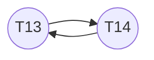

## Database Homework 9

> 10185101210 陈俊潼
> 2020.6

### 14.3

Because database system might be maintaining important data like transaction records, funds, order history, etc. The break of any properties of `ACID` (Atomicity, Consistency, Isolation or Durability) would cause very serious consequences and great loss for users.

### 14.6

Yes. Because this graph is acyclic. A possible schedule order is T1, T2, T3, T4, T5.

### 14.12

- **Atomicity:** Make sure all operations of the transaction are properly reflected in the database, or none. This ensures that crucial transactions are not breakable and maintain the consistency.
- **Consistency:** The data should always be correct and logical. The copy of the same data should always be the same everywhere.
- **Isolation:** Multiple transactions may execute concurrently, but each transaction must be unaware of other transactions and operate properly.
- **Durability:** The change of a successful transaction should be persist, even the system concurred errors and fails. The change of an unsuccessful transaction should be properly rolled back, without causing data inconsistency.

### 14.13

- **Active:** The initial state, the transaction stays in this state while it is executing.
- **Partially committed:** After the final statement has been executed, but not committed yet.
- **Failed:** After the discovery of errors during the transaction. The execution can no longer proceed.
- **Aborted:** After the transaction has been rolled back and the database restored to its prior state before the first statement of the transaction.
- **Committed:** After the completion of transaction.

### 14.14

- **Serial schedule:** This indicates a single transaction is being executed at a time. Or we can say all the statements belongs to a single transaction.
- **Serializable schedule:** This indicates a concurrency situation. If a group of concurrency transaction can be turned into a serial schedule, we call this a serializable schedule.

### 14.15

a.

T~13~ first: 

| Transaction | Instruction              | A    | B    |
| ----------- | ------------------------ | ---- | ---- |
| T~13~       | read(A)                  | 0    | 0    |
| T~13~       | read(B)                  | 0    | 0    |
| T~13~       | if A = 0 then B := B + 1 | 0    | 0    |
| T~13~       | write(B)                 | 0    | 1    |
| T~14~       | read(B)                  | 0    | 1    |
| T~14~       | read(A)                  | 0    | 1    |
| T~14~       | if B = 0 then A := A + 1 | 0    | 1    |
| T~14~       | write(A)                 | 0    | 1    |

T~14~ first:

| Transaction | Instruction              | A    | B    |
| ----------- | ------------------------ | ---- | ---- |
| T~14~       | read(B)                  | 0    | 0    |
| T~14~       | read(A)                  | 0    | 0    |
| T~14~       | if B = 0 then A := A + 1 | 0    | 0    |
| T~14~       | write(A)                 | 1    | 0    |
| T~13~       | read(A)                  | 1    | 0    |
| T~13~       | read(B)                  | 1    | 0    |
| T~13~       | if A = 0 then B := B + 1 | 1    | 0    |
| T~13~       | write(B)                 | 1    | 0    |

b.

| T~13~                    | A    | B    | T~14~                    | A    | B    |
| ------------------------ | ---- | ---- | ------------------------ | ---- | ---- |
| read(A)                  | 0    |      |                          |      |      |
| read(B)                  | 0    | 0    |                          |      |      |
| if A = 0 then B := B + 1 | 0    | 0    | read(B)                  |      | 0    |
|                          |      |      | read(A)                  | 0    | 0    |
|                          |      |      | if B = 0 then A := A + 1 | 1    | 1    |
| write(B)                 | 1    | 1    | write(A)                 | 1    | 1    |

Doesn’t satisfies the consistency requirement.

c.

B must be written first before read, A must be written first before B. If we draw a precedence graph of these two transactions, we get:

This is a previous circle, so it’s not possible for them to result in a serializable schedule.

