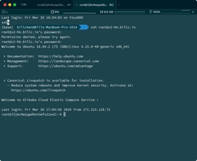
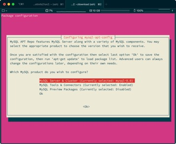
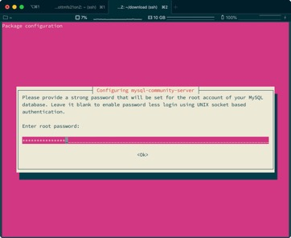
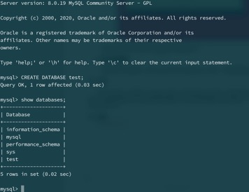

1. 服务器购买
  

 使用阿里云的学生服务器，配置Ubuntu 18.0.4操作系统。
    

2.连接服务器


使用命令 ssh root@v2-hk.billc.io远程连接到服务器：


 

3.安装MySQL

使用apt命令默认安装的MySQL版本号为5.x，为了安装最新的MySQL，需要使用如下命令配置dpkg源。

在MySQL官网https://dev.mysql.com/downloads/repo/apt/ 获取最新版本的deb包地址，使用 wget https://dev.mysql.com/get/mysql-apt-config_0.8.15-1_all.deb 和 dpkg -i mysql-apt-config_0.8.15-1_all.deb 配置MySQL 8.0：




接着使用命令apt update和apt install mysql-server即可。中途会弹出提示设置root密码:



安装成功之后即可使用命令mysql -p登录数据库了。

### 4.建立实验数据

在终端中进入数据库，使用CREATE DATABASE test; 创建一个测试数据库：



然后进入该表，依次使用以下命令创建一个用户表：

```mysql
CREATE TABLE `test`.`user` (
 `id` int(0) NOT NULL,
 `username` varchar(255) NULL,
 `password` varchar(255) NULL,
 PRIMARY KEY (`id`)
); 
```
再使用以下命令创建一个

 


 