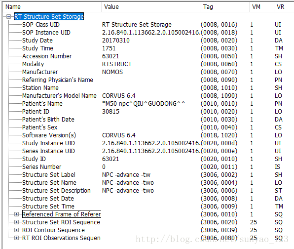

## 1.

1. GIF（Graphics Interchange Format）：是一种位图图像格式，采用LZW压缩算法进行编码，有效地减少了图像文件在网络上传输的时间。它是目前广泛应用于网络传输的图像格式之一。GIF通常会自带一个调色板，里面存放需要用到的各种颜色。在Web运用中，图像的文件量的大小将会明显地影响到下载的速度，因此我们可以根据GIF带调色板的特性来优化调色板，减少图像使用的颜色数（有些图像用不到的颜色可以舍去），而不影响到图片的质量。

2. BMP（Bitmap Image）是windows下显示图片的基本格式。在windows下任何格式的图片文件（包括视频播放）都要转化为位图才能显示出来。各种格式的图片文件也都是在位图格式的基础上采用不同的压缩算法生成的。其文件头包含了一下信息：

 ```c
 typedef struct tagBITMAPFILEHEADER
{
WORDbf Type; // 位图文件的类型，必须为BM(1字节)（42,4D)
DWORD bfSize; // 位图文件的大小，以字节为单位(4字节)
WORD bfReserved1; // 位图文件保留字，必须为0(2字节)
WORD bfReserved2; // 位图文件保留字，必须为0(2字节)
DWORD bfOffBits; // 位图数据的起始位置，以相对于位图(4字节)
// 文件头的偏移量表示，以字节为单位
} BITMAPFILEHEADER;
 ```

5. JPG (Joint Photographic Experts Group)是最常用的图像文件格式，由一个软件开发联合会组织制定，是一种有损压缩格式，能够将图像压缩在很小的储存空间，图像中重复或不重要的资料会被丢失，因此容易造成图像数据的损伤。同时支持渐进式JPEG格式，为标准JPEG的改良格式，可以在网页下载时先呈现出图片的粗略外观后，再慢慢地呈现出完整的内容(就像GIF格式的交错显示)。另外，存成渐进式JPEG格式的档案比存成标准JPEG格式的档案要来得小，所以如果要在网页上使用图片，常用这种格式。
6. DCM (DICOM)：DCM格式用于保存图像，其可以包括超声图像，MRI（磁共振成像）和CT（计算机断层扫描）等的扫描表。这些DCM文件的内容还可以包括患者的详细信息，例如患者的姓名和其他相关的医疗数据。包含了以下额外信息：



## 2.
将 RGB 三个通道的深度值进行按照一定的比例计算到灰度图像的深度中，例如使用公式 $Gray = R* 0.299 + G* 0.587 + B*0.114$ 可以计算出真实的亮度值，然后映射到灰度值中。也可以根据实际情况采用其他不同的权重进行映射。