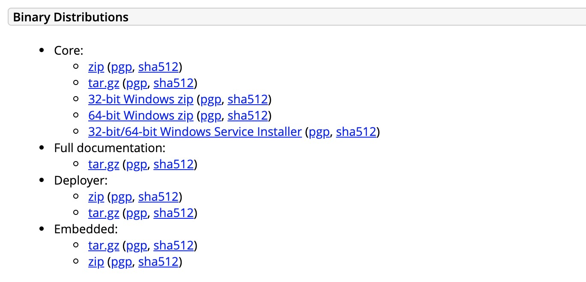
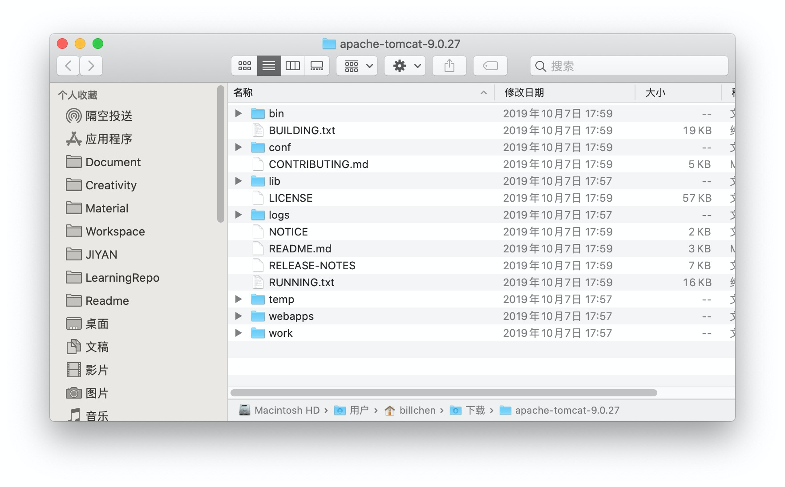
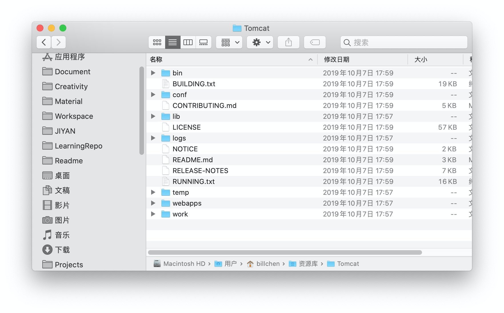
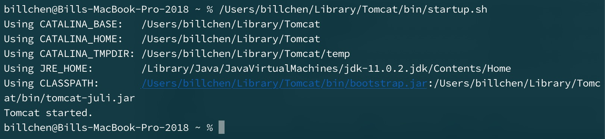
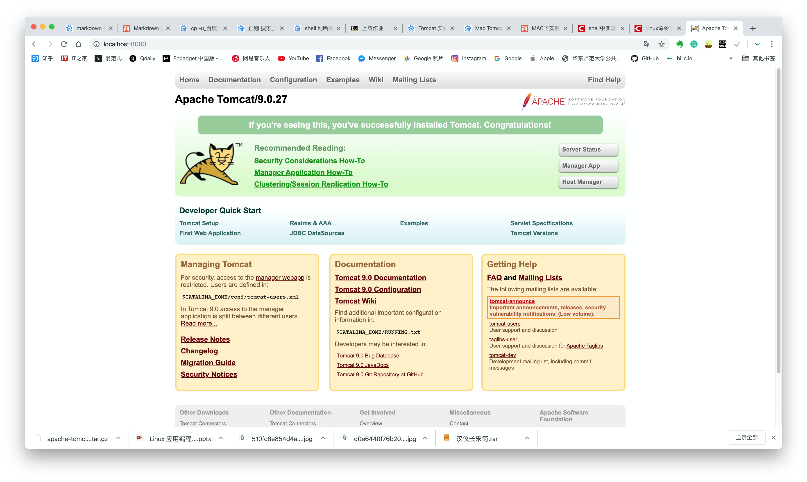

## Apache Tomcat 安装报告

> 10185101210 陈俊潼

在官网 [https://tomcat.apache.org/download-90.cgi](https://tomcat.apache.org/download-90.cgi) 下载 tar.gz 格式的二进制程序文件：



解压后获得程序文件：



使用终端命令

```bash
mkdir /Users/billchen/Library/Tomcat
cp /Users/billchen/Downloads/apache-tomcat-9.0.27/* /Users/billchen/Library/Tomcat
```

 将所有文件复制到资源库文件夹： /Users/billchen/Library/Tomcat：



授予 bin 目录下的文件以执行权限：

```bash
sudo chmod 755 /Users/billchen/Library/Tomcat/bin/*.sh
```

接下来执行 `/Users/billchen/Library/Tomcat/bin/startup.sh` 即可运行 Tomcat.



浏览器输入 `http://localhost:8080` 可以看到欢迎界面，安装完毕。

