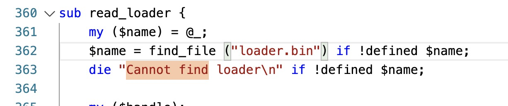
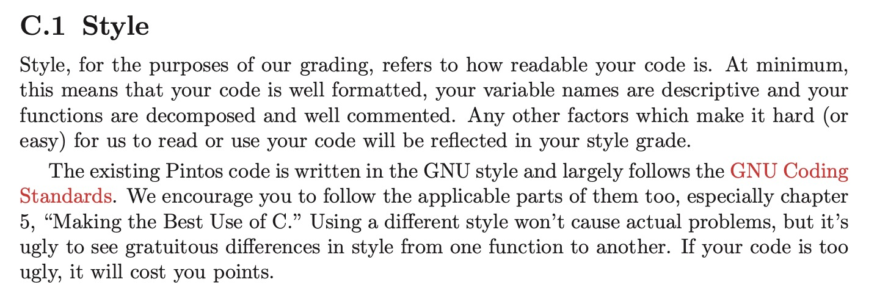
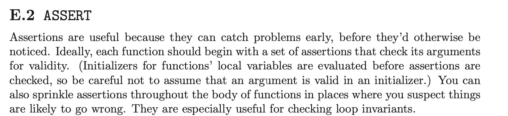
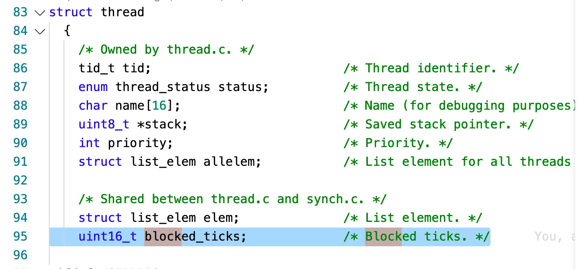
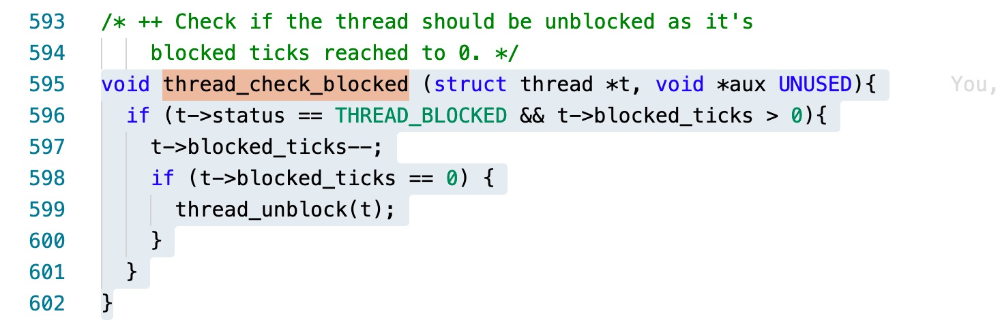
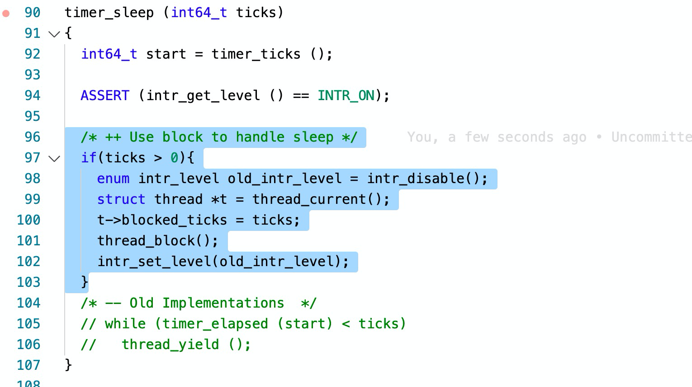

# PINTOS 实验报告

> 10185101210 陈俊潼, East China Normal University

## 准备工作

### 安装与调试

为了方便使用 VSCode 做实验，避免安装一个繁重 Ubuntu 虚拟机，便尝试直接在 macOS 上安装 pintos。使用的 pintos 来自：

[https://github.com/maojie/pintos_mac](https://github.com/maojie/pintos_mac)

下载后使用以下 port 命令安装依赖库、gdb和 bochs：

```bash
sudo port install i386-elf-binutils
sudo port install i386-elf-gcc
sudo port install sdl
sudo port install gdb # 用于调试，安装后需要使用命令 ggdb 调试
sudo port install bochs -smp +gdbstub
```

其中 `sudo port install bochs -smp +gdbstub` 后面的两个参数是为了开启 gdb 调试。因为 port 默认安装的 pintos 没有 --enable-gdb-stub 参数（可以通过查阅 port 的 variant 得到，如下图）。


为了能够直接输入 gdb 运行 ggdb，可以`vim ~/.bash_profile`，加入一行 `alias gdb='ggdb';`。

接着讲将 pintos 放入任意目录，在终端中将 utils 目录 export PATH:

```bash
# 后面的目录是 utils 所在的目录
export PATH=$PATH:~/OneDrive/Workspace/LearningRepo/Course/OSConcepts/pintos/utils
```

进入 threads 目录运行 make 后，可以尝试运行：


发现无法找到内核。修改 kernal.o 和 loader.o 的位置。在 /utils/pintos 的第 256 行：


/utils/pintos.pm 第 362 行：



/utils/pintos-gdb 第 4 行，调整GDBMACROS的目录：


接着测试调试。

输入命令

```bash
sudo pintos --gdb -s -- run alarm-multiple
```

新建终端，进入 threads/build 目录下输入命令：

```bash
ggdb kernel.o # 使用 port 安装的 mac 下的 gdb 应输入 ggdb
target remote localhost:1234
```

回到 Bochs 运行界面，可以发现已经连接成功：


这时已经可以在 gdb 中输入命令 `make check`查看检查信息，得到以下反馈：

```
(gdb) target remote localhost:1234
Remote debugging using localhost:1234
warning: No executable has been specified and target does not support
determining executable automatically.  Try using the "file" command.
0x00000000 in ?? ()
(gdb) make check
pass tests/threads/alarm-single
pass tests/threads/alarm-multiple
pass tests/threads/alarm-simultaneous
FAIL tests/threads/alarm-priority
pass tests/threads/alarm-zero
pass tests/threads/alarm-negative
FAIL tests/threads/priority-change
FAIL tests/threads/priority-donate-one
FAIL tests/threads/priority-donate-multiple
FAIL tests/threads/priority-donate-multiple2
FAIL tests/threads/priority-donate-nest
FAIL tests/threads/priority-donate-sema
FAIL tests/threads/priority-donate-lower
FAIL tests/threads/priority-fifo
FAIL tests/threads/priority-preempt
FAIL tests/threads/priority-sema
FAIL tests/threads/priority-condvar
FAIL tests/threads/priority-donate-chain
FAIL tests/threads/mlfqs-load-1
FAIL tests/threads/mlfqs-load-60
FAIL tests/threads/mlfqs-load-avg
FAIL tests/threads/mlfqs-recent-1
pass tests/threads/mlfqs-fair-2
pass tests/threads/mlfqs-fair-20
FAIL tests/threads/mlfqs-nice-2
FAIL tests/threads/mlfqs-nice-10
FAIL tests/threads/mlfqs-block
20 of 27 tests failed.
make: *** [check] Error 1
```

确认环境配置完成，实验正式开始。

在 pintos 运行时，会在 build 目录下创建 bochsrc.txt 文件，用于给 bochs 虚拟机提供配置文件。运行时的输出都会输出在终端窗口中。可以使用 intos run alarm-multiple > log 将输出重定向到文本文件保存。

### 代码规范

官方文档推荐在开始实现之前，阅读附录中的代码规范。指出项目应当遵循 `GNU Coding Standards`：



规范指出：

- 不应当使任意一行代码超过 79 个字符
- 支持 C99 标准库中的新特性
- 应当为每一个函数写明注释
- 不要使用 `strcpy()`、`strcat()`、`sprintf()`等不安全的函数

## Project 1

### Overview

在开始之前，初步了解 PintOS 目录下的几个文件夹的内容：

```
threads/：内核的源代码
userprog/：用户程序加载代码
vm/：虚拟内存目录
filesys/：文件系统目录
devics/：I/O 设备驱动目录
lib/：包含部分标准 C 语言的函数
lib/kernel：部分只在 Pintos 中有的 C 语言函数
lib/user：包含一些头文件，只在 Pintos 中有的一些 C 语言函数
tests/：每个 Project 的测试案例
examples/：在 Projcet 2 的一些案例
misc/ & utils/：官方不推荐修改的两个文件夹
```

而浏览 Pintos 的官方文档可以了解到 thread 目录下具有的文件包含以下功能：

//todo

除此之外，浏览官方文档的附录 Debugging Tools，了解到两个常用的调试工具的用法。第一个是`ASSERT`，官方的描述如下：



`ASSERT`的作用是测试括号内的表达式，如果表达式不为真，这会出现 kernel panic，将出现错误的详细信息打印在屏幕上。

第二个调试工具是 `printf()`，使用方法同 C 标准库函数。

### Mission 1: Alarm Clock (忙等待问题)

#### Requirement

在这个任务中需要重新实现 devices/timer/c 目录下的 timer_sleep()。虽然当前代码提供了一个实现方式，但它的实现方为忙等待，即它在循环中检查当前时间是否已经过去`ticks`个时钟，并循环调用`thread_yield()`直到循环结束。**需要重新实现这个函数来避免忙等待。**

对于 `timer_msleep()`、`timer_usleep()`、`timer_nsleep()`等函数，将会自动定期调用`timer_sleep()`，所有不需要修改。

#### Analysis

这个函数将会在 pintos 原先的实现中， timer_sleep() 的代码如下：

```c
/* Sleeps for approximately TICKS timer ticks.  Interrupts must
   be turned on. */
void
timer_sleep (int64_t ticks) 
{
  int64_t start = timer_ticks ();

  ASSERT (intr_get_level () == INTR_ON);
  while (timer_elapsed (start) < ticks) 
    thread_yield ();
}
```

1. 首先，`start` 记录了进入这个函数的当前时间。
2. 然后判断 `intr_get_level()`的返回值是否为真，即是否启用了中断，如果没有则 kernel panic。
3. 利用 `timer_elapsed ()` 判断当前经过的时间和`start`之间的差值。
4. 判断当前流逝的时间是否超过给定的 `ticks`，如果没有，执行 `thread_yield ()`，让线程休眠。

接下来查找`thread_yield()`函数。这个函数位于threads/threads.c：

```c
/* Yields the CPU.  The current thread is not put to sleep and
   may be scheduled again immediately at the scheduler's whim. */
void
thread_yield (void) 
{
  struct thread *cur = thread_current ();
  enum intr_level old_level;
  
  ASSERT (!intr_context ());

  old_level = intr_disable ();
  if (cur != idle_thread) 
    list_push_back (&ready_list, &cur->elem);
  cur->status = THREAD_READY;
  schedule ();
  intr_set_level (old_level);
}
```

1. 首先通过 `thread_current()`获得当前正在运行的线程。这个结构体指针中的进程结构体包含以下字段：

   ```c
   struct thread
     {
       /* Owned by thread.c. */
       tid_t tid;                          /* Thread identifier. */
       enum thread_status status;          /* Thread state. */
       char name[16];                      /* Name (for debugging purposes). */
       uint8_t *stack;                     /* Saved stack pointer. */
       int priority;                       /* Priority. */
       struct list_elem allelem;           /* List element for all threads list. */
   
       /* Shared between thread.c and synch.c. */
       struct list_elem elem;              /* List element. */
   
   #ifdef USERPROG
       /* Owned by userprog/process.c. */
       uint32_t *pagedir;                  /* Page directory. */
   #endif
   
       /* Owned by thread.c. */
       unsigned magic;                     /* Detects stack overflow. */
     };
   ```

   包含有进程 ID，进程状态，京城名，栈指针，优先级，线程链表，线程项，页目录，和一个用于检查栈溢出的量。而其中的 `thread_status`又包含有以下几种进程状态：

   ```C
   /* States in a thread's life cycle. */
   enum thread_status
     {
       THREAD_RUNNING,     /* Running thread. */
       THREAD_READY,       /* Not running but ready to run. */
       THREAD_BLOCKED,     /* Waiting for an event to trigger. */
       THREAD_DYING        /* About to be destroyed. */
     };
   ```

   这些文件都通过 thread.c 实现。

2. 获取`old_level`，即调用函数的时候的中断状态。同时发现在 `intr_disable()`函数中会暂时禁用中断。

3. 判断当前的进程是否为 idle_thread，如果不是，则将现在这个进程 push 到 ready_list 的尾部。

4. 调度当前进程，同时将中断状态设置回刚调用`thread_yield()`时的状态。

回顾 `timer_sleep()`函数，可以发现这个函数是一个自旋锁，将会一直循环检查当前经过的时间并且调用 `thread_yield()`来让进程休眠，会出现忙等待的现象。也就是为了让进程休眠特定时间，这个函数就在这一段时间里反复把进程从运行状态丢到就绪列表的最后。当调度到来时，如果时间没到，又一次把进程放在最后，这样做效率低下。

观察到 `thread_block()`函数和`thread_unblock`函数，观察其注释：

```c
/* Puts the current thread to sleep.  It will not be scheduled
   again until awoken by thread_unblock().

   This function must be called with interrupts turned off.  It
   is usually a better idea to use one of the synchronization
   primitives in synch.h. */
void
thread_block (void) 
{
  ASSERT (!intr_context ());
  ASSERT (intr_get_level () == INTR_OFF);

  thread_current ()->status = THREAD_BLOCKED;
  schedule ();
}
```

可知如果一个进程被设置为阻塞状态后，在调用`thread_unblock（）`之前将不再会被 `schedule()`函数调度，而这正是我们需要的。

#### Solution

为了解决这个问题，可以在进程第一次调用`timer_sleep()`的时候，通过调用 `thread_block()`函数来讲进程的状态设置为阻塞，同时记录下需要阻塞的时间，至此，`timer_sleep()`就完成了自己的工作，把唤醒的工作留给其他函数。

这样的话，当在每一次中断，即调用`timer_interrupt()`的时候，都需要把所有被阻塞的进程内记录的阻塞时间信息 -1，如果减到了 0，则 unblock 进程，供后续调度。

所以需要对代码进行以下修改：

1. 在 thread 的结构体，也就是 PCB 中加入一项 `blocked_ticks`:

   

2. 在初始化进程调用`thread_create()`的时候，将 `blocked_ticks` 设置为 0：

   

3. 新建一个 `thread_check_blocked(struct thread *t)`函数检查进程的阻塞时间记录情况。之所以需要增加第二个 `void *aux`指针的原因是这个韩珊瑚将会被`thread_foreach`调用，而这个函数将会给`thread_chheck_blocked`传递一个`aux`指针。

   

   同时在`thread.h`头文件中添加：

   ```c
   void thread_check_blocked(struct thread *, void * aux UNUSED);
   ```

4. 在 `timer_interrupt()`调用的时候，对每一个进程都使用 `thread_for_each()`函数调用`thread_check_blocked()`来处理阻塞状态：

   

5. 最后修改改`timer_sleep()`函数，使进程通过阻塞休眠而不是忙等待：

   

#### Result

使用命令`pintos -- run alarm-multiple`检查运行结果，可以得到：

```
(alarm-multiple) begin
(alarm-multiple) Creating 5 threads to sleep 7 times each.
(alarm-multiple) Thread 0 sleeps 10 ticks each time,
(alarm-multiple) thread 1 sleeps 20 ticks each time, and so on.
(alarm-multiple) If successful, product of iteration count and
(alarm-multiple) sleep duration will appear in nondescending order.
(alarm-multiple) thread 0: duration=10, iteration=1, product=10
(alarm-multiple) thread 0: duration=10, iteration=2, product=20
(alarm-multiple) thread 1: duration=20, iteration=1, product=20
(alarm-multiple) thread 0: duration=10, iteration=3, product=30
(alarm-multiple) thread 2: duration=30, iteration=1, product=30
(alarm-multiple) thread 0: duration=10, iteration=4, product=40
(alarm-multiple) thread 1: duration=20, iteration=2, product=40
(alarm-multiple) thread 3: duration=40, iteration=1, product=40
(alarm-multiple) thread 0: duration=10, iteration=5, product=50
(alarm-multiple) thread 4: duration=50, iteration=1, product=50
(alarm-multiple) thread 0: duration=10, iteration=6, product=60
(alarm-multiple) thread 1: duration=20, iteration=3, product=60
(alarm-multiple) thread 2: duration=30, iteration=2, product=60
(alarm-multiple) thread 0: duration=10, iteration=7, product=70
(alarm-multiple) thread 1: duration=20, iteration=4, product=80
(alarm-multiple) thread 3: duration=40, iteration=2, product=80
(alarm-multiple) thread 2: duration=30, iteration=3, product=90
(alarm-multiple) thread 1: duration=20, iteration=5, product=100
(alarm-multiple) thread 4: duration=50, iteration=2, product=100
(alarm-multiple) thread 1: duration=20, iteration=6, product=120
(alarm-multiple) thread 2: duration=30, iteration=4, product=120
(alarm-multiple) thread 3: duration=40, iteration=3, product=120
(alarm-multiple) thread 1: duration=20, iteration=7, product=140
(alarm-multiple) thread 2: duration=30, iteration=5, product=150
(alarm-multiple) thread 4: duration=50, iteration=3, product=150
(alarm-multiple) thread 3: duration=40, iteration=4, product=160
(alarm-multiple) thread 2: duration=30, iteration=6, product=180
(alarm-multiple) thread 3: duration=40, iteration=5, product=200
(alarm-multiple) thread 4: duration=50, iteration=4, product=200
(alarm-multiple) thread 2: duration=30, iteration=7, product=210
(alarm-multiple) thread 3: duration=40, iteration=6, product=240
(alarm-multiple) thread 4: duration=50, iteration=5, product=250
(alarm-multiple) thread 3: duration=40, iteration=7, product=280
(alarm-multiple) thread 4: duration=50, iteration=6, product=300
(alarm-multiple) thread 4: duration=50, iteration=7, product=350
(alarm-multiple) end
```

duration 和 iteration 的乘积已经是不减排序了，修改完成。运行`make check`查看结果：


除了在 Mission 2 中要解决的`alarm-priority`以外都显示通过测试。

### Misson 2: Priority Scheduling (优先级调度问题)

#### Requirements

这一部分要求在 Pintos 中实现优先级调度。

在 thread  的 PCB 中已经具有了 `priority`项，优先级最低从`PRI_MIN`到最高`PRI_MAX`。当 ready list 中出现了一个比当前正在运行的进程优先级更高的进程的时候，当前的进程将会立即让出 CPU。同时，当进程在等待一个信号量的时候，最高优先级的进程将会被第一个唤醒。

除此之外，实验还要求每一个进程可以在任意时候提高或降优先级，并且在降低优先级后如果不是当前系统中优先级最高的进程，立即让出 CPU。

需要考虑的问题有优先级倒置、优先级捐赠。并且完成`thread.c`中的`void thread_set_priority (int new_priority)`函数和`int thread_get_priority (void)`函数。

#### Analysis

操作系统目前的调度函数为`schedule()`，代码如下：

```c
/* Schedules a new process.  At entry, interrupts must be off and
   the running process's state must have been changed from
   running to some other state.  This function finds another
   thread to run and switches to it.

   It's not safe to call printf() until thread_schedule_tail()
   has completed. */
static void
schedule (void) 
{
  struct thread *cur = running_thread ();
  struct thread *next = next_thread_to_run ();
  struct thread *prev = NULL;

  ASSERT (intr_get_level () == INTR_OFF);
  ASSERT (cur->status != THREAD_RUNNING);
  ASSERT (is_thread (next));

  if (cur != next)
    prev = switch_threads (cur, next);
  thread_schedule_tail (prev);
}
```

可以看到在第 12 行，函数通过调用`next_thread_to_run()`获取要调度的下一个进程，然后在第 20 行调用 `switch_threads(cur, next)`把当前进程和要调度的下一个进程进行交换。

观察目前`next_thread_to_run()`的代码：

```c
/* Chooses and returns the next thread to be scheduled.  Should
   return a thread from the run queue, unless the run queue is
   empty.  (If the running thread can continue running, then it
   will be in the run queue.)  If the run queue is empty, return
   idle_thread. */
static struct thread *
next_thread_to_run (void) 
{
  if (list_empty (&ready_list))
    return idle_thread;
  else
    return list_entry (list_pop_front (&ready_list), struct thread, elem);
}
```

可以看到这个函数只是简单的返回 `ready_list` 中最前面的进程。如果队列为空，则返回一`idle_thread`空进程。

而观察`thread.c`中添加进程方式，发现有三个函数在向 `ready_list`中添加进程，分别是`thread_list()`、`init_thread()`、和`thread_yield()`。而这三个函数都使用了`list_push_back (&ready_list, &cur->elem);`来添加。因此，pintos 目前使用的算法是 FIFO 调度。

为了实现优先级调度，首先应当使**进程进入队列的时候按照优先级的大小插入**，而不是简单	