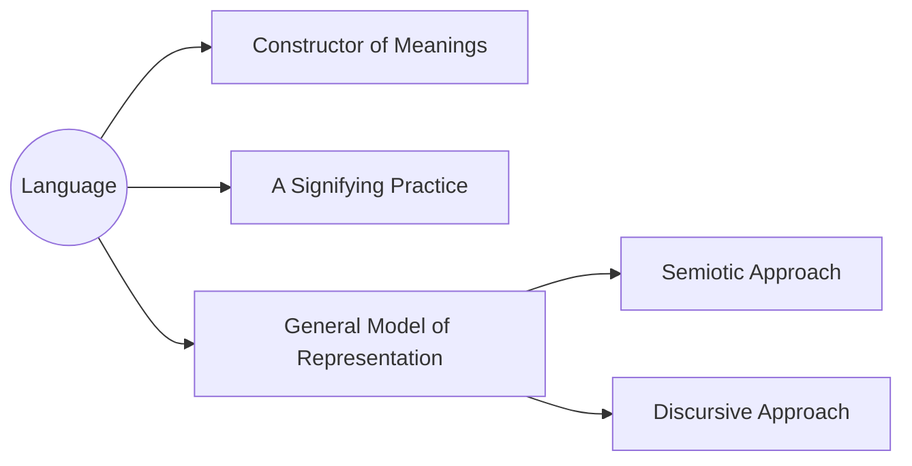
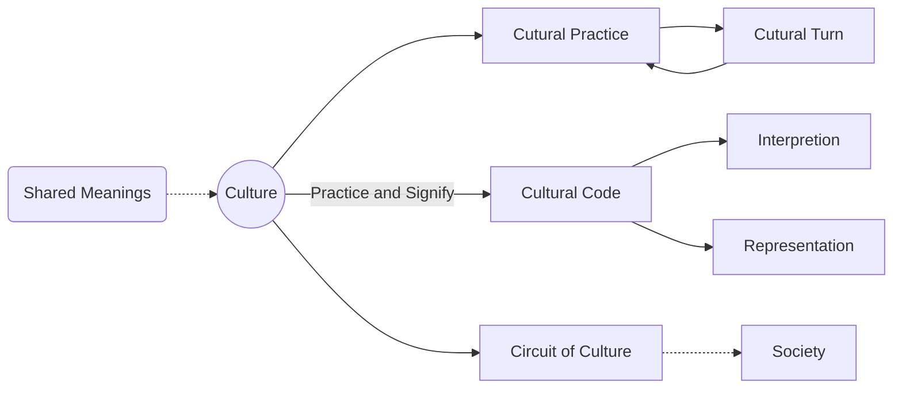
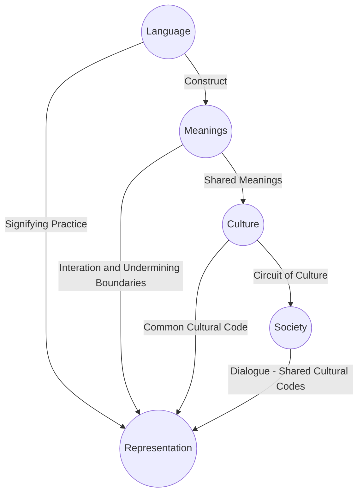

# Language, Meanings & Culture: Connections and Influences

*Bill Chen (10185101210)*  
*East China Normal University*  
*From Course: Language, Society and Cultural Difference \- A Review of Contemporary Australia* 

## Abstract

In this essay, we will describe how Stuart Hall demonstrates the connection amongst language, society and culture in his 'Introduction' in *Representation: cultural representation and signifying practices* and the practical appliance in inexperienced culture environment in different ways. Through this example we will also use Stuart Hall's theory to demonstrate the connection amongst these factors and the heterogeneous representation in a conceived culture.

## 1. Stuart Hall's Theory: Cultural Representation

Figure 1: The Circuit of Culture

Stuart Hall explained the concept of cultural representation. In which he emphasized the five most significant elements in cultural representation, respectively regulation, consumption, production, identity and representation and formed *The Circuit of Culture* (Figure 1)[^(1)]. These five elements are closely interlocked and counterbalance each other in the construction of the culture. It is also a kind of representative practice, and it is through this practice that the culture formed and developed.

The basis of the Circuit of Culture is language. Language is also the constructor of meanings. Since it's privileged the cornerstone of the culture, this is the first things to be demonstrated.

### 1.1 Language

Figure 2: Language

Language constructs meanings. Through language, we can deliver concept and receive information. Notes that the definition of language is not constrained to verbal languages, it can be anything that has meanings in it. Thus sounds, written words, electronically produced images, music notes and so on, can all be defined as language. 

More importantly, languages signify. The way that language works is a process of signifying and communicating between members under the same environment, and with sufficient significations, the meaning becomes more and more clear, and then becomes *fixed meanings*. It's abstracted as a sign of meaning, signs stand for or represent our concepts, making people interpret their meanings in roughly the same way.

Language is also a model of how culture and representation work, known as two major approaches - *Semiotic Approach* and *Discursive Approach*. The former means to regard language as 'science of signs' and their role as vehicles of meaning in culture, focusing on 'how language produce meanings', while the latter is more like a general term used to refer any approach in which meaning, representation and culture are considered to be constitutive, focusing on the effects and consequences of representation[^(2)].

### 1.2 Meanings

Language in broad sense itself doesn't contain meanings, it signifies a sign and people interpret it. So the meanings of the same language are variable and changable[^(3)]. But The fixed meaning, or furthermore speaking, the *shared meaning* can be formed after a long time of production and circulation and representative practices.

The concept of shared meaning is also one of the most important terms used in cultural representation. In many social and human sciences, cultural studies, they tended to emphasize the importance of shared meanings, and use 'a system of shared meanings' as the definition of culture[^(4)]. Though culture is argued to be so much a set of things, the meaning behind these things is often shared.

The variability of meanings can largely affect the way we think and live and furthermore, affect society. Though we don't have a straightforward relationship to meanings, they mobilize powerful feelings and emotions to us. These meanings are decisive in judging who is normal and who is excluded, organized our concept into different and sharp boundaries, and shape our lives[^(5)]. But the exchange between the boundaries of meanings, the interaction of representations, the substituting and displacing of one another constantly undermining these boundaries, producing a society that's more and more complex.

### 1.3 Culture

Figure 3: Culture

As mentioned before, culture is a system of *Shared Meanings*. Focusing on this, we now emphasise the *Cultural Practice*. Like the circulation of meanings, the practice of culture comes from members of the culture's repetitive use of the meanings. In the constant communication and the use of various meanings and languages, people feel the way we represent them, the meanings behind them and slightly change the interpretation according to different circumstances and background.

This is important because through this people will eventually create a common way of interpretation and representation system, which can be called the *Cultural Code*. Hence under this culture, under this system of shared meanings, people can understand their language, signs, ideas and feelings in roughly the same way. The ability of 'decoding' other's representation and embody the signs that other's can 'decode' is based on this process. And this production and circulation of meanings, the representation and interpretation in the culture conceptualize it as a primary or 'constitutive' process. The cultures also have reinvented itself in these cycles[^(6)], granting old languages new meanings, changing the *fixed meanings* and so on.

Besides the practices in a single culture, there's a *Circuit of Culture* in the different cultures. The meanings in the culture are produced and circulated through several different processes and practices. This contributes to the formation of regulation of social conduct and then shape society[^(7)].

## 2. Connections & Influences

Of the factors we demonstrated above, and Stuart Hall's theory about representation, we can roughly conclude the connections amongst them, as shown in Figure 4.

Figure 4: Connections

These five factors connect closely and have intimate relationships with each other. First, the basis of culture - language can construct meanings, convey ideas and concepts. With many times of signifying and practising, the meanings of the language would be fixed. Members under the same culture then accept these meanings, regarding them as the *Shared Meanings* and formed a common *Cultural Code*. People constantly represent and translate the languages with the *Cultural Code*, adjusting their own ideas and understandings of the meanings behind the signs. Now, the way they understand the world and interact with the other's concept and ideas is roughly the same. Besides, this representation doesn't only happen within a single culture, but also happens cross-culturally. They produce much *Circulation of Culture*. In that way, representation functions less like the model of a one-way transmitter and more like the model of dialogue. In other words, *Dialogic*. What sustains this 'dialogue' is the presence of *Shared Cultural Code* across cultures, which can't guarantee the meanings will stay stable and unchanged permanently. The dialogue between people and cultures compose of the sophistication and diversity of society, and in return, produce large influences on languages and meanings[^(8)]in certain cultures.

## 3. A Practical Anaylise: Unprecedented Culture

### 3.1 Premise

Based on Stuart Hall's theory, we conceived a situation when one person went to a completely unfamiliar cultural environment. Assume this person doesn't know anything about this culture, including language, social patterns or manners. And the place is constrained in a local supermarket.

### 3.2 Simulation

At first he will understand nothing about his surroundings, or in other words, the languages. But in a short time, he could match the signs with the things and intentions from others' behaviours, see through the meanings behind these languages. For instance, he may not know that a word 'Cashier' in this language, but he will find that people all go to a certain place to get their goods cashed, he then can know that this is a place called Cashier, and he should go there as everyone else does.

We know that languages not only contains verbal words. Signs, colours, gestures can all be a part of the language. So he may not be able to possess many vocabularies or grammar of this language, but he can understand others' gestures and signs. The concept of shared meanings in Stuart Hall's theory can, therefore, be obtained by his intention to interpret others' representations. Once he'd constructed the basic shared meanings with the others', he could draw a rough image of this culture and interact with it. People's manners, the regulation of social conducts, or even the *Cultural Code* can be learnt from his observation, so buying things and ask for what he wants in this supermarket is made possible.

Research shows that people placed in a new culture have a strong ability to establish a connection with his surroundings and capture signals around him. Normally they'll quickly accept the new ideas and discover new sides of themselves[^(9)]. Hence the core of culture - language, in this case, can be interpreted by the circuit of meanings and signifying practices. So one who never knew this language before can also learn the non-verbal part of the language rapidly. This is also because that the *Cultural Code* between different cultures often have many similarities, and he can use his prior experience, knowledge and his own *Cultural Code* to interpret the unprecedented representations around him.

## References

[^(1)]: Hall, S. (Ed.). (1997). Representation: Cultural representations and signifying practices.
[^(2)]: Barker, C., & Galasinski, D. (2001). *Cultural studies and discourse analysis: A dialogue on language and identity*. Sage.
[^(3)]: Bowerman, M., & Choi, S. (2001). Shaping meanings for language: universal and language-specific in the acquisition of semantic categories. In *Language acquisition and conceptual development* (pp. 475-511). Cambridge University Press.
[^(4)]: Smircich, L. (1983). Concepts of culture and organizational analysis. *Administrative science quarterly*, 339-358.
[^(5)]: Luhmann, N. (1977). Differentiation of society. *Canadian Journal of Sociology/Cahiers canadiens de sociologie*, 29-53.
[^(6)]: Lee, B., & LiPuma, E. (2002). Cultures of circulation: The imaginations of modernity. *Public culture*, *14*(1), 191-213.
[^(7)]: Feibleman, J. K. (1961). The cultural circuit in psychology and psychiatry. *The Journal of nervous and mental disease*, *132*(2), 127-145.
[^(8)]: Norton, B., & Toohey, K. (2011). Identity, language learning, and social change. *Language teaching*, *44*(4), 412-446.(8) 
[^(9)]: Bird, A., Osland, J. S., Mendenhall, M., & Schneider, S. C. (1999). Adapting and adjusting to other cultures: What we know but don't always tell. *Journal of Management Inquiry*, *8*(2), 152-165.